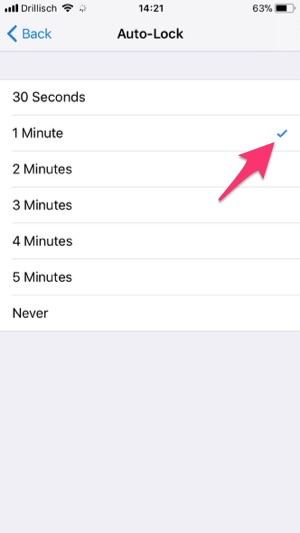

# Battery Life Hacks: All You Need To Know

I really didn't want my phone to die, because if it did, so might I. At least it was a sunny day. I was standing atop Yellow Rock in the middle of nowhere, Utah, looking out at the vast, beautiful, savannah-like landscape and...totally lost.

The marvelous red, yellow and orange lines were so mesmerizing, I'd lost sight of my trail. Wriggling their way through the rock like snakes, I traced them all the way to the horizon. The sun was starting to set, my snacks and OJ were empty and my phone was running low.

*"I wonder how much they charge for the rescue chopper..."*

* * * * *

Fast forward to yesterday. At 7 PM, after almost 12 hours at school, I strolled across the hallway, talking to my mom on the phone. The conversation lasted an hour. After we hung up, I glanced at my phone: 64% battery life. When I went to bed a few hours later, it was still at 34%.

For the average iPhone user, that's unheard of. We run around with wires, adapters and brick-sized portable chargers, just to get through the day. That's ridiculous. But after today, you *won't* be an average iPhone user.

If you could rely on your phone to last through the day, you'd be less annoyed, work better and live a little more peacefully. Here are 15 small tweaks to make that happen. Each one only takes seconds to implement, but taken together, they greatly extend your iPhone's battery life.

* * * * *

### 1. Turn Bluetooth Off

I shouldn't even have to say this, but I do. Unless you wear an Apple Watch, for which Bluetooth is the most resourceful way to stay connected to your phone, Bluetooth drains your battery for no reason at all.

You can disconnect all devices right in Control Center, which you can access anywhere by swiping up from the bottom of the screen. However, to fully turn off Bluetooth, you *must *go to 'Settings' → 'Bluetooth' and toggle it there*.*

#### Optional: Turn LTE Off

In Germany, service providers are stingy. With 1 or 2 GB of data per month, this isn't just helpful, it's necessary. But even if you have more bandwidth, you probably still have Wi-Fi in most places. If you want to turn this off go to 'Cellular' → 'Cellular Data Options' → 'Enable LTE' and select 'Off.'

If you choose not to do it altogether, definitely turn it off individually for big data suckers, like Music, Photos, iBooks and Podcasts. You can find it in their respective settings.

### 2. Turn Most Notifications Off

I have 32 apps on my phone, 8 are allowed to send notifications. I never use alerts, banners only for calls and calendar events and badges for anything that should be checked *eventually*, but is never urgent, like app updates.

If your 'Notifications' list looks somewhat like this, you're on the right track:

### 3. Turn Auto-Brightness Off

Lowering your phone's brightness is one of, if not *the *best way to save battery. However, as long as auto-brightness keeps raising and lowering it without your command, it's worthless.

This is a bit hidden. You can find it under 'General' → 'Accessibility' → 'Display Accommodations' → 'Auto-Brightness.'

#### Optional: Activate Grayscale

While we're here, if you tap on 'Color Filters,' enable them and choose 'Grayscale,' your screen will be black and white all the time. It's easier on the eyes, helps your natural sleep cycle and less power-consuming for your phone. It might feel unusual at first, but I've come to love it. More details [here](https://betterhumans.coach.me/a-phone-setup-that-will-make-you-more-mindful-1c5d8be7e661).

### 4. Set Brightness to 10%-25%

Now that your phone won't mess with the brightness setting you choose, you can bring up Control Center again and set it somewhere between 10% and 25%. For most environments, this is enough. I only manually increase it when I need to, like in the sun or when reading a longer piece.

### 5. Turn 'Reduce Motion' On

There's a lot more to be found in 'Accessibility.' Select 'Reduce Motion' and then tap the knob. What this does is change the animation every time you press the home button. Instead of a "zoom out" effect, you'll just get a cross-fade. Here's a before-and-after video:

This also removes the so-called [parallax effect](https://www.macworld.co.uk/how-to/iosapps/how-turn-off-annoying-screen-transitions-in-ios-11-3664237/), which is the artificial sense of depth created when you tilt your phone in various apps and on the home screen. Less sea sickness, more battery life, a double win.

Once you enable 'Reduce Motion,' a new option will pop up that says 'Auto-Play Message Effects.' If it's not disabled already, do that. Since iOS 10 there are a ton of fun little animations and filters you can send your messages with. In iOS 11 they've gone full screen.



While they're fun, if you get lots of them and they all automatically play, that's a huge battery drain. With auto-play disabled, you'll have to tap on them to start the effect. Same fun, more control.

### 6. Turn 3D Touch Off

Also under 'Accessibility,' you'll find 3D Touch. While it does come with a few nifty features, the vibration from the pressure tap takes a toll on your battery. Some of them just convert to 'hold the button' features instead, while others, like folder previews, disappear. So far I'm not missing them.

### 7. Turn 'Shake to Undo' Off

This sits two slots below 3D Touch. I have never been in a situation where this would've been useful. To the contrary, shaking is often slower than just correcting your mistake the normal way and might even happen by accident. The vibration just saps battery.

#### Optional: Turn ALL Vibration Off

Below 'Shake to Undo,' there's an option to eliminate ALL vibration from your phone, even for calls and emergency alerts. Nice if you can make it work, but even for me a bit impractical.

#### Alternatively: Turn 'Vibrate on Silent' Off

If you go all the way back to the main setting screen, then tap 'Sounds,' there's an option to turn off 'Vibrate on Silent.' This is neat, as it eliminates vibration only when you flick the Ring/Silent switch on the side of your phone. One of [my top 4 productivity hacks](https://betterhumans.coach.me/4-quick-tweaks-that-will-make-you-more-productive-226be113a510).

### 8. Disable 'Background App Refresh' For Most Apps

Under 'General' → 'Background App Refresh,' you can determine which apps are allowed to keep updating while they're open, but not in view. I try to only use this for apps that take long to sync, like Dropbox and Evernote, or are useful when traveling, like route planners and Google Maps.

### 9. Set 'Auto-Lock' To 1 Minute

The longer your phone sits around before it locks itself and turns off the screen, the more energy it wastes. Go to 'Display & Brightness' → 'Auto-Lock' and select one minute. You can of course adjust this to what you find works for you, but the less, the better.

### 10. Turn 'Raise to Wake' Off

A dark screen saves energy, so why lose that every time you pick up your phone? Right below 'Auto-Lock' you can turn off 'Raise to Wake' to make your screen light up only when you press the side or home button while in locked mode.

### 11. Turn Siri Off

Unless you're relying on the kind lady inside your phone to get stuff done, let her sleep. Just disable all four toggles under 'Siri & Search.' Whatever standby services they're for, I'm sure they don't run on sunshine and rainbows.

#### Optional: Turn 'Low Power Mode' Off

Wait, isn't Low Power Mode supposed to preserve battery? Yes, but there's one problem with it.

Your iPhone automatically sends you an alert when your battery falls below 20%, asking you whether you want to activate Low Power Mode. I noticed that often, when you do, the battery drops significantly at first, sometimes to the point where the iPhone just shuts off.

This may be because it induces a whole lot of battery saving changes at once, which in itself needs a lot of juice. I prefer to set it to airplane mode instead, which seems to work better. While you're here, you can also enable 'Battery Percentage,' in case you haven't already, to show your current charge next to the symbol.

### 12. Disable 'Location Services' For Most Apps

Most apps will default into tracking your location via GPS wherever you go, but the majority doesn't even need to in order to function. Go to 'Privacy' → 'Location Services' and then set apps like App Store, Dropbox or Evernote to 'Never' and location-based apps to 'While Using.' That's more than enough access.

#### Optional: Disable Sending Analytics To Apple

This depends on how much you want to support Apple, but it automatically creates various analytics data files, *every single day*. Transmitting those sure ain't free, at least for your battery. Scroll to the bottom of 'Privacy' and hit 'Analytics.' You can see the reports under 'Analytics Data,' but if you want to stop submitting them, just toggle off both options.

### 13. Turn Automatic App Downloads Off

In the 'iTunes & App Store' section, turn off all automatic downloads. There's usually a reason you download an app on one device and not another. There goes one more unnecessary battery drainer!

### 14. Fetch New Data Only When On Wi-Fi

This is a big one. Go to 'Accounts & Passwords' → 'Fetch New Data,' then disable 'Push,' set all apps to 'Fetch' and choose 'Automatically.' Now your iPhone will grab new data for your Mail and Calendar apps in the background only when it's on Wi-Fi *and* a charger.

#### Optional: Enable 'Low Quality Image Mode' for Messages

At the bottom of your 'Messages' settings, there's the option to enable 'Low Quality Image Mode.' With this, you'll send downsized images, like WhatsApp does by default. Takes less time, saves some battery.

### 15. Turn Game Center Off

Besides the super annoying alerts to log in to Game Center, it also sucks battery when you do. Scroll down under 'Settings' and disable it, unless you're a power iPhone gamer, of course.

* * * * *

A [review](https://www.tripadvisor.com/ShowUserReviews-g57030-d6983510-r481716821-Yellow_Rock_Trail-Kanab_Utah.html#REVIEWS) of Yellow Rock Trail reads "Photogenic, but hard to get to.*" *What an understatement. After the seventh wrong turn, I was ready to rock slide my way back down to the dry river bed where I'd come from. Just then it hit me.

*"The pictures!"*

I'd taken pictures along the way, not just of what was ahead, but also of what lay behind me. Scrolling through my phone, I managed to make out a trident formation close to the road where I'd parked the car, then found my way back.

Situations like these, where our own life depends on that of our phone's battery, are rare, of course. I hope you'll never become part of those 0.01%.

For now, I'll take comfort in the fact that for the other 99.99% of cases, your phone will last through the day and thus, make it a tiny bit better.

--- *Niklas Göke*
