# Running SpinRite 6.0 on MacOS

## Running on external drive

> Original article: <https://kevinstreet.co.uk/2017/09/11/running-spinrite-6-0-on-macos/>

SpinRite is an excellent disk maintenance and recovery tool provided by Steve Gibson over at [https://www.grc.com](https://www.grc.com/). There are many success stories from its use provided by Steve frequently on his Security Now! podcast.

There are various guides online for running SpinRite on a Mac but none that I found worked *exactly* as described, so this is my guide based on how I got SpinRite to work on my Mac. The basic principle is to set up a virtual machine on your Mac and give it raw block access to the disk and then run SpinRite as normal within the VM.

This guide is written using the following versions of software so your experience may differ if you are using different versions:

MacOS Sierra 10.12.6 (also works with MacOS High Sierra 10.13)\
SpinRite 6.0\
VirtualBox 5.1.26 r117224\
PlayOnMac 4.2.12

This guide is designed for more advanced users as granting anything raw block access to a disk can be dangerous, especially if you select the wrong disk! Please be careful while following these steps.

This guide does rely on you connecting the hard disk up to your Mac via USB using a caddy. It may be that the disk is so far gone that it will not mount in MacOS and if that is the case you will not be able to use this guide. However it may still be possible to run SpinRite on it by connecting it directly to the motherboard of another computer via SATA or IDE.

### Creating an ISO from the SpinRite.exe provided

When you first purchase and download SpinRite you are given the file SpinRite.exe to run which you can use to install locally or create an ISO to boot from. The easiest way to get the ISO is to run SpinRite.exe on any Windows system you have available, or even a Windows VM running on your Mac and copy the SpinRite.iso file across to your Mac. However if that simply is not possible for you an alternative way is to run SpinRite.exe in Wine on your Mac. I prefer the implementation provide by [PlayOnMac](https://www.playonmac.com/en/) so I will be using that in this guide. If you can create the ISO in Windows skip ahead to the next section.

The first step is to download and install PlayOnMac. Once you have it, launch it and select Install a program. In the new window that comes up click on Install a non-listed program.

Click Next on both "Please read this" windows then Next again when the Manual Installation wizard comes up. Select Install a program in a new virtual drive and click Next. Give it a name (SpinRite will do) and click Next. Do not tick any of the before installation options and click Next. Select 32 bits windows installation and click Next. Click Cancel on any additional installations that Wine prompts you about (such as Wine Gecko) until you reach the select set-up file to run screen.

Click Browse and select your SpinRite.exe file.

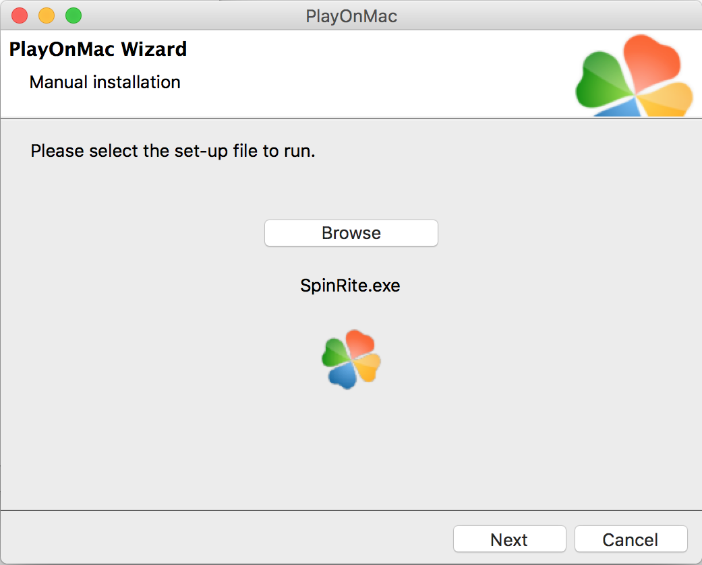

When you click Next SpinRite will launch!

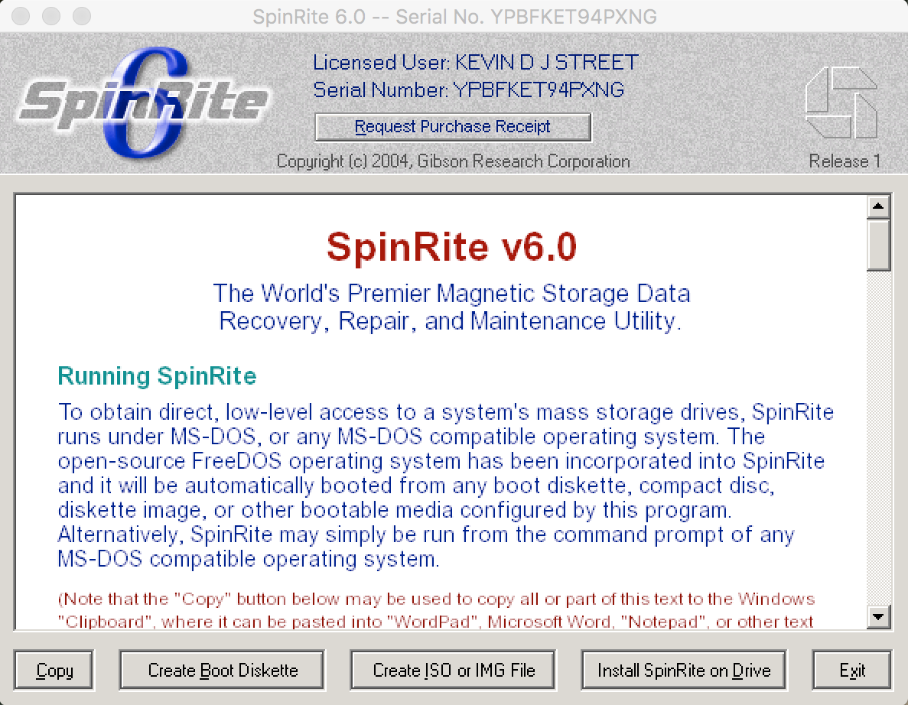

Click Create ISO or IMG File and then Save a Boot Image File. When the folder structure appears select Users > your username > Desktop to save the SpinRite.iso file to the desktop on your Mac. Once that has been successfully created exit SpinRite and PlayOnMac.

### Running SpinRite on your Mac in a VirtualBox VM

The first step here is to [download and install VirtualBox](https://www.virtualbox.org/wiki/Downloads). There is nothing special about the installation so just follow the wizard through without changing any of the options.

Attach the hard disk you want to run SpinRite on by connecting it to a USB caddy and plugging the USB into your Mac. Unplug any other external drive you may have connected. Next, open Terminal and enter the command `diskutil list` to see the disks attached to your Mac. The disks prefixed with **external** will be the one you have connected up, followed by **physical** or **virtual**. In my example these are /dev/disk4 (physical) and /dev/disk5 (virtual). You may have multiple virtual entries depending on how many partitions are on the disk. You can also use the size of the disk to verify it is the correct one. Write down each of the disk identifiers that relate to the external drive.

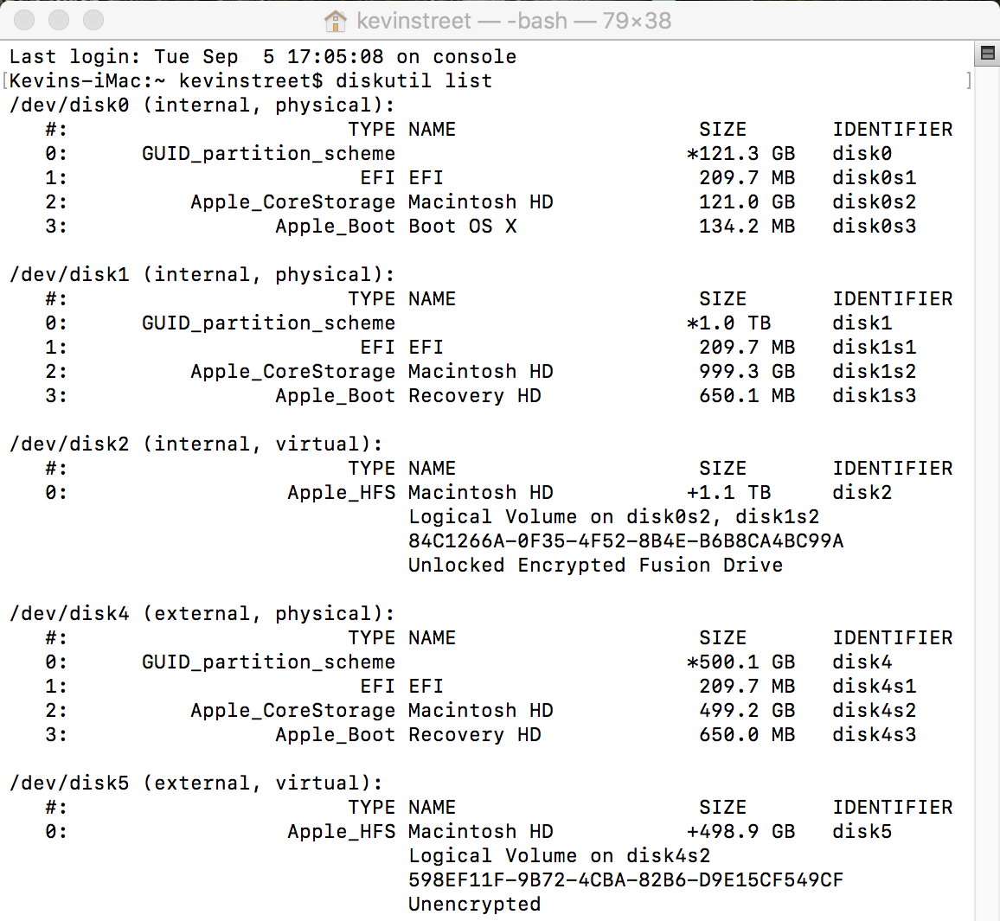

The next step is to unmount the virtual disk partitions, but not the physical disk. In my case that means unmounting /dev/disk5. To do this type `diskutil unmountdisk /dev/disk5`. Repeat this for any other virtual disk partitions your drive has.

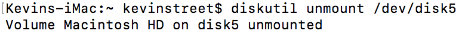

Now you need to create a vmdk file that will be attached to the virtual machine. This vmdk will direct all input and output to the physical disk you have connected. This is done using the following command:

```command
sudo /usr/local/bin/VBoxManage internalcommands createrawvmdk -filename RawDisk.vmdk -rawdisk /dev/disk4
```

Note that for this command you must use the disk identifier for the **physical** disk and not any of the virtual disks. In my case this is /dev/disk4. If you get an error stating VERR\_RESOURCE\_BUSY make sure have you have unmounted every **virtual** disk. When you run the command you will be prompted for your password, enter it and press enter.

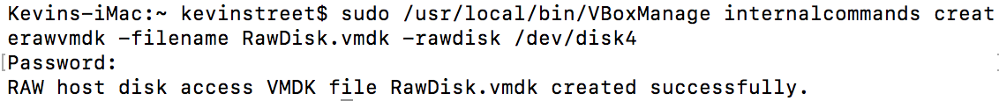

This will create a file RawDisk.vmdk in the root of your home directory. This will also re-mount the disk. Unmount it again using `diskutil unmountdisk /dev/disk5` (**virtual** ones again).

Now you need to launch VirtualBox as root which can also be done using Terminal. This is required to allow read and write access to a raw device. Launch VirtualBox using the following command:

`sudo /Applications/VirtualBox.app/Contents/MacOS/VirtualBox`

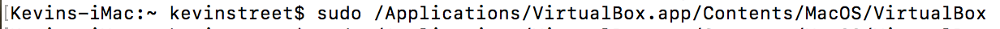

**Do not close this Terminal window.** As VirtualBox was launched through Terminal you must keep Terminal open throughout the rest of the process and while using SpinRite.

Create a new VM by clicking New, give it a name, select Other under Type and under version select DOS, then click Continue.

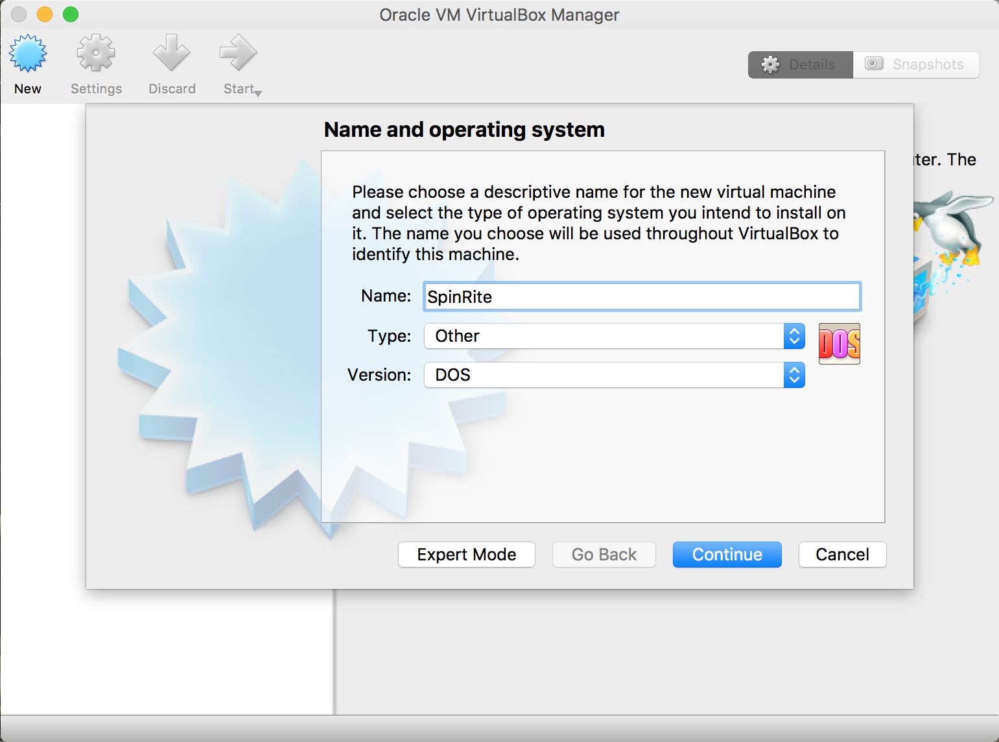

Under Memory size the default of 32 MB is more than enough so accept that and click Continue.

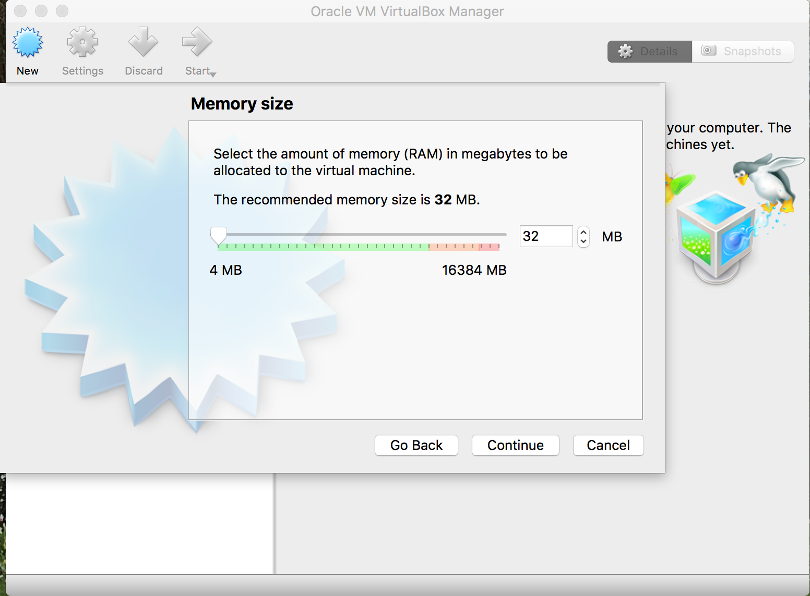

Under Hard disk select Use an existing virtual hard disk file and click on the little folder icon next to it to bring up the file selection prompt.

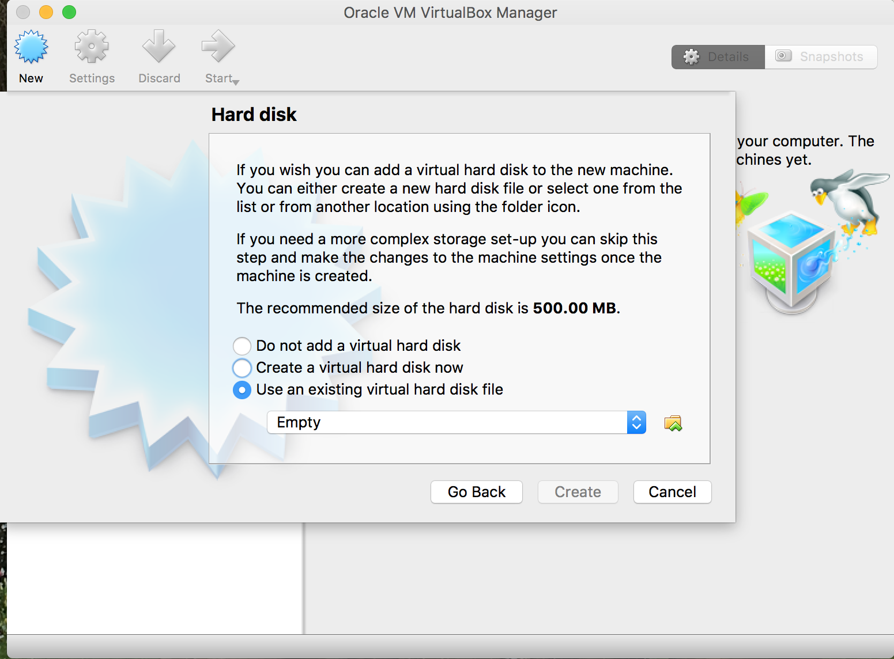

As you are running VirtualBox under root you will be taken to the folder structure for the root user account. However the RawDisk.vmdk file is saved in your user area. At the top of the file selection window click on the drop down box and select Macintosh HD (or whatever your Mac's hard drive is called). From there select Users > your username.

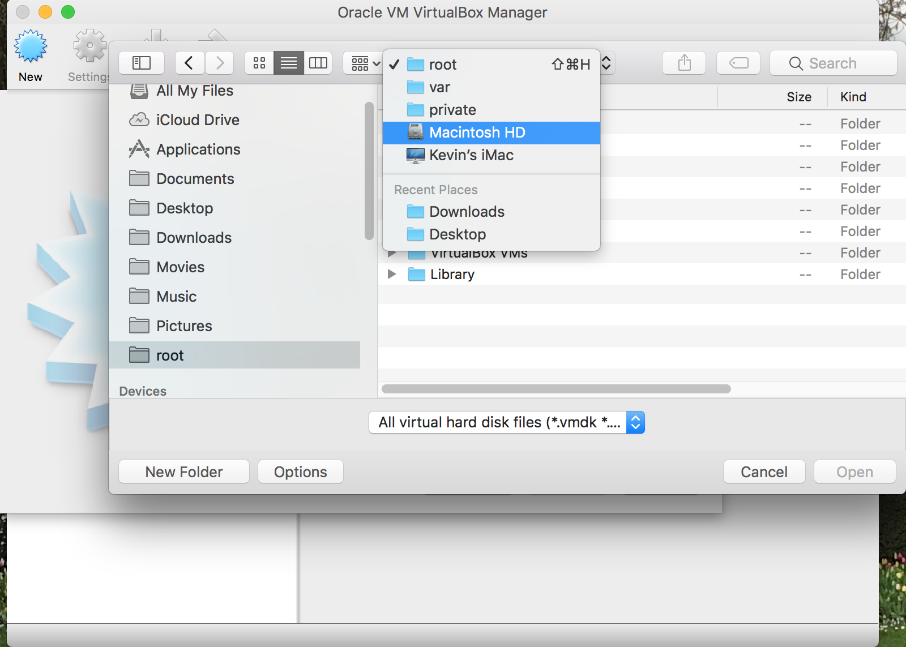

In this folder you should find RawDisk.vmdk. Click on Open.

If you get an error VERR\_RESOURCE\_BUSY when trying to open RawDisk.vmdk make sure that the **external virtual** disks haven't been mounted again (check using `diskutil list` and fix using the same `diskutil unmountdisk` command as before).

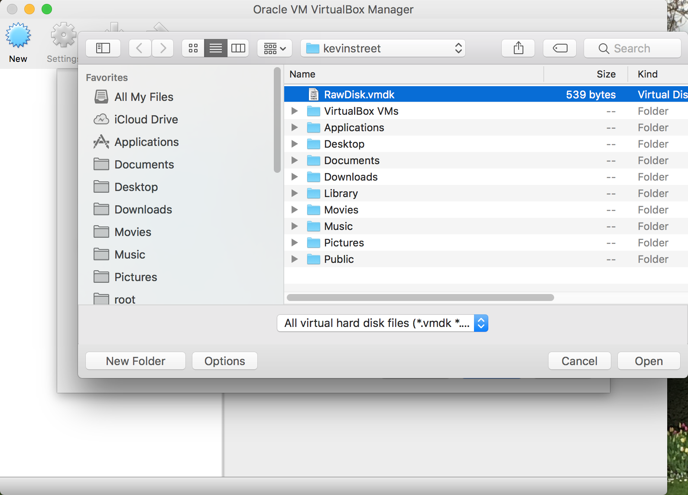

As soon as you click Open Mac OS will actually remount the disk -- how annoying! This must be rectified again by using the command the same way as before. In my case it is  `diskutil unmountdisk /dev/disk5`. You will have to do this in a new Terminal window as you can no longer interact with the one you launched VirtualBox from until you close VirtualBox.

Once that is done click Create.

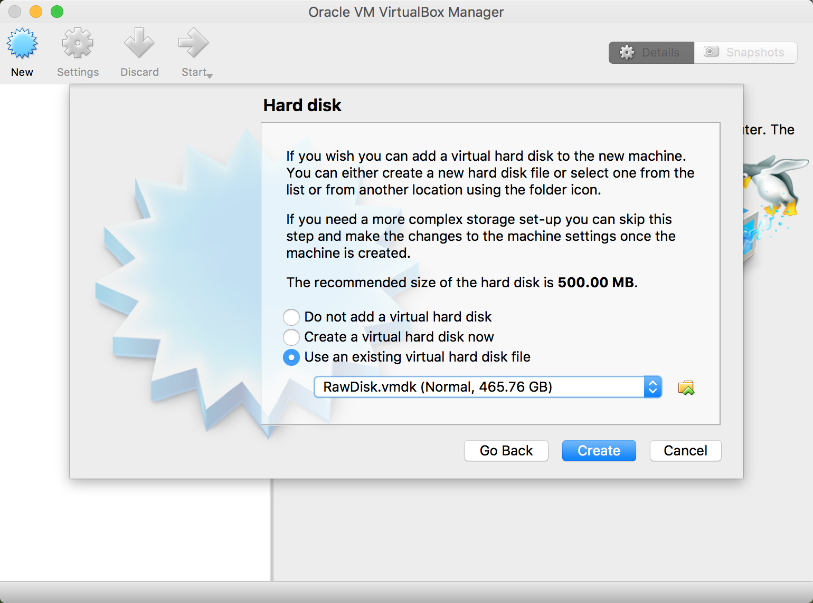

Open Settings for the VM and go to Storage and select the CD icon underneath RawDisk.vmdk. Next to Optical Drive click on the small CD icon and use the file explorer that pops up to select your SpinRite.iso file. Once that is done click on OK.

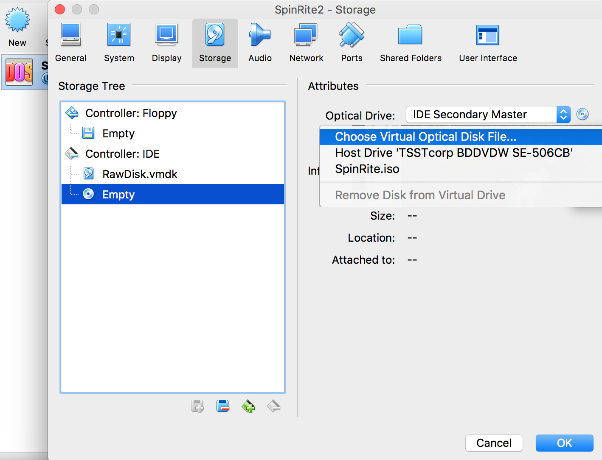

Power on the VM and it should automatically boot from the CD and launch SpinRite! Assuming you already know how to use SpinRite make your way through the menu and select the disk you have attached to your Mac.

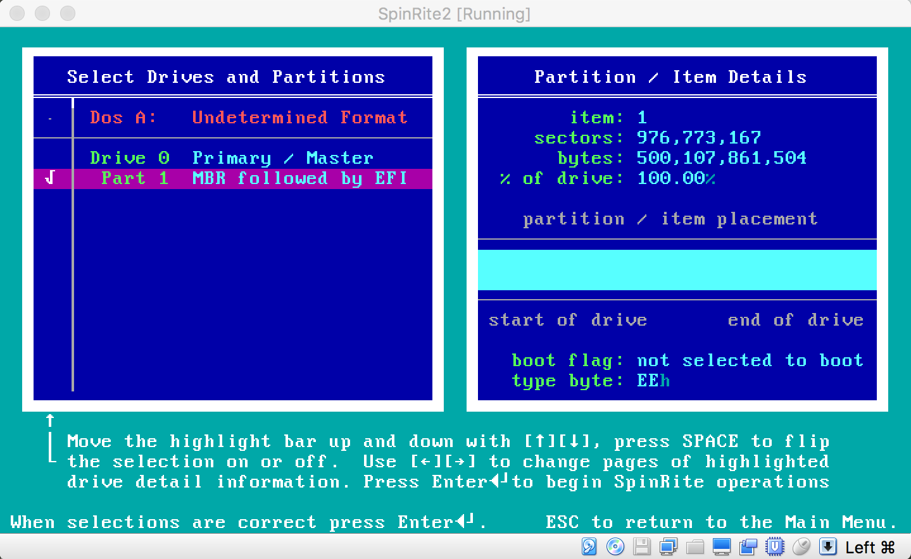

Start the SpinRite process and let it do its magic!

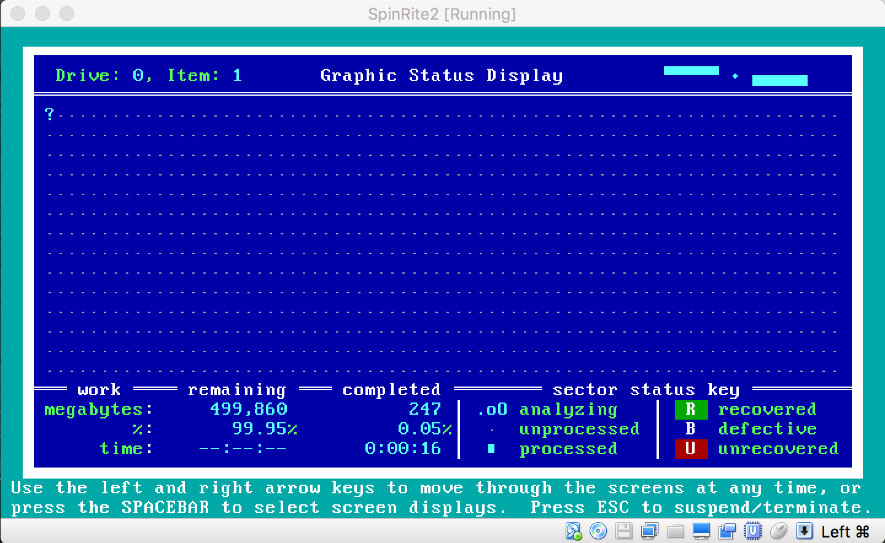

That's it for running SpinRite on your Mac. Phew! ... Bring on the future releases of SpinRite 6.x and 7.0 for better Mac compatibility!

## Running on internal drive

> Original article: <https://kevinstreet.co.uk/2017/10/16/running-spinrite-6-0-on-macos-part-2/>

The first part of this guide focused on running SpinRite on your Mac to scan an external drive. However, what if you want to run SpinRite on your Mac's internal drive? If you're running a fairly modern Mac your storage will be soldered to the motherboard making it impossible to remove. So much for removing the drive so that you can run SpinRite on another computer! This post will guide you through the process of running SpinRite on your Mac's internal storage *using your Mac!*

In order to proceed with this you will need an external hard drive or USB drive with at least 20 GB of space available on it. This is because you will be installing MacOS onto an external drive and booting your Mac from it. The faster this storage, the better! USB 3.1 (and USB C) and Thunderbolt drives will work best.

As with Part 1 this guide is aimed at more advanced users. I highly recommend making a backup of your system before starting (assuming your hard drive isn't so far gone you can't do that). I also recommend reading Part 1 to familiarise yourself with the process that will be followed here, though it is not identical it is similar.

I would also like to thank Miguel from the comments section of Part 1 for the inspiration for Part 2.

### Installing MacOS on an external drive

The first part of this guide is to install MacOS onto an external drive. Start by opening the App Store and searching for MacOS High Sierra and proceeding to download it.

While that is downloading plug in your external drive and open Disk Utility. In the View menu make sure Show All Devices is selected.

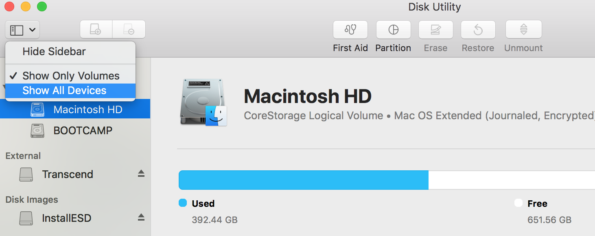

When selecting your external storage make sure you select the top level item (in my example below this is JetFlash Transc... rather than Transcent below it) and click Erase. Give it any name you wish and make sure the format is Mac OS Extended (Journaled) and the Scheme is set to GUID Partition Map.

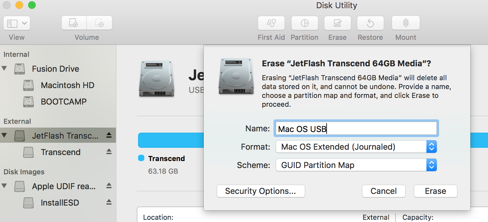

Once that is done wait for the MacOS High Sierra download to complete. Once it has the installer will launch automatically. On the first screen of the installer click Next and then accept the EULA. On the disk selection screen click Show All Disks... and then select your external drive.

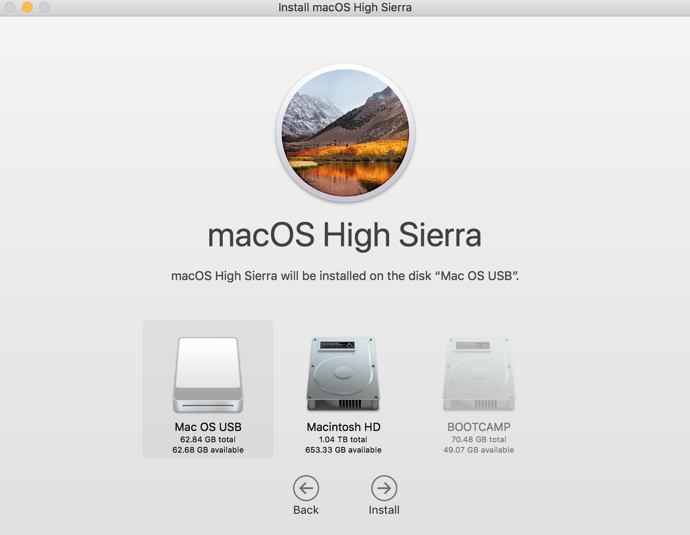

Click Install and you will be prompted to enter your password in order to install a helper. Enter your password and click Add Helper and the installation will begin. Once the first part of the install is done your Mac will reboot and continue installing. Allow this process to complete.

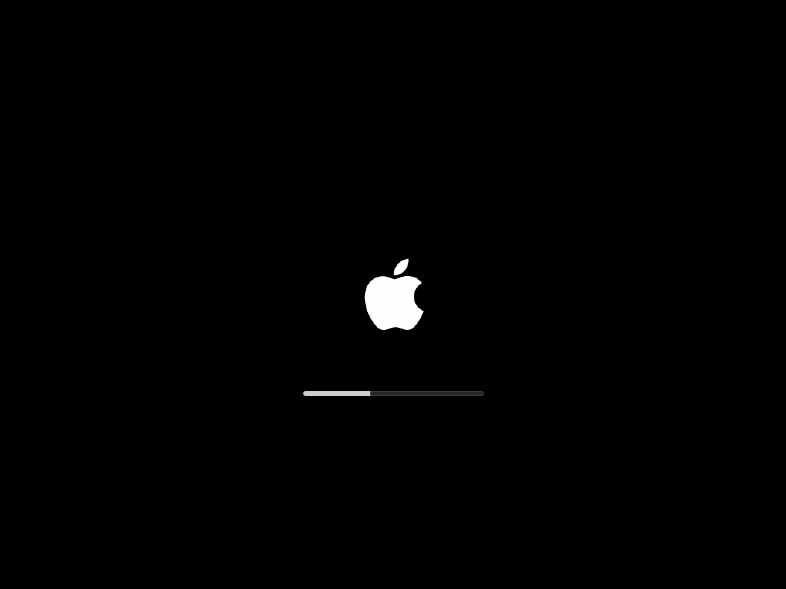

When this is done you will need to run through the first startup process, setting your language and keyboard options. Go through it as minimally as possible (for example you don't need to sign in with your Apple ID). You should connect to WiFi or ethernet as you will need to install VirtualBox and will need a way to transfer your SpinRite.ISO to this install of MacOS.

### Running SpinRite on your Mac's internal storage

All steps in this part of the guide need to be done from your new MacOS install running from your external storage. If you need to return to your regular MacOS install simply restart your Mac and remove the external storage from your Mac.

The first step is to [download and install VirtualBox](https://www.virtualbox.org/wiki/Downloads). There is nothing special about the installation so just follow the wizard through without changing any of the options. You also need to transfer your copy of SpinRite to the new MacOS install (you need the ISO, read the first section in Part 1 of this series for details on getting that).

If your internal Mac storage is encrypted with FileVault MacOS will prompt you for the password to unlock it every time the drive mounts. You can click Cancel any time this prompt appears as it is not necessary to unlock the drive to run SpinRite on it.

With VirtualBox installed and your SpinRite.ISO at the ready, let's begin!

Start by opening Terminal and running `diskutil list`. A list of disks attached to your Mac will be returned and the one we are looking for is your **internal** disk. Look for the one with a type of Apple\_HFS or Apple\_APFS. In my example this is /dev/disk0.

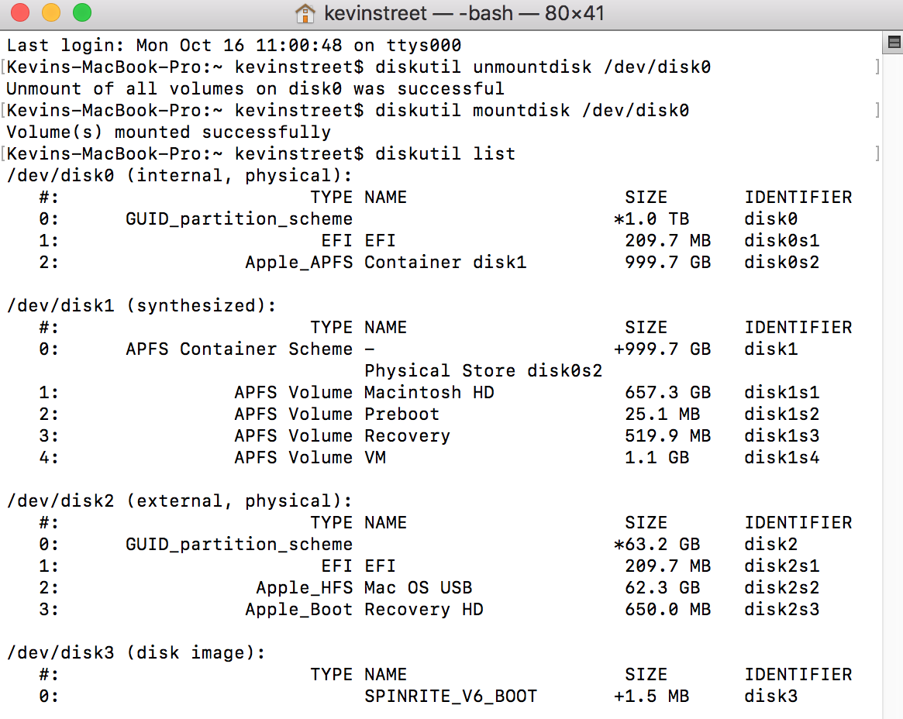

The next thing to do is unmount this drive. This is done by typing in `diskutil unmountdisk /dev/disk0`. Remember to change this disk to the one that is correct for you.


Now you need to create a vmdk file that will be attached to the virtual machine. This vmdk will direct all input and output to your Mac's internal drive. This is done using the following command:

`sudo /usr/local/bin/VBoxManage internalcommands createrawvmdk -filename RawDisk.vmdk -rawdisk /dev/disk0`

If you get an error stating VERR\_RESOURCE\_BUSY make sure /dev/disk0 is not mounted (rerun the command `diskutil unmountdisk /dev/disk0` if necessary). When you run the command you will be prompted for your password, enter it and press enter.

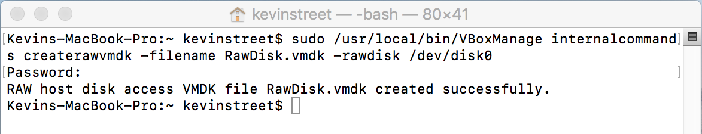

This will create a file RawDisk.vmdk in the root of your home directory. This will also re-mount the disk. Unmount it again using `diskutil unmountdisk /dev/disk0`.

Now you need to launch VirtualBox as root which can also be done using Terminal. This is required to allow read and write access to a raw device. Launch VirtualBox using the following command:

```console
sudo /Applications/VirtualBox.app/Contents/MacOS/VirtualBox
````


**Do not close this Terminal window.** As VirtualBox was launched through Terminal you must keep Terminal open throughout the rest of the process and while using SpinRite.

Create a new VM by clicking New, give it a name, select Other under Type and under version select DOS, then click Continue.


Under Memory size the default of 32 MB is more than enough so accept that and click Continue.


Under Hard disk select Use an existing virtual hard disk file and click on the little folder icon next to it to bring up the file selection prompt.


As you are running VirtualBox under root you will be taken to the folder structure for the root user account. However the RawDisk.vmdk file is saved in your user area. At the top of the file selection window click on the drop down box and select Macintosh HD (or whatever your Mac's hard drive is called). From there select Users > your username.


In this folder you should find RawDisk.vmdk. Click on Open.

If you get an error VERR\_RESOURCE\_BUSY when trying to open RawDisk.vmdk make sure that /dev/disk0 haven't been mounted again (check using `diskutil list` and fix using the same `diskutil unmountdisk` command as before).


As soon as you click Open MacOS will remount the disk. This must be rectified again by using the command the same way as before. In my case it is  `diskutil unmountdisk /dev/disk0`. You will have to do this in a new Terminal window as you can no longer interact with the one you launched VirtualBox from until you close VirtualBox.

Once that is done click Create.


Open Settings for the VM and go to Storage and select the CD icon underneath RawDisk.vmdk. Next to Optical Drive click on the small CD icon and use the file explorer that pops up to select your SpinRite.iso file. Once that is done click on OK.


Power on the VM and it should automatically boot from the CD and launch SpinRite! Assuming you already know how to use SpinRite make your way through the menu and select the disk you have attached to your Mac. It is recommended that you only run SpinRite on Level 2 for SSD storage.

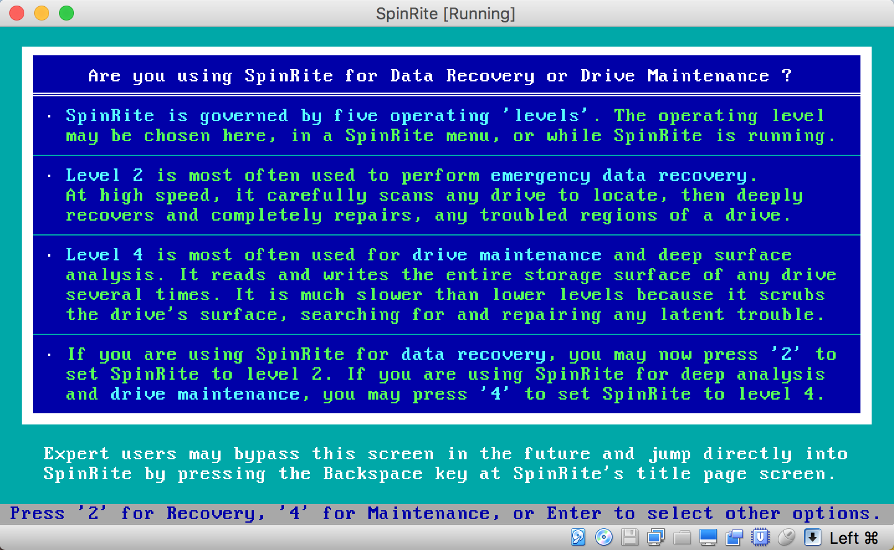

And that's it! You may wish to hold on to your external MacOS install for future use as it is quite a hassle getting one of those set up and it is good practise to run SpinRite on your drive on a fairly regular basis.
