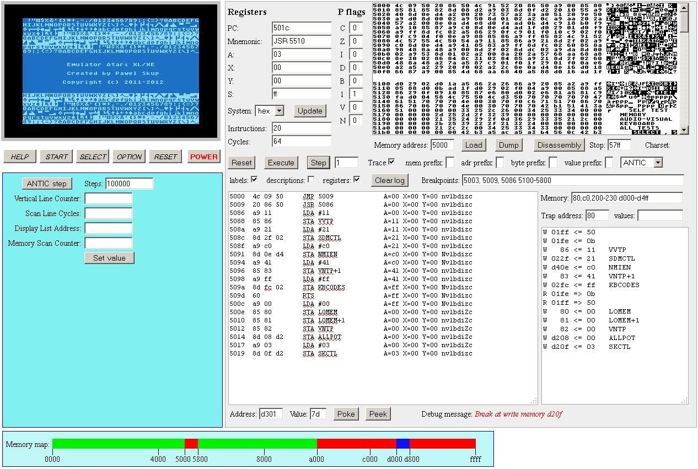

# Emulator komputera Atari XE w przeglądarce www

> Original article: <http://www.programistrz.pl/projekty/atari/>

## Geneza projektu

Pomysł napisania emulatora procesora [MOS 6502](http://pl.wikipedia.org/wiki/MOS_Technology_6502) (który był używany w latach 80. ubiegłego wieku w wielu popularnych komputerach domowych - w tym w [Atari XL/XE](http://pl.wikipedia.org/wiki/Rodzina_8-bitowych_Atari)) zrodził się dawno temu, bo około 1995 roku. Wtedy posiadałem jeszcze komputer [Atari 65XE](http://pl.wikipedia.org/w/index.php?title=Plik:65xe.jpg), z którego czasami korzystałem. Posiadałem w tamtym czasie też komputer PC i to na nim głównie programowałem. Wygoda pracy (szybkość i większa rozdzielczość ekranu) na PC oraz jego popularność spowodowały, że porzuciłem pisanie programów na Atari, choć miałem duży sentyment do tego komputera. Dość duża popularność w Polsce tego sprzętu w tamtym czasie powodowała, że wciąż pojawiały się jeszcze różne programy (gry i użytki) na te komputery. To było impulsem powstania pomysłu (i częściowej, nigdy nie skończonej realizacji), by napisać dość zaawansowany kompilator asemblera procesora MOS 6502 działający na komputerach PC (który generowałby kod działający na komputerach Atari). Oczywiście prócz asemblera przydatny byłby też jakiś debugger (też na PC), dzięki któremu sprawniej pisałoby się i testowało programy. Kompilator asemblera zacząłem nawet pisać (w [Turbo Pascalu](http://pl.wikipedia.org/wiki/Turbo_Pascal)), ale szybko go porzuciłem (był inne rzeczy - bardziej przydatne - do zrobienia).

Później temat ten wracał co jakiś czas przy różnych okazjach, pojawiła się też myśl napisania własnego emulatora komputera Atari serii XL/XE (w [Delphi dla Windows](http://en.wikipedia.org/wiki/Embarcadero_Delphi)). Wiele razy analizowałem w myślach możliwość napisania emulatora procesora MOS 6502 (jako podstawy dla późniejszego emulatora komputera Atari) - to był prosty (ale jednocześnie bardzo wydajny i rewolucyjny jak na swoje czasy) procesor i jego emulacja nie byłaby skomplikowana (3 rejestry, 7 wskaźników/flag, 13 trybów adresowania, proste operacje, łatwe zarządzanie pamięcią), jednakże pomysłów tych nigdy nie zrealizowałem.

W grudniu 2011 roku trafiłem na artykuł o starych komputerach domowych (w tym Atari), zacząłem szukać dodatkowych informacji na ten temat (o [twórcy](http://pl.wikipedia.org/wiki/Nolan_Bushnell) i historii [firmy Atari](http://pl.wikipedia.org/wiki/Atari_%28ameryka%C5%84skie_przedsi%C4%99biorstwo%29), kulisach powstania rewelacyjnego [procesora MOS 6502](http://en.wikipedia.org/wiki/MOS_Technology_6502), itd.). Trafiłem też na fora internetowe, poświęcone komputerom Atari. Wiele z nich było założonych w Polsce i prowadzonych przez pasjonatów tego komputera. Dotarłem do mnóstwa bardzo ciekawych materiałów, między innymi dotyczących szczegółów sprzętowych oraz programowych, które w latach, gdy sam używałem Atari, nie był mi znane.

Impulsem do napisania własnej wersji emulatora procesora MOS 6502 było natrafienie na stronę [Visual 6502 in JavaScript](http://visual6502.org/JSSim/index.html), zawierającą coś niesamowitego: wierny działający symulator procesora MOS 6502 napisany w JavaScripcie a bazujący na symulacji działania każdej bramki logicznej, z której ten procesor się składa. Schemat elektroniczny tego procesora został odtworzony poprzez reverse-engineering, który jest opisany [tutaj](http://visual6502.org/docs/6502_in_action_14_web.pdf), a [tutaj](http://www.youtube.com/watch?gl=PL&v=HW9AWBFH1sA) można obejrzeć film z prezentacji tego żmudnego procesu, zawierającą omówienie działania tego procesora oraz jego symulatora.

*Ciekawostka: przy projektowaniu układów współpracujących z procesorem 6502 firmy MOS Technology oraz oprogramowania do niego (w tym BASIC'a) swój udział miał [Steve Wozniak](http://en.wikipedia.org/wiki/Steve_Wozniak), który wcześniej pracował w HP - to właśnie on, wraz ze [Steve'em Jobsem](http://pl.wikipedia.org/wiki/Steve_Jobs) i [Ronaldem Wayne'em](http://pl.wikipedia.org/wiki/Ronald_Wayne) w 1976 założył firmę [Apple](http://pl.wikipedia.org/wiki/Apple_Inc), a pierwsze komputery tej firmy były oparte właśnie na tym procesorze.*

## Emulator procesora 6502

Pod koniec roku 2011 napisałem na szybko (w ciągu 2 dni) większość kodu emulatora procesora 6502 w JavaScripcie, który mogłem potem porównać (co do poprawności działania) z wynikami pracy wspomnianego powyżej symulatora. Oczywiście przy pisaniu swojego emulatora korzystałem z dostępnej (dość bogatej) dokumentacji, ale nie wszystkie zachowania procesora były tam opisane. Problem był w przypadku dodawania i odejmowania liczb, gdy procesor pracuje w trybie dziesiętnym a argumenty operacji miały wartości niepoprawne w kodzie BCD (np. 0xAB) - nigdzie nie było opisane, jak w takich przypadkach zachowuje się procesor (jaka jest wtedy wartość odpowiednich flag). Dzięki możliwości sprawdzenia tych operacji empirycznie na symulatorze mogłem zaobserwować te zależności i odpowiednio dostosować mój kod.\
W trakcie pisania, jak i po zakończeniu całego emulatora, uruchamiałem testowe programy, przygotowane w asemblerze (i skompilowane do bajtowego kodu maszynowego przy pomocy aplikacji [6502 Assembler](http://www.masswerk.at/6502/assembler.html)), które miały na celu przetestowanie poprawności działania mojego emulatora i wykrycie ewentualnych błędów. Kiedy zakończyłem prace nad tym emulatorem i wszystko działało poprawnie, zabrałem się za napisanie dalszych modułów niezbędnych w emulatorze komputera Atari XL/XE.

## Moduł zarządzania pamięcią

Kolejnym modułem, który napisałem, był moduł emulacji obsługi pamięci komputera. Wcześniej, w celach testowania emulatora procesora 6502, używałem zwykłej tablicy symulującej pamięć komputera (bez podziału na RAM, ROM i obszar rejestrów sprzętowych). Do testowania działania emulacji procesora takie proste rozwiązanie było wystarczające - po prostu w wybrany obszar pamięci (tablicy) wgrywałem kod bajtowy do wykonania, który potem był odczytywany/zapisywany przez poszczególne rozkazy emulowanego procesora.\
Jednak prawdziwy komputer Atari miał bardziej złożoną obsługę pamięci - między innymi zarządzał dostępną dla CPU pamięcią RAM/ROM w obszarach zajmowanych przez interpreter BASIC'a oraz system operacyjny (OS), a w komputerach z pamięcią większą niż 64 MB RAM (np. w modelu 130 XE) również tą dodatkową pamięcią (podzieloną na banki wielkości 16 KB). Tym wszystkim zarządzał układ [MMU](http://en.wikipedia.org/wiki/Atari_MMU) (Memory Management Unit), którego emulator postanowiłem napisać. Mój emulator, tak jak prawdziwy układ MMU, kontroluje podłączone bloki pamięci (RAM i ROM) i pilnuje, by w obszarach pamięci ROM nie można było zapisywać. Potrafi on wczytać pliki binarne zawierające ROM systemu operacyjnego czy BASIC'a, takie jakie wykorzystują "prawdziwe" emulatory Atari.

## Procesor graficzny ATNIC

Mając już te dwa powyższe emulatory CPU i MMU zabrałem się za napisanie emulatora trzeciego układu, potrzebnego do emulowania komputera Atari, a mianowicie procesora [ANTIC](http://pl.wikipedia.org/wiki/ANTIC). To najbardziej skomplikowany (do emulowania) układ, ponieważ operuje on na swojej własnej liście komend do wykonania (jego program zwany jest [Display List](http://atariki.krap.pl/index.php/ANTIC_Display_List)), która określa na podstawie danych zawartych w pamięci operacyjnej komputera, w jaki sposób ma być wyświetlany obraz na ekranie monitora.\
ANTIC posiada 6 trybów tekstowych oraz 8 trybów graficznych, których linie mogą być dowolnie mieszane między sobą na ekranie (decyduje o tym DL). Posiada też możliwość scrollowania tekstu w pionie i poziomie (tego jeszcze nie implementowałem), może też generować przerwanie procesora ([DLI](http://www.atarimagazines.com/compute/issue47/153_1_Atari_Display_List_Interrupts.php)) i wtedy CPU może wykonać operacje dotyczące modyfikacji danych przygotowanych do wyświetlania (np. zmiany kolorów) - oczywiście o tym decyduje programista. DLI również jeszcze nie zaimplementowałem (ale zamierzam), bo wiąże się to ze skoordynowaniem wykonywania programu głównego CPU z wyświetlaniem obrazu przez ANTIC (oba procesory pracują równolegle, niezależnie od siebie, z inną prędkością, ale dzięki przerwaniom DLI mogą synchronizować swoje działania). Tak samo jeszcze nie oprogramowałem obsługi graczy i pocisków ([Player/Missile Graphics](http://www.page6.org/archive/issue_08/page_10.htm)), ale oczywiście zamierzam to zrobić.

Obecnie do napisania jest kilka rzeczy. Przede wszystkim muszę poprawić i przyspieszyć działanie modułu ANTIC oraz opracować metodę quasi-równoległego wykonywania operacji przez CPU oraz ANTIC. Potem będę musiał zaimplementować obsługę klawiatury i przerwań IRQ (za obsługę których w Atari był odpowiedzialny układ [POKEY](http://pl.wikipedia.org/wiki/POKEY), który również generował dźwięk oraz odpowiadał za transmisję szeregową z urządzeniami zewnętrznymi - magnetofonem, stacją dyskietek i innymi peryferiami). Z oczywistych powodów ja nie będę emulował dźwięków (ani transmisji szeregowej), bo JavaScript nie ma takiej możliwości. Nie ma też takiej potrzeby, ponieważ ma to być prosty emulator Atari.

## Wersja testowa emulatora ATARI

Jak wygląda aplikacji (która jeszcze nie jest skończona) w trybie debugowania można obejrzeć na poniższym zrzucie ekranu:

Można też się pobawić nieco ograniczoną, ale w pełni interaktywną **[wersją demonstracyjno-testową](http://www.programistrz.pl/projekty/atari/demo/atari_demo.html)**. Po lewej stronie u góry jest "ekran monitora", którego zawartość jest wyświetlana przez moduł [antic.js](http://www.programistrz.pl/projekty/atari/demo/antic.js), który symuluje działanie procesora ANTIC (na tyle wiernie, na ile jest to możliwe w tej technologii/szybkości wyświetlania). Zaraz poniżej są klawisze konsoli (w tym przycisk POWER służący włączaniu i wyłączaniu działania emulatora). Jeszcze niżej jest obszar przydatny przy debugowaniu działania modułu antic.js, zawierający wartości kluczowych parametrów tego modułu (które można też modyfikować). Po prawej stronie jest dość rozbudowany moduł obsługi działania głównego procesora Atari (MOS 6502), który jest emulowany (bardzo wiernie) przez moduł [cpu6502.js](http://www.programistrz.pl/projekty/atari/demo/cpu6502.js). Moduł ten emuluje dwa typy procesora: NMOS 6502 oraz CMOS 65C02. Osoby zainteresowane różnicami odsyłam do stosownej literatury. Za zarządzanie pamięcią odpowiada moduł [mmu.js](http://www.programistrz.pl/projekty/atari/demo/mmu.js). Realizuje on schemat działania analogiczny do tego w Atari 65 XE (na razie nie obsługuje on jeszcze pamięci rozszerzonej jak np. w Atari 130 XE). Dodatkowo na potrzeby debugowania emulatora oraz analizy kodu programów stworzyłem moduł [DEFINE_MEMORY_LABEL.js](http://www.programistrz.pl/projekty/atari/demo/DEFINE_MEMORY_LABEL.js) zawierający etykiety większości adresów pamięci Atari wraz z ich opisem. Moduł [keyboard.js](http://www.programistrz.pl/projekty/atari/demo/keyboard.js) służy do emulacji klawiatury Atari wraz z jego specyficznymi klawiszami specjalnymi (jak CONTROL czy INVERSE) - jego głównym zadaniem jest konwersja klawiszy PeCeta na kody klawiszy Atari. Główny moduł [atari.js](http://www.programistrz.pl/projekty/atari/demo/atari.js) (na razie w fazie pisania/testowania) zajmuje się zarządzaniem wszystkimi wymaganymi do emulacji elementami oraz zapewnia kontrolę nad emulatorem poprzez stronę HTML.\
Po włączeniu emulatora (przyciskiem "POWER") automatycznie wczytuje się do pamięci RAM (pod adresem $0600) [kod demonstracyjny](http://www.programistrz.pl/projekty/atari/demo/atari_demo.asm), napisany przeze mnie w asemblerze 6502 (i skompilowany, wspomnianym wcześniej, [asemblerem](http://www.masswerk.at/6502/assembler.html) działającym w przeglądarce internetowej), który jest następnie wykonywany przez CPU - ustawia on tryb graficzny GRAPHICS 0 (dzięki przygotowanej, pod adresem $9C20, Display List dla ANTICa) oraz wypełnia pamięć ekranu (będącej pod adresem $9C40) przykładowymi danymi, które potem wyświetla moduł ANTICa.

## Ciekawe linki

* [NMOS 6502 Opcodes](http://www.6502.org/tutorials/6502opcodes.html)
* [6502 Microprocessor](http://nesdev.com/6502.txt)
* [6502 Instruction Set](http://e-tradition.net/bytes/6502/6502_instruction_set.html)
* [6502 Opcodes](http://www.thealmightyguru.com/Games/Hacking/Wiki/index.php?title=6502_Opcodes)
* [CPU 6502 - Technical Information](http://www.fceux.com/web/help/fceux.html?6502CPU.html)
* [6502 Undocumented Opcodes - Hidden features for 6502 CPU assembly](http://www.intel-assembler.it/portale/5/6502_undocumented_opcodes/CPU_6502_features.asp)
* [Documentation for 6502/6510/8500/8502 instruction set](http://www.zimmers.net/anonftp/pub/cbm/documents/chipdata/64doc)
* [CPU 6502/6510/8500/8502 Opcodes](http://www.oxyron.de/html/opcodes02.html)
* [How MOS 6502 Illegal Opcodes really work](http://www.pagetable.com/?p=39)
* [The 6502/65C02/65C816 Instruction Set Decoded](http://www.llx.com/~nparker/a2/opcodes.html)
* [CPU 6502 Instructions](http://www.obelisk.demon.co.uk/6502/instructions.html)
* [CPU 6502 Undocumented Opcodes](http://www.ataripreservation.org/websites/freddy.offenga/illopc31.txt)
* [Functional Test for the NMOS 6502 - request for verification](http://forum.6502.org/viewtopic.php?f=2&t=2241)
* [AllSuiteA.asm - hmc-6502 - A pin-compatable, open source 6502 microprocessor](http://code.google.com/p/hmc-6502/source/browse/trunk/emu/testvectors/AllSuiteA.asm)
* [CPU 6502 Unsupported Opcodes](http://visual6502.org/wiki/index.php?title=6502_Unsupported_Opcodes)
* [CPU 6502 Giant Electronic Schematic.pdf](http://www.downloads.reactivemicro.com/Public/Electronics/CPU/6502%20Schematic.pdf)
