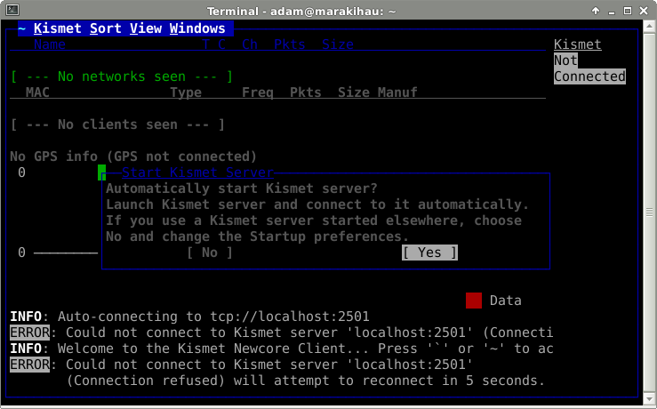
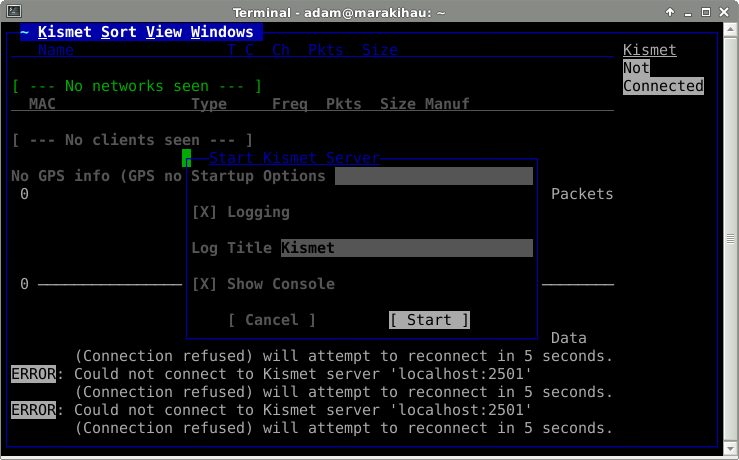
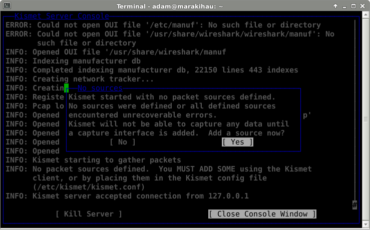
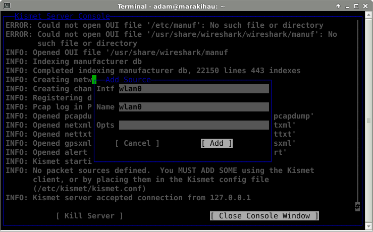
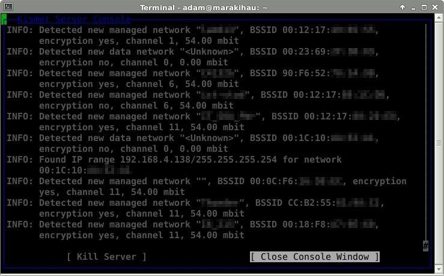

# Wprowadzenie do nasłuchiwania ruchu

> Original article: <https://sekurak.pl/bezpieczenstwo-sieci-wi-fi-czesc-2-wprowadzenie-do-nasluchiwania-ruchu/>

## Wstęp

[Analizowaliśmy już](01-wstep.md) możliwości i potencjalne problemy związane z zabezpieczeniem sieci Wi-Fi. Chciałbym teraz się przyjrzeć pierwszemu etapowi analizy bezpieczeństwa sieci WiFi jakim jest rozpoznanie. Analiza publicznie dostępnych informacji pozwoli zrozumieć zagrożenia dla sieci WiFi.

Wykorzystanie współdzielonego medium sprawia, że cała transmisja „lata" wokół nas i jest potencjalnie dostępna dla każdego, kto znajdzie się w jej zasięgu. W związku z tym, nie ma nic prostszego, niż zacząć ją nasłuchiwać.

Podobnie jak ma to miejsce w przypadku kart sieciowych LAN, karta Wi-Fi odbiera tylko ruch który jest do niej zaadresowany, pomijając wszystkie inne pakiety. Zatem, w celu odebrania pakietów, które nie są do nas adresowane, kartę sieci LAN należy przełączyć w tryb promiscuous. Jednak jeśli w sieci używany jest switch, na kablu do karty sieciowej pojawią się tylko i wyłącznie pakiety do nas adresowane.

> W przypadku sieci Wi-Fi nie ma takiego ograniczenia, a tryb pozwalający nasłuchiwać całą otaczającą transmisję nazywa się monitor. W tym trybie karta odbiera wszystkie ramki wszystkich otaczających nas sieci Wi-Fi, które do niej fizycznie docierają. **Z tego powodu, tryb ten jest szczególnie interesujący w aspekcie bezpieczeństwa.** Dodatkowo, nawet w przypadku gdy sieć używa szyfrowania, pewne dane sterujące siecią nie są (bo nie mogą być) szyfrowane i istnieje możliwość zdobycia informacji, np. o adresach MAC autoryzowanych urządzeń.

Ze względu na mnogość i różną jakość chipsetów, z których wykorzystaniem budowane są karty bezprzewodowe, nie każdy firmware/sterownik pozwala na przejście w tryb monitor. Natomiast, dla niektórych sterowników istnieją nieoficjalne patche. Są one domyślnie zainstalowane w dystrybucjach Linuxa, t.j. Backtrack/Kali. W przypadku zakupu nowej karty, najlepszym rozwiązaniem wydają się te oparte o układ Atheros, gdyż dają największe możliwości niskopoziomowego sterowania kartą.

## Praktyczne wykorzystanie trybu Monitor

Większość dobrych narzędzi związanych z bezpieczeństwem Wi-Fi jest dostępna tylko pod systemami z rodziny Linux. W związku z tym skupimy się właśnie na nich. Jeśli nie posiadacie własnego linuxa, polecam pobranie dystrybucji Kali dedykowanej do testów bezpieczeństwa. Posiada wszystkie poniższe narzędzia preinstalowane. Ponadto Kali Linux można także uruchomić w trybie Live, bez potrzeby instalacji na dysku.

Ze względu na fakt, że wykonywane działania dotyczą zarządzania siecią, konieczne jest wykonywanie ich z poziomu roota. W przykładach analizowanych w tym artykule będę korzystał z karty Wi-Fi TP-Link TL-WN722N. Jest to karta USB wykorzystująca chipset Atheros. Posiadam już zainstalowany system operacyjny, ze wszystkimi potrzebnymi narzędziami, oparty o dystrybucję Debian GNU/Linux. W związku z tym nie mam potrzeby instalować Kaliego.

Zaczynam pracę od podłączenia karty Wi-Fi. Na szczęście współcześnie większość urządzeń działa już pod linuxem bez specjalnych problemów. Najpierw sprawdzam, czy system wykrył moją kartę usb:

```console
root@debian:~# lsusb | grep "Ath"
Bus 002 Device 002: ID 0cf3:9271 Atheros Communications, Inc. AR9271 802.11n
```
Dodatkowo, od razu widzę ją dostępną jako nowy interfejs sieciowy.

```console
root@debian:~# iwconfig
lo no wireless extensions.
wlan0 IEEE 802.11bgn ESSID:off/any
Mode:Managed Access Point: Not-Associated Tx-Power=0 dBm
Retry long limit:7 RTS thr:off Fragment thr:off
Encryption key:off
Power Management:off
eth0 no wireless extensions.
```

W przypadku gdy karta nie będzie widoczna, może to oznaczać, że odpowiedni moduł nie został załadowany. W moim przypadku kartę obsługuje moduł ath9k_htc i można go załadować ręcznie:

```console
adam@debian:~# modprobe ath9k_htc
```

Skoro mam już działającą kartę, mogę przejść do testowania aplikacji do nasłuchiwania sieci.

## Kismet

Pierwszym interesującym narzędziem, wykorzystującym możliwości trybu Monitor, jest Kismet. Jest to narzędzie z długą historią i wieloma interesującymi opcjami. Pozwala na przykład na szerokie rozpoznanie otaczających nas sieci Wi-Fi. Dodatkowo, posiada wsparcie do GPS. Ponadto instalacja Kismeta jest bardzo prosta i sprowadza się właściwie do zainstalowania go z systemu paczek. Aplikacja składa się z serwera nasłuchującego i interfejsu konsolowego. Przejdźmy zatem do testowania. Moja wersja Kismeta to:

```console
adam@debian:~# kismet -v
Kismet 2013-03-R0
```

1. Uruchamiam Kismeta:

    ```console
    adam@debian~:# kismet
    ```

    Otrzymuję początkowe okno interfejsu z komunikatem, że serwer Kismet'a nie działa i pytanie czy należy go uruchomić. Wybieram opcję „Yes".

    


2. Dostaję okno wyboru opcji dla serwera. Pozostawiam wszystkie opcje domyślne i wybieram „Start".

    


3. W tle widzę konsolę z logami uruchamianego serwera. Nad nią pojawił się komunikat mówiący, że nie mam zdefiniowanych żadnych źródeł i czy chcę teraz dodać takie źródło? (Źródło -- to informacja o użytym interfejsie i jego sterowniku.) Wybieram opcję „Yes". Zdefiniowanie źródła jest niezbędne do pracy z Kismetem. W większości przypadków Kismet poprawnie rozpozna driver dla karty sieciowej. Natomiast w przypadku niepowodzenia odsyłam do manuala Kismeta, w którym szczegółowo opisano konfigurowanie źródeł dla różnych rodzajów kart.

    


4. W tym oknie definiuję moje źródło. W moim przypadku wystarczyło podanie interfejsu (pole „Intf") oraz mojej nazwy, pod którą kismet będzie widział źródło danych. Tutaj, dla uproszczenia, podałem także wlan0.

    


5. W konsoli serwera widzę wykrycie pierwszych sieci bezprzewodowych. Wybieram „Close Consol Window", gdyż chcę przejść już do interfejsu.

    


6. Przeszedłem teraz do właściwego okna pracy z Kismetem. Przełączanie pomiędzy oknami i opcjami odbywa się przy pomocy klawisza Tab, a dostęp do menu -- przy pomocy „Esc", „\`" lub „~". W górnym oknie mam widoczne znalezione sieci WiFi, a po wybraniu, przy pomocy strzałek, interesującej mnie sieci, otrzymuję szczegóły dotyczące szyfrowania, producenta czy BSSID (w uproszczeniu adres MAC AP). W dolnym oknie widoczne są informację o urządzeniach w sieci. Poniżej znajduje się wykres obrazujących natężenie ruchu w tej sieci, a na samym dole znajduje się konsola logów. Menu zawiera wiele interesujących opcji, tj. sortowanie listy sieci wg różnych kryteriów, np. SSID, BSSID czy siła sygnału.

    


7. Po przejściu do menu przełączania się pomiędzy oknami (klawisz „~", a następnie „W") są dostępne różne opcje. Wybieram wyświetlenie szczegółów dotyczących sieci, naciskając klawisz „d".

    


8. Otrzymuję szczegóły związana z moją siecią, tj. użyte szyfrowanie czy siła sygnału w dB. Użycie dB zamiast % jest korzystniejsze, bo dużo bardziej miarodajne.

    


9. Wybierając Menu, mogę zamknąć bieżące okno (klawisze ~Nw).

    


10. Analogicznie, jak we wcześniejszym punkcie, po wybraniu konkretnej sieci, mogę przejść do menu wyświetlania klientów sieci (klawisze ~Wl).

    


11. Na tym zrzucie widać szczegóły innej sieci, oznaczonej na zielono, ze względu na brak szyfrowania.

    


12. Aby zakończyć pracę z Kismetem, wybieram kombinację klawiszy ~KQ oraz opcję „Kill serwer".

    

Po tej krótkiej prezentacji widać wyraźnie, że Kismet pozwala na zebranie wszystkich niezbędnych informacji na temat wybranej sieci Wi-Fi, włącznie z listą jej klientów. Stanowi to bardzo dobry punkt wyjściowy do dalszej analizy bezpieczeństwa sieci.

## Aircrack-ng

Chciałbym teraz przejść do drugiego i chyba najważniejszego oraz najpopularniejszego pakietu oprogramowania z dziedziny bezpieczeństwa Wi-Fi -- Aircrack-ng. Zawiera on w sobie wiele narzędzi pozwalających realizować różnorodne zadania, włącznie z przeprowadzaniem zoptymalizowanych i specjalistycznych ataków na szyfrowane sieci. Autor pakietu, przez ostatnie lata na bieżąco implementował w nim pojawiające się co jakiś czas nowe, coraz wydajniejsze metody ataku, włącznie z wykorzystaniem kart GPU. Ze względu na fakt, że w oficjalnych repozytoriach wielu dystrybucji znajdują się paczki instalacyjne niezawierające wielu nowych poprawek, polecam instalację bezpośrednio ze źródeł lub z repozytorium svn. Pomimo to, pakiet działa bardzo stabilnie, a my unikniemy w ten sposób wielu irytujących problemów, np. błędu ujemnych kanałów, który ciągnie się za Aircrackiem od kilku lat.

Instalacja pakietu Aircrack-ng wykracza poza zakres tego artykułu. Jednak, [instrukcja](http://www.aircrack-ng.org/doku.php?id=install_aircrack) dostarczona na oficjalnej stronie jest bardzo dobra i polecam z niej skorzystać.

W pakiecie aircrack-ng poszczególne funkcjonalności zostały rozbite na osobne programy o różnych nazwach. Dlatego wszystkie użyte poniżej polecenia dostępne są po poprawnej instalacji pakietu aircrack-ng.

1. Zaczynam od wylistowania moich interfejsów Wi-Fi. Widać, że posiadam tylko jeden (wlan0), pracujący aktualnie w trybie Managed.

    ```console
    root@debian:~# iwconfig
    lo no wireless extensions.
    wlan0 IEEE 802.11bgn ESSID:off/any
    Mode:Managed Frequency:2.437 GHz Access Point: Not-Associated
    Tx-Power=20 dBm
    Retry long limit:7 RTS thr:off Fragment thr:off
    Encryption key:off
    Power Management:off
    eth0 no wireless extensions.
    ```

2. Następnie, uruchamiam tryb monitor dla mojego interfejsu wlan0.

    ```console
    root@debian:~# airmon-ng start wlan0
    Interface Chipset Driver
    wlan0 Atheros AR9271 ath9k - [phy0]

    (monitor mode enabled on mon0)

    root@debian:~# iwconfig
    lo no wireless extensions.
    mon0 IEEE 802.11bgn Mode:Monitor Tx-Power=20 dBm
    Retry long limit:7 RTS thr:off Fragment thr:off
    Power Management:off
    wlan0 IEEE 802.11bgn ESSID:off/any
    Mode:Managed Frequency:2.437 GHz Access Point: Not-Associated
    Tx-Power=20 dBm
    Retry long limit:7 RTS thr:off Fragment thr:off
    Encryption key:off
    Power Management:off
    eth0 no wireless extensions.
    ```

    Warto zauważyć, że został utworzony nowy interfejs nazwany mon0, który, jak widać powyżej, pracuje w trybie Monitor. Co ciekawe, mój interfejs fizyczny wlan0, nadal jest w trybie Managed. Zatem, do wszystkich dalszych działań będę używał właśnie interfejsu mon0, gdyż przez niego oferowane są wszystkie funkcje pakietu Aircrack-ng.

    Przy pomocy poniższego polecenia mam możliwość wyświetlić wszystkie sieci, ich parametry i klientów w moim otoczeniu.

    ```console
    root@debian:~# airodump-ng mon0
    ```
    Prezentowane dane aktualizowane są w czasie rzeczywistym. Podając dodatkowy parametr, będący cyfrą, po nazwie interfejsu, istnieje możliwość wybrania pojedynczego kanału do nasłuchiwania. Wynik powyższego polecenia zaprezentowany jest na zrzucie ekranu:

    

    W tej konfiguracji można także podglądać transmisję sieciową przy pomocy klasycznych snifferów, tj. tcpdump czy wireshark. Przykładowy wynik uzyskany przy pomocy tcpdumpa jest następujący:

    ```console
    root@aldebaran:/tmp# tcpdump -i mon0
    tcpdump: WARNING: mon0: no IPv4 address assigned
    tcpdump: verbose output suppressed, use -v or -vv for full protocol decode
    listening on mon0, link-type IEEE802_11_RADIO (802.11 plus radiotap header), capture size 65535 bytes
    19:26:13.783139 1.0 Mb/s 2467 MHz 11b -37dB signal antenna 3 Beacon (My-SSID) [1.0* 2.0* 5.5* 11.0* 18.0 24.0 36.0 54.0 Mbit] ESS CH: 11, PRIVACY
    19:26:13.885555 1.0 Mb/s 2467 MHz 11b -37dB signal antenna 3 Beacon (My-SSID) [1.0* 2.0* 5.5* 11.0* 18.0 24.0 36.0 54.0 Mbit] ESS CH: 11, PRIVACY
    19:26:14.413204 1.0 Mb/s 2442 MHz 11b -62dB signal antenna 3 Beacon (My-SSID2) [1.0* 2.0* 5.5* 11.0* 18.0 24.0 36.0 54.0 Mbit] ESS CH: 6, PRIVACY
    19:26:14.499954 1.0 Mb/s 2472 MHz 11b -43dB signal antenna 3 Beacon (My-SSID) [1.0* 2.0* 5.5* 11.0* 18.0 24.0 36.0 54.0 Mbit] ESS CH: 11, PRIVACY
    19:26:14.597304 1.0 Mb/s 2472 MHz 11b -32dB signal antenna 3 Probe Request (My-SSID) [1.0 2.0 5.5 11.0 6.0 9.0 12.0 18.0 Mbit]
    19:26:14.597592 1.0 Mb/s 2472 MHz 11b -43dB signal antenna 3 Acknowledgment RA:00:14:a5:XX:XX:XX (oui Unknown)
    19:26:14.599232 1.0 Mb/s 2472 MHz 11b -43dB signal antenna 3 Probe Response (My-SSID) [1.0* 2.0* 5.5* 11.0* 18.0 24.0 36.0 54.0 Mbit] CH: 11, PRIVACY
    19:26:14.599436 1.0 Mb/s 2472 MHz 11b -32dB signal antenna 3 Acknowledgment RA:5c:4c:a9:XX:XX:XX (oui Unknown)
    ```

    Aby zakończyć pracę z trybem monitor, należy wydać poniższe polecenie, a interfejs mon0 znika z systemu.

    ```console
    root@debian:~# airmon-ng stop mon0
    Interface Chipset Driver
    mon0 Atheros AR9271 ath9k - [phy0] (removed)
    wlan0 Atheros AR9271 ath9k - [phy0]
    root@debian:~# iwconfig
    lo no wireless extensions.
    wlan0 IEEE 802.11bgn ESSID:off/any
    Mode:Managed Frequency:2.437 GHz Access Point: Not-Associated
    Tx-Power=20 dBm
    Retry long limit:7 RTS thr:off Fragment thr:off
    Encryption key:off
    Power Management:off
    eth0 no wireless extensions.
    ```

c.d.n.

--- *Adam Smutnicki*
