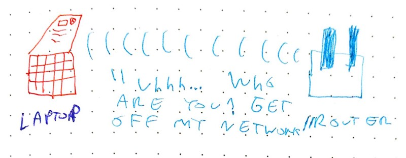
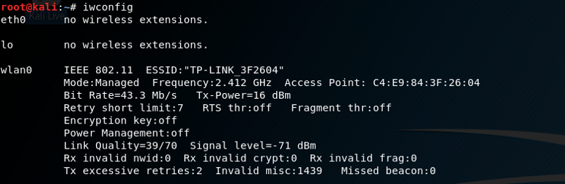
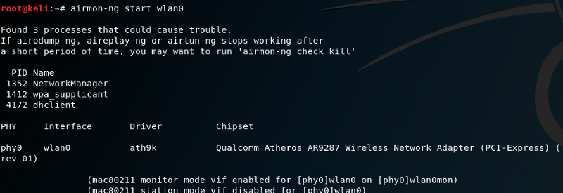
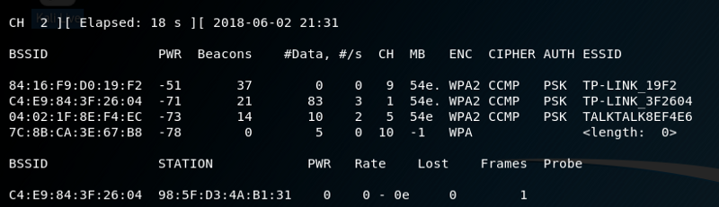
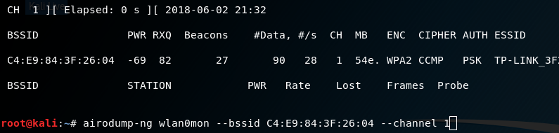
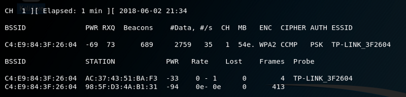
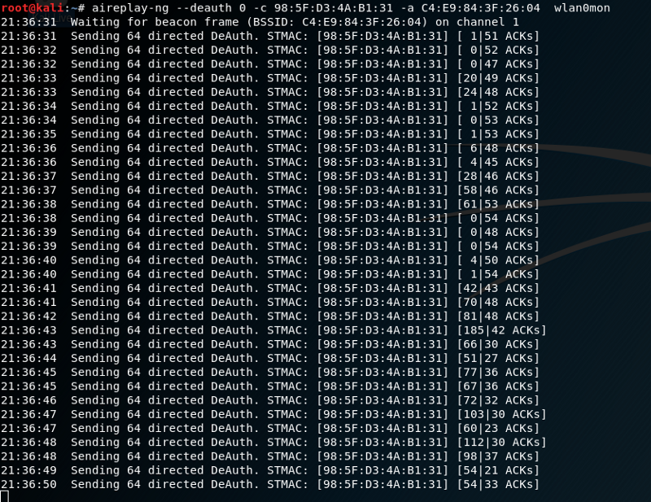
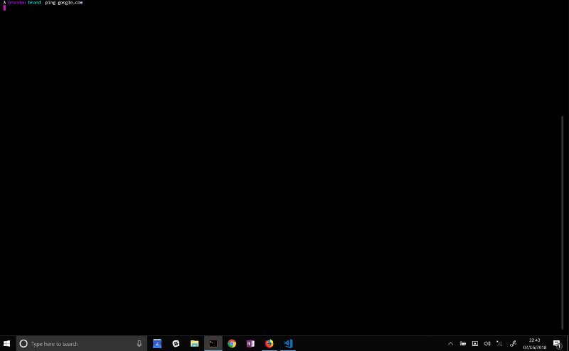

# Forcing a device to disconnect from WiFi using a deauthentication attack

> Original article: <https://skerritt.blog/forcing-a-device-to-disconnect-from-wifi-using-a-deauthentication-attack/>

This post will show you how to disable a devices connection to WiFi using a detauthentication attack.

A deauthentication attack is a type of attack which targets the communication between router and the device. Effectively disabling the WiFi on the device.

The deauthentication attack isn’t some special exploit of a bug. It’s a created protocol and is being used in real world applications.

Deauthencation attack’s use a _deauthenication frame._ This frame sent from a router to a device forces the device to disconnect. In technical terms it’s called:

> sanctioned technique to inform a rogue station that they have been disconnected from the network

This means that a device is on the network that shouldn’t be on the network. The router sends a deauthentication frame to the device telling it that it has been disconnected.

I like to imagine the interaction goes something like this:




In 2015, a [report](http://nymag.com/selectall/2017/11/you-should-probably-check-your-airbnb-for-hidden-cameras.html) showed that some AirBNB’s have hidden cameras which spy on their occupants.

In response, a programmer created a simple [shell script](https://julianoliver.com/output/log_2015-12-18_14-39). This script auto-detected the cameras and kicked them from the network using the techniques you will learn.

The same author wrote a script to auto-kick off [Google Glass](https://julianoliver.com/output/log_2014-05-30_20-52).

*Disclaimer:* You know the drill. Don’t do this to anyone else that isn’t you unless you have their permission. I am not advocating _illegal_ hacking.

## How do you perform a deauthentication attack?

The 2 important things we need to know are:

* The device we want to kick off of the network
* The router that the device is connected to

```console
sudo apt install aircrack-ng
```

Now run

```console
iwconfig
```

This will show you what your wireless card is called.



In this instance, my wireless card is called wlan0. iwconfig only shows you the wireless interfaces. lo and eth0 don’t come up since they are not wireless. This means we know for sure wlan0 is the wireless interface.

Next run this command:

```console
airmon-ng start wlan0
```

where wlan0 is your network card. This will put your card into _monitor mode_ which allows the card to monitor all traffic on the network.



Now that the wireless card is in monitor mode we want to see every router around us. You will need to *run iwconfig again* as this command will change your network card name. In most cases it changes it to mon0 but in mine it’s changed to wlan0mon.

```console
airdump-ng wlan0mon
```

And you should see something like this:



This is every single router in range. We need to know what router the device is on. You can tell how close a router is by the PWR column. PWR is the signal strength, how close it is to you. The closer it is, the larger the signal strength.

In this instance our victim (my laptop) is on TP-LINK\_32F604. We want to take note of 2 things here:

* The BSSID (mac address) of the router
* The Channel of the router
* The first part is xx:xx:xx. In this case, it’s C4:E9:84 These groupings specify the maker of the network card.
* The last three groupings: yy:yy:yy. In this case, it’s 3F:26:04. These groupings specify the exact network card. Not the make or model but the exact network card, much like a license plate specifies the exact car.

Each manufacture has a set of MAC addresses they’re allowed to use.  These are the xx:xx:xx groupings. Within these mac addresses are the  exact cards. You need both parts to find out the exact network card, but  you only need the first grouping to find out the manufacturer.

So far we have found out what the router is. Now we want to find out what the device is. To do this, run this command:

```console
airodump-ng wlan0mon --bssid routers BSSID here]--channel router[[s channel here]]
```



Now you should see something like this:



We need to know what specific device we want to boot off the network. We can see the router there. Luckily on this network there is only 1 device. If you wanted to find out what that device is you can run the first 3 groupings of the MAC address (called STATION here) into Google. I got back [this](https://hwaddress.com/oui-iab/98-5F-D3), which is the correct device.

So now we know the MAC address of the router and the MAC address of the device. Let’s initiate our attack.

Run this command:

```console
aireplay-ng --deauth 0 -c DEVICES MAC ADDRESS] -a ROUTERS MAC ADDR[[ESS] wlan0mon]
```

* The 0 represents an infinite amount of deauth attacks. If you wanted to only run 3 deauth attacks you’ll change this to 3.
* -c is the client, what you’re attacking. This is the devices MAC address.
* -a is the router, what is the router the victim is connected to.
* wlan0mon is the name of the network card still in monitor mode.



The device is now disconnected from the network!



On the clients end it looks like this. The ping timed out and Windows disconnected from the router.

These commands are simple but yet they are the cornerstone of most cyber security toolkits.

## Phishing attacks

A simple deauthentication attack will force a victim to reauthenticate. The attacker can than sniff the WPA 4-way handshake and perform a WPA bruteforce attack on the password.

Another attack that relies heavily on this deauthentication attack is forcing the user to connect to an access point you made. You’ll clone the users router onto your device, then you’ll deauthenticate the user and make sure your router has a higher signal than the original router. The users device will automatically connect to your router since it is "closer".

Once the users device is connected to your fake AP you can easily sniff all of their outgoing and incoming connections.

