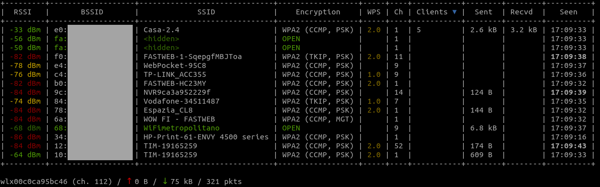
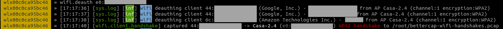
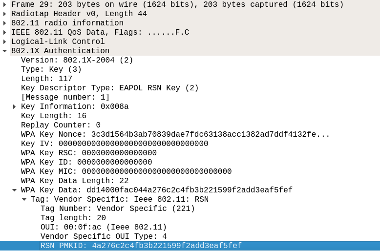
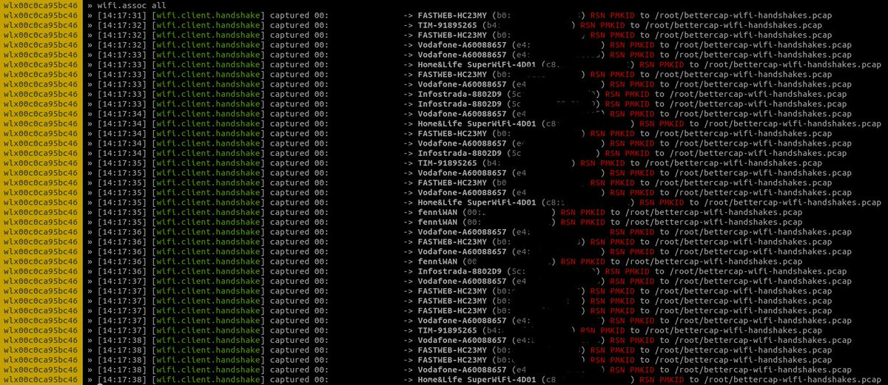

# Pwning WPA/WPA2 Networks With Bettercap and the PMKID Client-Less Attack

> Original article: <https://www.evilsocket.net/2019/02/13/Pwning-WiFi-networks-with-bettercap-and-the-PMKID-client-less-attack/>

In this post, I’ll talk about the new WiFi related features that have been recently implemented into bettercap, starting from how the EAPOL [4-way handshake](https://wlan1nde.wordpress.com/2014/10/27/4-way-handshake/) capturing has been automated, to a whole new type of attack that will allow us to recover WPA PSK passwords of an AP without clients.

We’ll start with the assumption that your WiFi card supports monitor mode and packet injection (I use an `AWUS1900` with [this driver](https://github.com/aircrack-ng/rtl8812au)), that you have a (working [hashcat](https://hashcat.net/) v4.2.0 or higher is required) installation ideally with GPU support enabled) for cracking and that you know how to use it properly either for dictionary or brute-force attacks, as no tips on how to tune the masks and/or generate proper dictionaries will be given :)

> On newer macOS laptops, the builtin WiFi interface `en0` already supports monitor mode, meaning you won’t need a Linux VM in order to run this :)

## Deauth and 4-way Handshake Capture

First thing first, let’s try a classical deauthentication attack: we’ll start bettercap, enable the `wifi.recon` module with channel hopping and configure the `ticker` module to refresh our screen every second with an updated view of the nearby WiFi networks (replace `wlan0` with the interface you want to use):

```console
sudo bettercap -iface wlan0

# this will set the interface in monitor mode and start channel hopping on all supported frequencies
> wifi.recon on
# we want our APs sorted by number of clients for this attack, the default sorting would be `rssi asc`
> set wifi.show.sort clients desc
# every second, clear our view and present an updated list of nearby WiFi networks
> set ticker.commands 'clear; wifi.show'
> ticker on
```

You should now see something like this:



Assuming `Casa-2.4` is the network we want to attack, let’s stick to channel `1` in order to avoid jumping to other frequencies and potentially losing useful packets:

```console
> wifi.recon.channel 1
```

What we want to do now is forcing one or more of the client stations (we can see 5 of them for this AP) to disconnect by forging fake deauthentication packets. Once they will reconnect, hopefully, bettercap will capture the needed EAPOL frames of the handshake that we’ll later pass to hashcat for cracking (replace `e0:xx:xx:xx:xx:xx` with the BSSID of your target AP):

```console
> wifi.deauth e0:xx:xx:xx:xx:xx
```

If everything worked as expected and you’re close enough to the AP and the clients, bettercap will start informing you that complete handshakes have been captured (you can customize the pcap file output by changing the `wifi.handshakes.file` parameter):



> Not only bettercap will check for complete handshakes and dump them only when all the required packets have been captured, but it will also append to the file one beacon packet for each AP, in order to allow any tool reading the pcap to detect both the BSSIDs and the ESSIDs.

The downsides of this attack are obvious: no clients = no party, moreover, given we need to wait for at least one of them to reconnect, it can potentially take some time.

## 4-way Handshake Cracking

Once we have succesfully captured the EAPOL frames required by hashcat in order to crack the PSK, we’ll need to convert the `pcap` output file to the `hccapx` format that hashcat can read. In order to do so, we can either use [this online service](https://hashcat.net/cap2hccapx/), or install the [hashcat-utils](https://github.com/hashcat/hashcat-utils) ourselves and convert the file locally:

```console
/path/to/cap2hccapx /root/bettercap-wifi-handshakes.pcap bettercap-wifi-handshakes.hccapx
```

You can now proceed to crack the handshake(s) either by dictionary attack or brute-force. For instance, to try all 8-digits combinations:

```console
/path/to/hashcat -m2500 -a3 -w3 bettercap-wifi-handshakes.hccapx '?d?d?d?d?d?d?d?d'
```

And this is it, the evergreen deauthentication attack in all its simplicity, performed with just one tool … let’s get to the fun part now :)

## Client-less PMKID Attack

In 2018 hashcat authors [disclosed](https://hashcat.net/forum/thread-7717.html) a new type of attack which not only relies *on one single packet*, but it doesn’t require any clients to be connected to our target AP or, if clients are connected, it doesn’t require us to send deauth frames to them, there’s no interaction between the attacker and client stations, but just between the attacker and the AP, interaction which, if the router is vulnerable, is almost immediate!

It turns out that *a lot* of modern routers append an optional field at the end of the first EAPOL frame sent by the AP itself when someone is associating, the so called `Robust Security Network`, which includes something called `PMKID`:



As explained in the original post, the PMKID is derived by using data which is known to us:

```console
PMKID = HMAC-SHA1-128(PMK, "PMK Name" | MAC_AP | MAC_STA)
```

Since the “PMK Name” string is constant, we know both the BSSID of the AP and the station and the `PMK` is the same one obtained from a full 4-way handshake, this is all hashcat needs in order to crack the PSK and recover the passphrase! Here’s where the new `wifi.assoc` command comes into play: instead of deauthenticating existing clients as shown in the previous attack and waiting for the full handshake to be captured, we’ll simply start to associate with the target AP and listen for an EAPOL frame containing the RSN PMKID data.

Say we’re still listening on channel 1 (since we previously `wifi.recon.channel 1`), let’s send such association request to every AP and see who’ll respond with useful information:

```console
# wifi.assoc supports 'all' (or `*`) or a specific BSSID, just like wifi.deauth
> wifi.assoc all
```

All nearby vulnerable routers (and let me reiterate: *a lot* of them are vulnerable), will start sending you the PMKID, which bettercap will dump to the usual pcap file:



## PMKID Cracking

We’ll now need to convert the PMKID data in the pcap file we just captured to a hash format that hashcat can understand, for this we’ll use [hcxpcaptool](https://github.com/ZerBea/hcxtools):

```console
/path/to/hcxpcaptool -z bettercap-wifi-handshakes.pmkid /root/bettercap-wifi-handshakes.pcap
```

We can now proceed cracking the `bettercap-wifi.handshake.pmkid` file so generated by using algorithm number `16800`:

```console
/path/to/hashcat -m16800 -a3 -w3 bettercap-wifi-handshakes.pmkid '?d?d?d?d?d?d?d?d'
```

## Recap

* Goodbye airmon, airodump, aireplay and whatnots: one tool to rule them all!
* Goodbye Kali VMs on macOS: these modules work natively out of the box, with the default Apple hardware <3
* Full 4-way handshakes are for n00bs: just one association request and most routers will send us enough key material.

Enjoy :)


