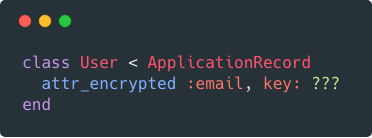

# Strong Encryption Keys for Rails

> Original article: <https://ankane.org/encryption-keys>



Encryption is a common way to protect sensitive data. Generating a secure key is an important part of the process.

[attr\_encrypted](https://github.com/attr-encrypted/attr_encrypted), the popular encryption library for Rails, uses AES-256-GCM by default, which takes a 256-bit key. So how can we generate a secure one?

*If you're in a hurry, feel free to skip to [the answer](#a-better-way).*

## Take 1

One way to generate a key is:

```ruby
SecureRandom.base64(32).first(32)

```

This generates a 32 character string that looks pretty secure. Each character has 64 possible values (letters, numbers, / and +). However, a single byte can represent 256 possible values. We've eliminated 75% of possible values per byte, which compounds across all 32 bytes. Here's the math:

| Method | Possible Keys | Equivalent |
| --- | --- | --- |
| Random | 256^32^ | 2^256^ |
| Take 1 | 64^32^ | 2^192^ |

This reduces the number of possible keys by 99.999999999999999994%. Luckily, computers have not (yet) been able to brute force 128-bit keys, which have 2^128^possible values.

## Why 256?

So why do we use 256-bit keys to begin with? Security researcher Graham Sutherland [puts it well](https://security.stackexchange.com/questions/14068/why-most-people-use-256-bit-encryption-instead-of-128-bit):

"Essentially it's about security margin. The longer the key, the higher the effective security. If there is ever a break in AES that reduces the effective number of operations required to crack it, a bigger key gives you a better chance of staying secure."

Also, quantum computers are expected to brute force in [square root time](https://blog.agilebits.com/2013/03/09/guess-why-were-moving-to-256-bit-aes-keys/). This means a 256-bit key could be brute forced in the same time as traditional computers can brute force a 128-bit key.

## A Better Way

The right way to generate a random 32-byte key is:

```ruby
SecureRandom.random_bytes(32)

```

However, we can't store this directly in Rails credentials or as an environment variable. We need to encode it first. Hex is a popular encoding. Rails uses this for its master key in Rails 5.2.

```ruby
SecureRandom.random_bytes(32).unpack("H*").first

```

Ruby provides a helper to do this:

```ruby
SecureRandom.hex(32)

```

To decode the key, use:

```ruby
[hex_key].pack("H*")

```

We now have a much stronger key. If you store the key as an environment variable, your model should look something like:

```ruby
class User < ApplicationRecord
  attr_encrypted :email, key: [ENV["EMAIL_ENCRYPTION_KEY"]].pack("H*")
end

```

## Libraries

Libraries should educate users on how to generate sufficiently random keys. The [rbnacl](https://github.com/crypto-rb/rbnacl) gem has a neat way of enforcing this - it checks if a string is binary before allowing it as a key.

```ruby
if key.encoding != Encoding::BINARY
  raise ArgumentError, "Insecure key - key must use binary encoding"
end

```

This prevents our initial (flawed) method from working. I've incorporated this approach into the [blind_index](https://github.com/ankane/blind_index) gem and [opened an issue](https://github.com/attr-encrypted/attr_encrypted/issues/311) with attr_encrypted to get the author's thoughts.

## Conclusion

While secure key generation provides better protection against brute force attacks, it won't help at all if the key is compromised. Limit who has access to encryption keys as well. For more security, consider a [key management service](https://github.com/ankane/kms_encrypted) to manage your keys.

Happy encrypting!
