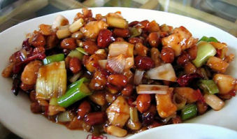

# Gong Bao Ji Ding

## Ingredients

* 3/4 pounds boneless, skinless, chicken breast, cut into bite size pieces
* 3 tablespoons soy sauce
* 1/2 teaspoon salt
* 2 teaspoons white cooking wine
* 1 teaspoon cornstarch
* 1/4 cup shelled raw peanuts
* 1/4 cup plus 2 tablespoons vegetable oil
* 1 tablespoon vinegar
* 1 tablespoon sugar
* 1 tablespoon cornstarch dissolved in 1/4 cup chicken broth or water
* 4 whole dried red chilies, stems and seeds removed
* 2 green onions, sliced into 1-inch pieces
* 2 tablespoons minced ginger
* 1 tablespoon minced garlic

## Directions

1. Season the chicken with 1 tablespoon of the soy sauce, and all of the salt and wine. Sprinkle with the dry cornstarch and mix well.
2. Steep the peanuts for 30 minutes in lukewarm water. Remove the skins and stir-fry them in 2 tablespoons of oil until brown and crisp. Remove.
3. Combine the remaining soy sauce, vinegar, sugar, and cornstarch paste to make a sauce.
4. Pour the remaining oil into the wok and heat until near smoking. Add the chilies, and after they have started to brown, add the chicken and stir-fry until cooked.
5. Add the onion, ginger, and garlic and stir-fry for 30 seconds.
6. Stir in the sauce, add the peanuts, and stir-fry for a few seconds.
