# Kompendium bezpieczeństwa haseł – atak i obrona (część 2.)

> Original article: <https://sekurak.pl/kompendium-bezpieczenstwa-hasel-atak-i-obrona-czesc-2/>

## Atak online

Atak online na hasła polega na wysyłaniu do danej usługi wielu zapytań wraz z danymi uwierzytelniającymi. Nie jest to atak kryptograficzny -- siłowo próbujemy znaleźć hasło do serwisu lub usługi.

Ataki online mają bardzo małą skuteczność, dlatego ich przeprowadzenie wymaga odpowiedniego planu. Jest tu o co walczyć -- słabo zabezpieczone konto do usługi może dać bezpośredni dostęp do systemu. Trzeba tylko pamiętać, że skuteczność ataku ograniczana jest przez przepustowość łącza oraz mechanizmy obronne zdalnego systemu.

Zwiększenie skuteczności ataków online polega na przeprowadzeniu w pewnym sensie ataku skierowanego, czyli przystosowanego do jednego, konkretnego celu. Atak skierowany na mechanizmy uwierzytelniające usługi zdalne polega na zbieraniu informacji o celu, poznaniu używanych przez cel technologii, odpowiednim przygotowaniu słownika i narzędzi atakujących.

Każda z wyżej wymienionych faz została opisana w kolejnych podrozdziałach wraz z przykładami używanego oprogramowania.

Dokładny opis narzędzi służących do ataków online, znajduje się w rozdziale [Narzędzia](https://sekurak.pl/kompendium-bezpieczenstwa-hasel-atak-i-obrona-czesc-2/#r12).

### 1. Zbierz informacje

Celem tej fazy jest *zbieranie informacji o celu ze źródeł publicznie dostępnych*. Wykorzystuje się tutaj wpisy w bazach whois, wyszukiwarki internetowe, fora, blogi, portale internetowe itd. Jeżeli cel udostępnia strony WWW, analizujemy je, aby określić tematykę serwisu oraz aby wyodrębnić słowa kluczowe.

Każda informacja może okazać się cenna: adresy DNS lub IP serwerów, subdomeny, słowa kluczowe, adresy e-mail, nazwiska pracowników oraz administracji.

Należy też sprawdzić, w jaki sposób generowane są identyfikatory użytkowników. Sprawdźmy, czy można je łatwo przewidzieć, np. poprzez enumerację kolejnych liczb całkowitych ID lub czy można je pobrać z list, rankingów.

**Przykładowe programy używane w tej fazie**: Dmitry, The Harvester, Fierce2.

**Usługi dostępne online**:

<http://centralops.net/co/>, <http://serversniff.net/index.php>, <http://wink.com/>, <http://www.alexa.com/>, <http://archive.org/>, <http://www.domaintools.com/>, <http://www.isearch.com/>, <https://pipl.com/>, <http://www.robtex.com/>, <http://sec.gov/edgar.shtml>, <http://www.tineye.com/>, <http://yoname.com/>

### 2. Poznaj technologie

Drugi krok polega na zbieraniu informacji o technologiach wykorzystywanych przez nasz cel. Musimy dowiedzieć się, w jaki sposób przeprowadzany jest proces uwierzytelnienia, z jakiego skryptu korzysta webaplikacja, jakie mechanizmy zabezpieczające oferuje wykorzystywana technologia. Sukces ataku jest uzależniony od tego, czy rozpoznamy stawiane nam ograniczenia.

Należy przeanalizować, jakie warunki stawiane są identyfikatorom użytkowników oraz ich hasłom. Sprawdźmy, czy system blokuje konto po nieudanych próbach logowania oraz czy któreś z urządzeń pośredniczących (firewall/IPS/IDS) nie odcina nas w momencie wysłania zbyt dużej liczby żądań.

W osobnym miejscu powinno się spisać, w jaki sposób wysyłane są dane uwierzytelniające oraz jak wygląda odpowiedź usługi w momencie poprawnego i błędnego logowania.

**Przykładowe programy używane w tej fazie**: p0f, nmap, whatweb.

### 3. Przygotuj słownik

Wielkość słownika jest kluczowym elementem wpływającym na sukces oraz czas ataku. Faza ta polega na przygotowaniu słownika podstawowego i rozszerzonego. Oba te słowniki powinny być stosunkowo małe (poniżej 1GB).

Przy generowaniu słów należy użyć wszystkie informacje zebrane w poprzednich fazach. Przygotowanie odpowiedniego słownika zostało dokładnie opisane w rozdziale Budowanie słowników.

Mała uwaga: w atakach na mechanizmy uwierzytelniania usług zdalnych celowo nie wykorzystuje się ataków bruteforce. W praktyce istnieje możliwość przetestowania tylko małej grupy haseł (np. maksymalnie 5-znakowych), które i tak można dodać do słownika.

**Przykładowe programy używane w tej fazie**: [CUPP](https://sekurak.pl/kompendium-bezpieczenstwa-hasel-atak-i-obrona-czesc-2/#r12-cupp) oraz wszelkiego rodzaju narzędzia konsolowe do obróbki tekstu i proste języki skryptowe.

### 4. Przygotuj narzędzia

Przystępując do pracy, trzeba zdecydować się, które usługi chcemy atakować. Jeżeli jest taka możliwość, to warto nie ograniczać się do jednej usługi -- czasem łatwiej włamać się do wystawionej usługi MySQL niż na konto administratora webaplikacji.

Po wybraniu usług należy przygotować narzędzia automatyzujące ataki. Trzeba dokładnie poznać ich konfigurację i wykonać testy na własnych systemach. Musimy mieć absolutną pewność, że narzędzia są skonfigurowane poprawnie. W testach trzeba używać zarówno poprawnych, jak i błędnych haseł, w celu zaobserwowania reakcji programów atakujących.

Środowisko do testów powinno w jak największym stopniu odpowiadać środowisku celu. Testy przed atakiem najlepiej przeprowadzać do systemów wpiętych do Internetu -- można do tego wykorzystać konta shellowe lub darmowe konta webowe. W ostateczności zaleca się testowanie usług systemu znajdującego się w sieci lokalnej (np. laptop znajomego) lub z maszyny wirtualnej.

W testach koniecznie trzeba sprawdzić, czy można uruchomić kilka instancji narzędzi atakujących, aby jednocześnie atakować kilka usług lub zrównoleglić atak na jedną usługę. Oczywiście trzeba przeanalizować, czy taka operacja zmniejsza czas ataku.

**Przykładowe programy używane w tej fazie**: THC Hydra, Patator, BruteSSH.

### 5. Testuj precyzyjnie

W pierwszej kolejności należy testować usługi przy użyciu konkretnych nazw użytkowników, takich jak root, admin, administrator itp. Należy unikać testowania wszystkich kont lub zgadywania loginu użytkownika, gdyż to za bardzo wydłuża atak.

Testowanie pojedynczych kont zawierać próby:

-   Hasła puste,
-   Hasła, które są takie same jak login lub adres e-mail,
-   Hasła ze słownika podstawowego.

Sprawdzenie powyższych kombinacji pozwoli w stosunkowo krótkim czasie sprawdzić najczęściej używane hasła.

Jeśli po wykonaniu tych czynności nie uda się uzyskać dostępu, należy przeprowadzić atak ze słownika rozszerzonego. Jeżeli i to nie pomoże, wtedy należy albo utworzyć nowe reguły rozszerzające słownik, albo wykonać atak bruteforce.

Dodatkowo, gdy istnieje możliwość enumeracji loginów, warto dla każdego identyfikatora sprawdzić:

-   hasło puste,
-   hasło zgodne z loginem, adresem e-mail, imieniem i nazwiskiem użytkownika,
-   hasło odpowiadające dziesięciu (lub więcej) słowom kluczowym kojarzonym z serwisem lub usługą (nazwa serwisu, branży itp.).

## Atak offline

Atak offline jest atakiem kryptograficznym na hashe haseł, a jego celem jest znalezienie oryginału hasła lub jego kolizji. Atak ten jest o wiele wydajniejszy od brutalnego ataku online, ponieważ mamy do dyspozycji nie tylko całą moc obliczeniową swojej maszyny, ale do obliczeń możemy też wykorzystać inne komputery.

Coraz częściej obliczenia nie są przeprowadzane przez procesory CPU, a przez jednostki graficzne GPU, co pozwala skrócić czas ataku kilkunastokrotnie, nawet przy użyciu przeciętnej (ale nie zintegrowanej) karty graficznej.

W ostatnich latach pojawiła się możliwość wynajmowania chmur i klastrów obliczeniowych. Moc obliczeniowa oferowana w tych usługach przyśpiesza atak za stosunkowo małe pieniądze. Istnieje nawet możliwość darmowego wykorzystania usług takich jak [Windows Azure](https://www.windowsazure.com/en-us/pricing/free-trial/) czy [Amazon Elastic Compute Cloud](http://aws.amazon.com/free/).

Niestety w momencie pisania artykułu (koniec roku 2012) zachwyt nad obliczeniami w chmurze jest zbyt duży. Usługa Amazon EC2 daje dostęp do klastra obliczeniowego GPU w cenie $2.10 za godzinę obliczeń. W tej cenie dostajemy:

`Cluster GPU Quadruple Extra Large 22 GB memory, 33.5 EC2 Compute Units, 2 x NVIDIA Tesla "Fermi" M2050 GPUs, 1690 GB of local instance storage, 64-bit platform, 10 Gigabit Ethernet.`

NVidia Fermi pozwala sprawdzić niemal 1.5 miliarda hashy MD5 w każdej sekundzie (0.5 miliarda hashy SHA1). Do dyspozycji mamy dwie takie karty i jeszcze wiele klasycznych jednostek obliczeniowych. Mimo tego, że wartości te wydają się wielkie, to wcale bardzo mocno nie odstają od sprzętu, którym dysponuje przeciętny gracz PC.

Poglądowa tabela wydajności kart graficznych w procesie łamania haseł znajduje się [pod tym adresem](http://golubev.com/gpuest.htm) (dane z roku 2010).

Przeprowadzenie ataku offline na skrót kryptograficzny hasła można podzielić na trzy fazy:

1.  Przeszukanie baz danych skrótów (przykładowe linki: [[1]](http://www.md5decrypter.co.uk/) , [[2]](http://md5crack.com/) , [[3]](http://md5.rednoize.com/) , [[4]](http://md5hood.com/) , [[5]](http://b3l.org/chercher/?site=generate), [[6]](http://anqel.pl/narzedzia/md5/md5search.php),...);
2.  Przygotowanie słowników/tablic tęczowych dla narzędzi crackujących;
3.  Użycie narzędzi crackujących, takich jak Hashcat.

## Narzędzia

W tym dziale zaprezentowany jest podstawowy arsenał używany w atakach na hasła.

Fierce2 oraz WhatWeb pozwolą zebrać podstawowe informacje o celu. W tworzeniu słowników na podstawie tych informacji pomocny okazuje się CUPP. THC Hydra jest jednym z najpopularniejszych narzędzi do ataków online. Hashcat jest programem należącym do ścisłej czołówki. Atakom offline na hashe haseł poświęcony jest osobny rozdział.

### 1. Fierce2

Fierce2 to narzędzie służące do zbierania informacji o celu. Jest to łatwy w użyciu skaner DNS, który automatyzuje wiele żmudnych testów, które trzeba wykonać przy użyciu narzędzi `host`, `nslookup` czy `dig`. Bardzo dobrze sprawdza się w skanowaniu nieciągłych sieci.

Ilość informacji zwracanych przez narzędzie jest ogromna -- wiele z nich może trafić do słowników haseł. Aby zebrać te informacje wykorzystuje się następujące techniki:

-   enumeracja rekordów NS, MX,
-   transfer strefy (request axfr),
-   zapytania <abbr title="American Registry Internet Numbers">ARIN</abbr>, whois, hostname,
-   wildcard DNS Records,
-   prefix Bruteforce,
-   domain Bruteforce,
-   skanowanie vhostów,
-   znajdywanie sąsiednich IP (stron, które są powiązane z celem).

Wynikiem są listy adresów, vhostów, numerów IP i wiele innych cennych informacji. Zwrócone wartości to miejsca, które możemy sprawdzić pod kontem występowania interesujących nas usług, przeanalizować je i zastanowić się, w jaki sposób je zaatakować.

#### Fierce vs Fierce2

Pierwotnie Fierce został stworzony przez *RSNake* (ha.ckers), jednak w 2007 roku projekt został porzucony przez autora, a jego kod podarowany społeczności i jest obecnie rozwijany przez *Jabra*, jako [Fierce2](http://trac.assembla.com/fierce/wiki).

Uwaga: w dystrybucjach Backtrack 4 -- Backtrack 5R3 (i prawdopodobnie nowszych) domyślnie jest zainstalowany Fierce w wersji pierwszej!

#### Instalacja i przykłady użycia

Instalacja jest prosta i można ją przeprowadzić, wykorzystując skrypt przygotowany przez twórcę narzędzia. Dokładny opis znajduje się [na wiki projektu](http://trac.assembla.com/fierce/wiki/Installing).

```console
wget http://trac.assembla.com/fierce/browser/fierce2/trunk/install.sh?format=txt -O install.sh
chmod +x install.sh
sudo ./install.sh
```

Użycie programu polega na przekazaniu w parametrze --dns nazwy domeny do skanowania.

*Standard Fierce scan\
`fierce -dns company.com`

Scan + search all class c ranges found for PTR names that match the domain\
`fierce -dns company.com -wide`

Fierce scan that only checks for zone transfer\
`fierce -dns company.com -only zt`

Fierce scan that does not perform bruteforcing if a zone transfer is found\
`fierce -dns company.com -ztstop`

Fierce scan that does not perform bruteforcing if a wildcard is found\
`fierce -dns company.com -wildcstop`

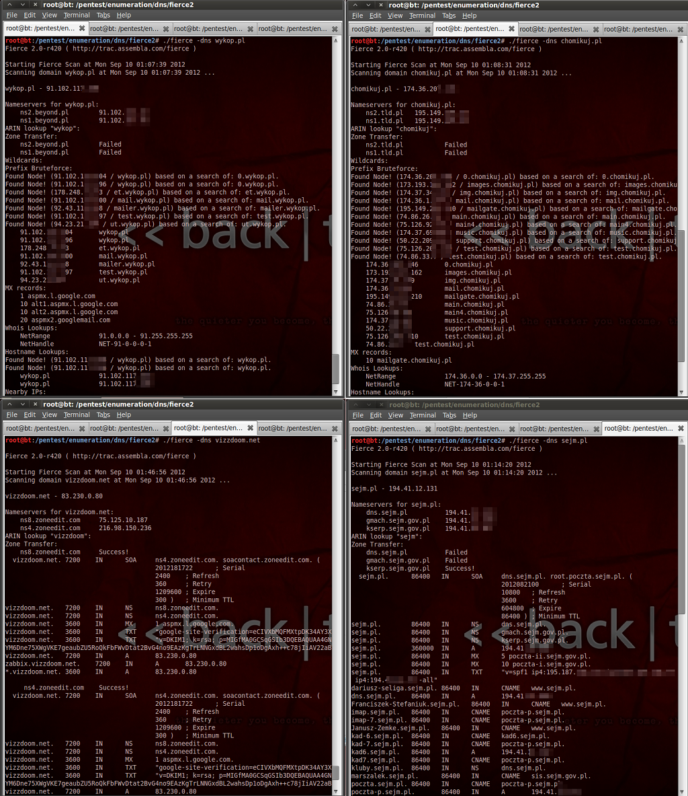

### 2. WhatWeb

WhatWeb pozwala wykryć wersje systemu zarządzania treścią używanego przez webaplikacje. Baza programu zawiera wiele systemów CMS, for oraz blogów. WhatWeb jest skanerem zarówno pasywnym, jak i aktywnym.

Oprócz enumeracji systemów CMS WhatWeb próbuje też zidentyfikować użyte biblioteki, skrypty javascript i inne popularne komponenty.

Użycie tego narzędzie jest pomocne w celu określenia mechanizmów przechowywania haseł webaplikacji. Po poprawnej enumeracji wystarczy ściągnąć identyczny system i sprawdzić, w jaki sposób przechowuje on hasła.

Warto zainteresować się też uproszczoną wersją online tego narzędzia: <http://whatweb.net/>.

#### Instalacja i przykłady użycia

Skaner jest domyślnie zainstalowany w wielu dystrybucjach pentesterskich. W Backtrack 5R3 można go znaleźć w lokalizacji `/pentest/enumeration/web/whatweb/`.

Instalacja, działanie oraz opisy parametrów w bardzo czytelnej formie można znaleźć na [stronie twórców](http://www.morningstarsecurity.com/research/whatweb). Przykład działania skryptu demonstruje poniższy listing:

```console
./whatweb -a 3 vizzdoom.net
```

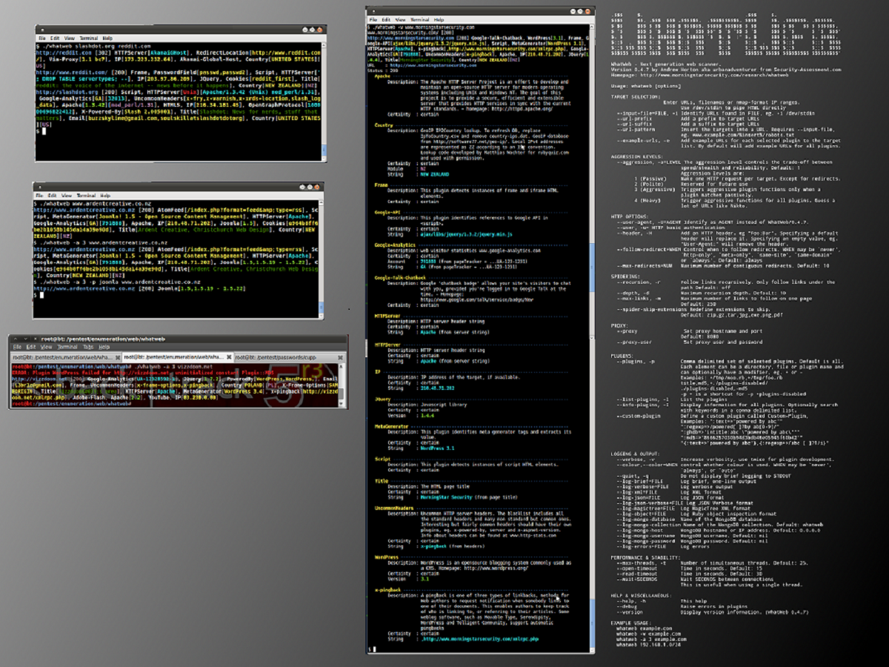

### 3. CUPP

*Common User Passwords Profiler* to narzędzie służące do generowania list popularnych haseł do ataków skierowanych na hasło konkretnego użytkownika.

CUPP wykorzystuje informacje takie jak imiona, nazwiska, daty urodzin, nazwiska członków rodziny, pseudonimy, zainteresowania i wiele innych. Wszystkie te informacje podajemy na wejściu programu, aby otrzymać specjalny słownik przystosowany do konkretnego celu.

Słownik taki jest bardzo efektywny, szczególnie gdy atakujemy osoby niezwracające szczególnej uwagi na tematykę bezpieczeństwa haseł.

#### Instalacja i przykłady użycia

CUPP można znaleźć w dystrybucji Backtrack 5R3 w lokalizacji: `/pentest/passwords/cupp/`.

Przełącznik -i włącza tryb interaktywny, w którym zadawane są nam pytania:

```console
./cupp -i
```

Załóżmy, że w portalach społecznościowych znaleźliśmy informacje na temat administratora strony, którą się interesujemy. Poznaliśmy jego imię, nazwisko, pseudonim, imię żony i dziecka, daty urodzenia. Dane te wprowadziliśmy do narzędzia CUPP wraz z kilkoma słowami kluczowymi, które dotyczą tematyki strony oraz stylu życia administratora.

CUPP na podstawie tych danych wygenerował słownik złożony aż z 46794 słów !

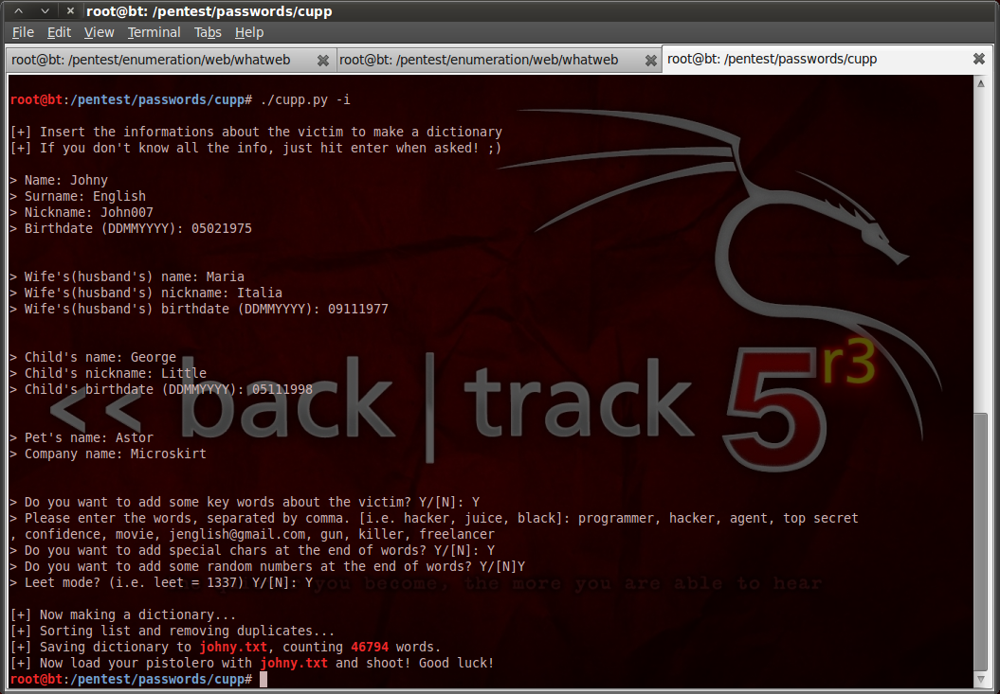

### 4. THC Hydra

Hydra jest jednym z najpopularniejszych narzędzi służących do ataków online na hasła statyczne. Nie bez powodu program zyskał sobie przydomek THC (The Hackers Choise).

Hydra swoją popularność zawdzięcza wsparciu wielu protokołów (HTTP w tym HTTP POST, FTP, POP3, IMAP, SMB, MSSQL, MYSQL, SSH, VNC...) oraz dużej elastyczności (proxy, basic/digest/NTLM Auth2, wielowątkowość...).

Bardzo dobry opis możliwości programu oraz porównanie go z innymi można znaleźć w [tym miejscu](http://www.thc.org/thc-hydra/network_password_cracker_comparison.html).

#### Instalacja i przykłady użycia

THC Hydra posiada interfejs konsolowy (`hydra`) oraz graficzny GTK (`xhydra`). Wersja graficzna nie jest specjalnie udana, jednak pozwala ustawić większość potrzebnych opcji (pokazuje też wszystkie argumenty linii poleceń).

Zarówno `hydra`, jak i `xhydra` są zainstalowane w Backtrack 5R3. Źródła do własnoręcznej instalacji można znaleźć [w tym miejscu](http://www.thc.org/thc-hydra/).

Jak już wcześniej wspomniano, najefektywniejszą metodą ataków na hasła online jest wybranie jednego loginu i przetestowanie z jego pomocą popularnych haseł ze słownika. Wybór loginu nie jest zawsze łatwym zadaniem, ale gdy poprawnie enumerujemy skrypt webaplikacji (np. poprzez opisany WhatWeb), mamy duże szanse na określenie loginu administratora.

Poniżej znajduje się przykład ataku na blog fikcyjnego *Johnego Englisha*. Administrator zdecydował się na skrypt *WordPress*, który został wykryty przy użyciu skanu *WhatWeb*. Przeglądając źródła skryptu dostępne online, szybko zauważamy, że administrator wordpressa to zawsze użytkownik *admin*. Logowanie polega na wysłaniu pary login-password przez formularz metodą HTTP POST do <http://johny-english-agent.com/wp-login.php>.

W momencie poprawnego logowania przenosimy się do panelu administracyjnego. Błędne logowanie sygnalizowane jest ponownym wyświetleniem formularza wraz z informacją *Login failed*.

Oto przykład użycia narzędzia THC Hydra, które wykona atak na stronę Johnego Englisha przy użyciu słownika johny.txt:

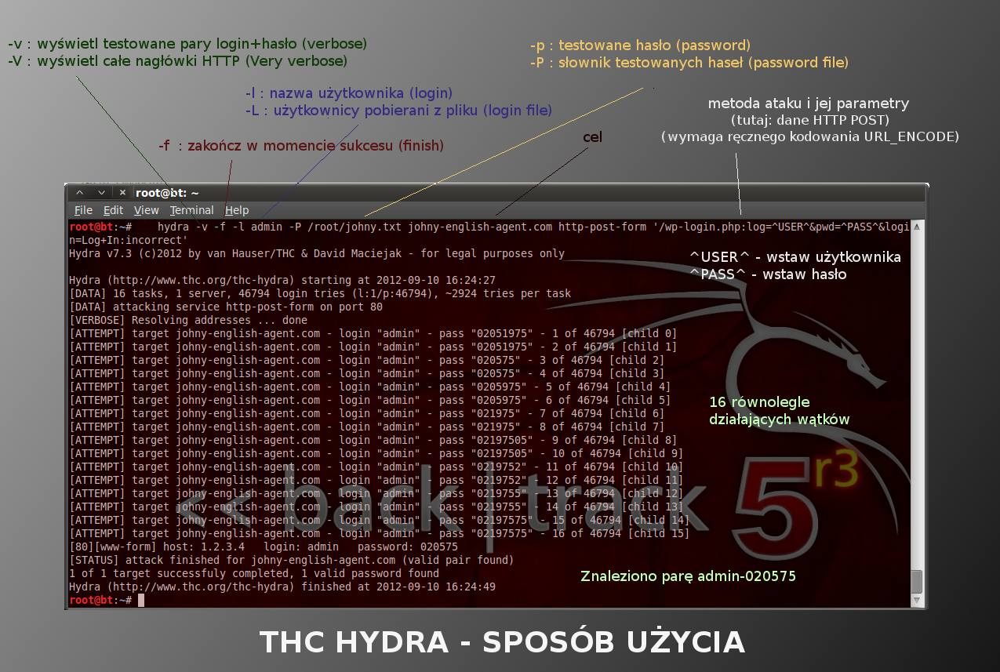

## Hashcat

Hashcat to zaawansowany łamacz hashy haseł. Mimo tego, że ten darmowy projekt jest stosunkowo młody, to przegonił on w szybkości działania nawet komercyjne narzędzia.

Hashcat jest podstawowym narzędziem w ręku każdego, kto zamierza przeprowadzać ataki na hashe haseł. Główne funkcje programu:

-   przeprowadzanie zaawansowanych ataków offline na hashe haseł (w tym ataki na sole i algorytmy takie jak bcrypt),
-   wydajne implementacje algorytmów dla CPU i GPGPU,
-   kompatybilny z legendarnym *John the Ripper* oraz komercyjnym *PasswordsPRO*,
-   dostępny dla Linuksa, Windowsa oraz nawet MacOS,
-   interfejs CLI oraz GUI,
-   trzy odmiany programu w celu zapewnienia największej szybkości działania dla każdego zadania.

### 1. Wersje programu Hashcat

Program występuje w trzech wariantach: Hashcat, oclHashcat-plus oraz oclHashcat-lite. Dobór odpowiedniej wersji do zadania znacznie skraca czas ataku.

Przedrostek `ocl` oznacza wersję wykonującą obliczenia GPGPU przy wykorzystaniu *Open Computing Language*.

#### Hashcat (klasyczny)

-   obliczenia CPU,
-   multihash (możliwość załadowania listy nawet 24 milionów hashy),
-   wielowątkowy, SSE, SSE2,
-   uniwersalny.

#### oclHashcat-Plus

Dodatkowo:

-   obliczenia GPGPU,
-   obsługa multi GPU (aż do 128 kart graficznych),
-   oparty o sterowniki OCL -- działa na kartach NVidia oraz AMD,
-   najszybsza na świecie implementacja algorytmów: `md5crypt`, `phpass`, `mscach2`, `WPA`, `WPA2`,
-   jedyny cracker, którego cały silnik reguł przetwarzany jest w GPGPU,
-   wsparcie przetwarzania rozproszonego -- MOSIX Virtual OpenCL Cluster Platform (VCL) (sieć połączonych klastrów Linux).

#### oclHashcat-Lite

Jest to specjalna wersja, która jest zoptymalizowana pod kątem ataku na **pojedynczy hash** (a nie listę hashy).

### 2. Hashcat -- rodzaje ataków

#### Straight Attack

Straight Attack to najprostszy z ataków słownikowych, w którym sprawdzane są ciągi występujące bezpośrednio w słowniku, bez żadnych modyfikacji:

-   prosty atak słownikowy,
-   sprawdzane są wszystkie ciągi ze słownika, bez żadnych modyfikacji,
-   bardzo efektywny w pierwszym stadium ataku, ale tylko przy użyciu dobrego słownika.

#### Bruteforce Attack

Klasyczny atak Bruteforce w Hashcat działa w następujący sposób:

-   sprawdza każdą kombinację znaków w danym zakresie,
-   najpierw sprawdzane są hasła o długości 1, następnie o długości 2 itd.
    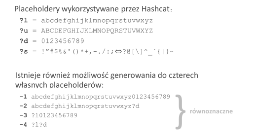

Mask Attack jest techniką, która rozszerza atak siłowy. Polega na określaniu zestawu znaków na każdej pozycji hasła. Takie podejście pozwala znacząco skrócić czas ataku siłowego.

Załóżmy, że chcemy złamać hasło `Vizz2012`. W klasycznym ataku siłowym musielibyśmy przetestować maksymalnie 62 ^12^ (około 2*10 ^14^ ) kombinacji. Technika ataku maskowanego sprawdzi maksymalnie 52*26 ^3^ *10 ^4^ (około 10 ^10^ ) kandydatów. Pozwala to skrócić czas ataku siłowego przykładowo z 3 dni do poniżej 1 minuty.

Kilka przydatnych przykładów Mask Attack:

-   klasyczny bruteforce 1-8 małych liter: `?l?l?l?l?l?l?l?l`,
-   hasła 1-6 znakowe zaczynające się od dużej litery: `?u?l?l?l?l?l?l`,
-   hasła 1-8 znakowe kończące się dwoma cyframi: `?l?l?l?l?l?l?d?d`,
-   sprawdzenie dat urodzin: `?d?d.?d?d.19?d?d`,
-   sprawdzenie 1-6 małych i dużych liter oraz cyfr: `-1 ?l?u?d ?1?1?1?1?1?1`.

#### Combinator Attack

Combinator Attack to kolejny atak słownikowy:

-   generuje wszystkie dwójki wyrazów w słowniku,
-   bardzo użyteczny dla długich haseł, tworzonych przez zlepienia słów.

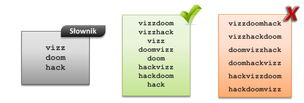

#### Hybrid Attack

Atak Hybrydowy łączy atak słownikowy z atakiem siłowym:

-   pobierane jest słowo ze słownika,
-   do niego dodawany jest ciąg z *Bruteforce/Mask Attack*,
-   znaki z ataku siłowego mogą być dopisywane przed lub po wyrazie ze słownika.

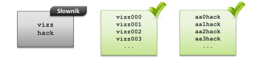

#### Toogle Case Attack

Toogle Case Attack to zaawansowany atak słownikowy:

-   odwraca *każdą* małą literę na dużą i na odwrót,
-   atak czasochłonny, jeśli wykorzystuje się duże słowniki,
-   domyślnie ograniczony do haseł o długości 1 -- 16.

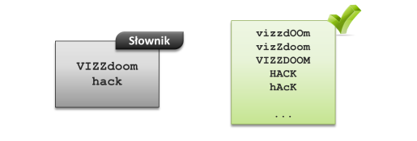

#### Permutation Attack

Permutation Attack to czasochłonny atak słownikowy:

-   do ataku wybierane są tylko hasła ze słownika o długości 1 -- 16,
-   tworzone są wszystkie permutacje każdego wyrazu.

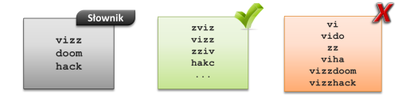

#### Table Lookup Attack

Table-Lookup jest nietypowym atakiem słownikowym:

-   wymaga podania pliku tabeli *lookup*,
-   tabela *lookup* jest prostym słownikiem przypasowań jednych znaków do innych, np. `a=aA4`,
-   sprawdzane są wszystkie ciągi z podanego słownika,
-   z każdego ciągu tworzone są nowe wyrazy na podstawie wpisów z tabeli *lookup*.

Atak ten jest pewnym uproszczeniem ataku *Rule Based Attack*. Okazuje się bardzo przydatny w odgadywaniu haseł tworzonych przez pewne przewidywalne reguły, np. gdy użytkownicy zamiast litery `e` używają cyfry `3`.

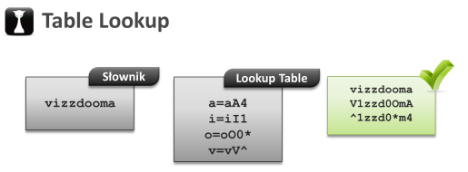

#### Rule Baed Attack

Rule Based Attack to jeden z najbardziej skomplikowanych ataków w Hashcat. Pozwala na znalezienie bardzo skomplikowanych haseł, przy użyciu wyrazów ze słownika jako wzorca.

Atak używa reguł, które implementowane są, jako osobny język programowania. Przypominają one wyrażenia regularne, jednak przetwarzane są wielokrotnie szybciej. Są to operacje na tekście, takie jak dodawanie znaku, zmiana litery na wielką, duplikacja znaku i wiele innych.

Hashcat jako jedyny cracker na świecie potrafi przetwarzać funkcje reguł w GPGPU. Wspiera również reguły z programów *Johny the Ripper* oraz *PasswordsPro*, dodatkowo je rozszerzając przez wykorzystanie dodatkowych placeholderów. Uniwersalny (kompatybilny z innymi programami) spis funkcji znajduje się na obrazku poniżej:

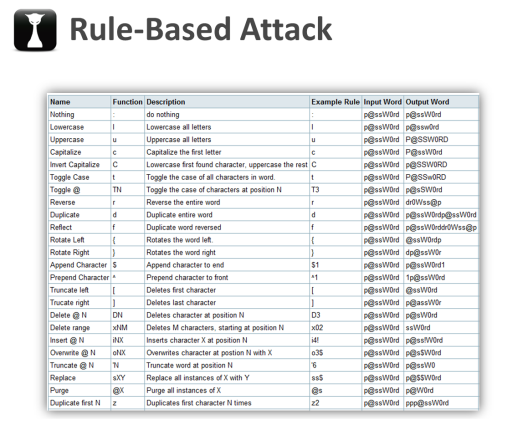

Oczywiście istnieje możliwość pisania własnych reguł, a nawet dynamicznego ich generowania podczas operacji crackowania. Warto dodać, że z Hashcatem instalowane są zestawy reguł napisane przez twórców oraz pasjonatów.

Jedną z reguł dostępnych po instalacji Hashcat jest `leetspeak.rule`. Pozwala ona na tworzenie kandydatów haseł ze słownika w slangu [Leetspeak](http://pl.wikipedia.org/wiki/Leet_speak). Reguła wraz z metodą działania została przedstawiona poniżej:

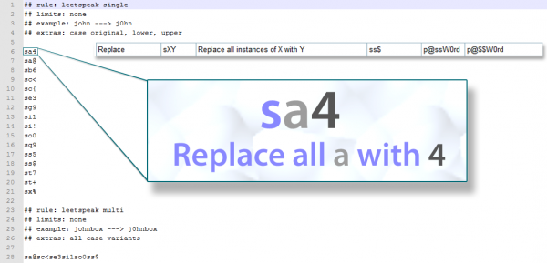

W tabeli zaprezentowano funkcje, które są rozpoznawane przez Hashcat oraz inne popularne crackery.

#### Markov-attack oraz atak Bruteforce++

Markov Attack to bardzo zaawansowany atak siłowy z wykorzystaniem statystyki znaków występujących w hasłach. W ataku tym wykorzystuje się specjalne pliki obliczane przez [statprocesor](http://hashcat.net/forum/thread-1291.html) dla podanego słownika.

Przy odpowiedniej konfiguracji atak Markova może w pełni zastąpić atak Brute-Force, ale może go również przyśpieszyć.

Od wersji `oclHashcat-plus 0.09` każdy Mask Attack jest optymalizowany przez tę metodę, co pozwala przyśpieszyć atak. Ogólna liczba generowanych kandydatów haseł oczywiście się nie zmniejsza, kandydaci Ci jednak są tworzeni w takiej kolejności, że statystycznie szybciej jesteśmy w stanie trafić w odpowiedni hash.

Atak siłowy wykorzystujący technikę ataku Markova w hashcat nazywa się atakiem Bruteforce++.

Więcej o tej metodzie można [poczytać w tym miejscu](http://hashcat.net/forum/thread-1541.html). Poniżej znajduje się graf przygotowany przez twórców programu, który pokazuje wzrost wydajności ataku Bruteforce++:

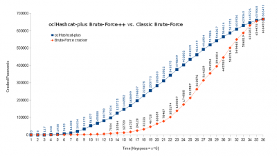

### 4. Wspierane algorytmy hashowania

Hashcat wspiera bardzo dużą liczbę bezpiecznych funkcji hashujących -- możemy odzyskiwać hashe MD5, SHA, NTLM, a nawet PBKDF2 (WPA/WPA2) czy BCrypt. Oprócz tego Hashcat posiada wiele algorytmów używanych przez najpopularniejsze systemy, uwzględniając przy tym wielokrotne hashowanie czy solenie. Bez problemu możemy łamać hashe systemów takich jak MySQL5, IPB2, Joomla czy vBulletin.

Ze względu na różne optymalizacje -- lista dostępnych algorytmów różni się w każdej wersji Hashcat. Warto jednak nadmienić, że twórcy są bardzo otwarci na propozycje społeczności i bardzo często w kolejnych wersjach implementują nowe algorytmy.

Poniższa tabela przedstawia poglądowy spis algorytmów hashowania wspieranych przez trzy wersje Hashcat:

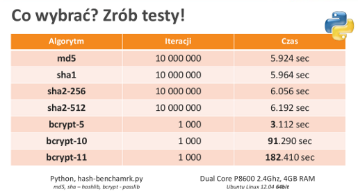

### 5. Liczba hashy a wydajność crackowania

Im większa lista ładowanych hashy, tym większa przestrzeń indeksów musi być przeszukana przez program po wyliczeniu każdego skrótu. Właśnie z tego powodu stworzono wersję oclHashcat-lite, która przeznaczona jest do łamania tylko pojedynczego hasha.

Na szczęście autorzy Hashcat bardzo starają się optymalizować ten program pod każdym względem. Nie inaczej jest i tu. Przy wydaniu wersji `oclHashcat-plus v0.09` po raz kolejny zoptymalizowano tę funkcjonalność i z pewnością zdarzy się to jeszcze nie raz. Wzrost wydajności przy każdej takiej optymalizacji jest duży, co prezentują poniższe grafy przedstawione przez twórców:

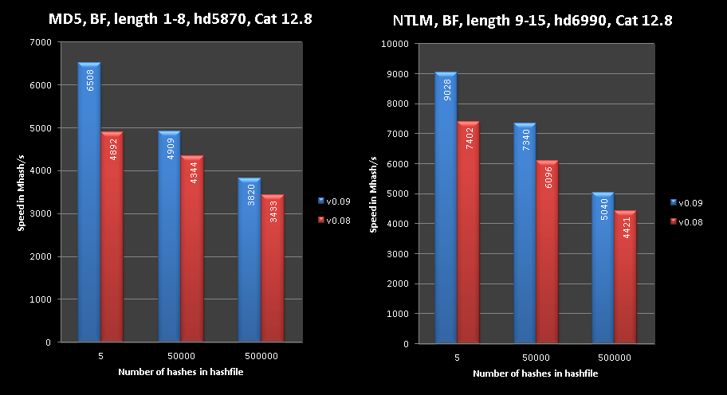

### 6. Przetwarzanie rozproszone

Hashcat może być uruchomiony w środowisku [MOSIX](http://www.mosix.cs.huji.ac.il/). MOSIX (dostępny dla Unix oraz Linux) wymaga skompilowania odpowiedniej łatki dla jądra oraz uruchomienia deamona obsługującego zadania. MOSIX pozwala interpretować wiele systemów operacyjnych, jako jeden system o dużej mocy obliczeniowej. Dzięki temu proces łamania haseł może być rozproszony między wieloma maszynami połączonymi przykładowo siecią LAN.

Nowsze wersje Hashcat (od połowy 2012 roku) potrafią wykonywać obliczenia rozproszone w procesach GPU kart graficznych spiętych ze sobą maszyn. Obecnie można wykonywać jednocześnie obliczenia aż na 128 procesorach graficznych. Rozwiązanie to jest możliwe dzięki projektowi Virtual OpenCL Cluster Platform ([VCL](http://www.mosix.org/txt_vcl.html)) opartego o MOSIX.

Twórcy Hashcata ściśle współpracują z zespołem MOSIX/VCL. Hashcat generuje minimalny narzut komunikatów w obliczeniach rozproszonych, a straty wydajności w sieciach LAN nie przekraczają 1%. Jest to jeden z najważniejszych czynników wpływających na efektywność tego rodzaju obliczeń. Tabela poniżej przedstawia testy wydajności przeprowadzone przez autorów Hashcat:

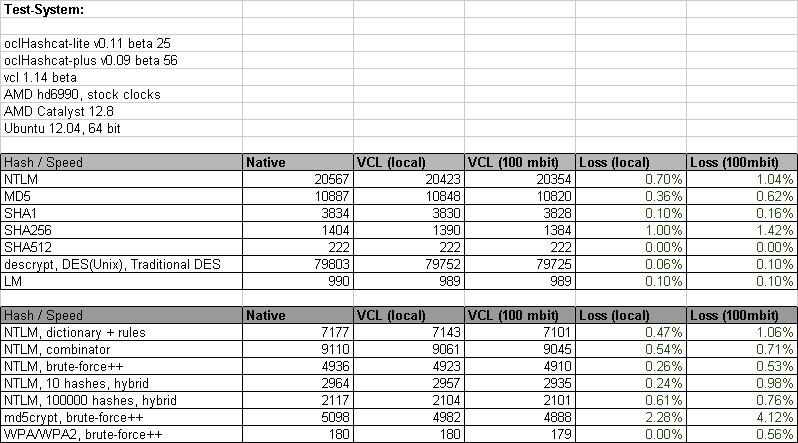

### 7. Przykład ataku na pojedynczy hash

#### Cel i wybór narzędzia

Celem jest złamanie pojedynczego hasha md5:

```text
c11c7c1a65ddecf8d3ce4f589c9d16be
```

Platforma używana w tym przykładzie jest następująca (koszt takiej jednostki w 2012 roku nie przekracza 1000-1100 zł):

```text
AMD Athlon II X4 640 3.00 GHz
NVidia Geforce 450GTS 783/1566 MHz 1GB GDDR5
8GB RAM
Windows 7 SP1 64bit
```

W przypadku łamania pojedynczych hashy najwydajniejszym programem z zestawu Hashcat jest oclHashcat-Lite. Pozwala on jednak przeprowadzać tylko ataki Bruteforce. Po porażce ataku Bruteforce (zbyt długiego oczekiwania) należy użyć oclHashcat-plus.

Konfigurację tego narzędzia najlepiej przeprowadzać przez interfejs graficzny Hashcat-gui, który można pobrać w [tym miejscu](http://hashcat.net/hashcat-gui/). Zawiera on już trzy odmiany Hashcata.

Zgodnie z opisem platformy, uruchamiamy wersję 64 bitową dla Windowsa (w przypadku Linuksa uruchamiamy z konsoli plik `hashcat-gui64.bin`), a następnie obsługę sterownika NVidia. Przechodzimy do zakładki oclHashcat-Lite:

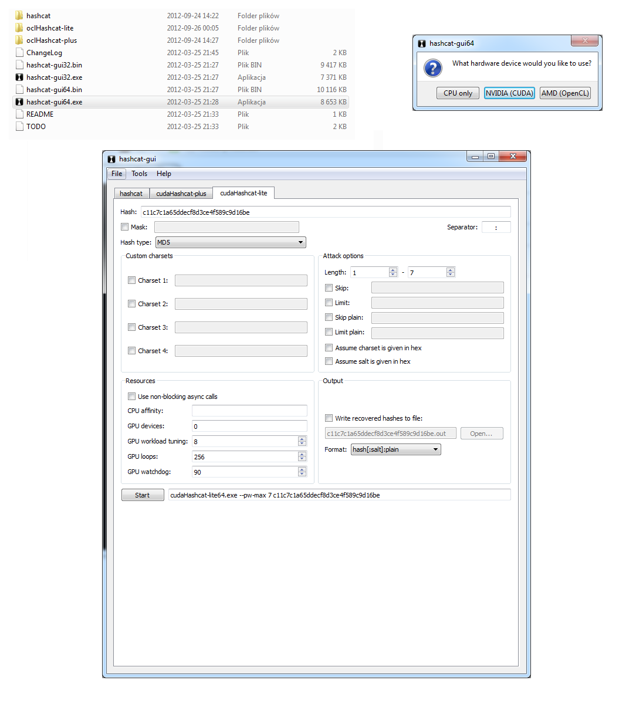

#### Prosty Bruteforce

Najpierw warto sprawdzić, czy oryginał hasła nie jest czymś skrajnie prostym. W tym celu użyjemy klasycznego ataku bruteforce dla maksymalnie 7 znaków:

```console
cudaHashcat-lite64.exe --pw-max 7 c11c7c1a65ddecf8d3ce4f589c9d16be
```

Atak trwał niespełna 3 minuty. Niestety nie udało znaleźć się oryginału:

#### Prosty Mask Attack

Po przetestowaniu najprostszych kombinacji warto przejść do dłuższych haseł. Zwiększanie liczby znaków ataku siłowego wydłuża znacząco atak, więc lepszym pomysłem jest teraz wykonanie kilku Mask Attacks.

W tym momencie warto testować stosunkowo krótkie kombinacje, których pesymistyczny czas obliczeń nie przekracza kwadransa.

Ogólne wzorce, które pasują do najpopularniejszych haseł użytkowników, prezentuje listing poniżej. Najpierw podawane są wzorce najpopularniejsze, następnie mniej popularne. Należy wybrać odpowiednio krótkie kombinacje (oraz pamiętać o przestawieniu parametru length, aby nie skracał nam ataku):

```text
?u?l?l?l?l?l?l?d?d
?u?l?l?l?l?d?d?d
?u?l?l?l?l?l?d?d?d?d
?u?l?l?l?l?d?d?d?d
?u?l?l?l?l?l?l?l?d?d
?u?l?l?l?l?l?l?d?d
?u?l?l?l?l?l?l?l?d?d?d?d
?u?l?l?l?d?d?d?d
?u?l?l?l?l?l?l?l?d
```

Atak przy wykorzystaniu wzorca `?u?l?l?l?l?d?d?` niestety się nie powiódł (czas trwania 13 sekund). Nie należy się tym zrażać i wypróbować inne kombinacje o podobnej złożoności. Jak się okazało, wykorzystując nieznacznie dłuższy wzorzec `?u?l?l?l?l?l?l?d?d` udało się złamać hash, co pokazuje poniższy zrzut ekranu:

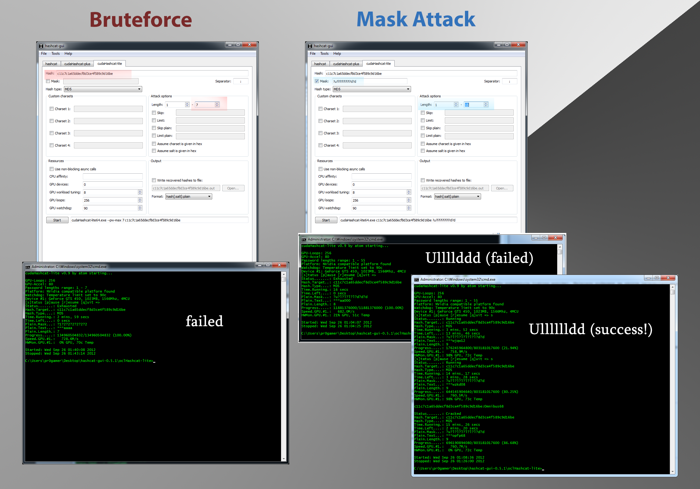

Zadanie wykonane, szukany oryginał to `Omnibus68`.

### 8. Przykład ataku na listę hashy

#### Cel i wybór narzędzia

Celem jest lista 6 142 991 hashy SHA1, która jest dostępna na forum [InsidePRO](http://forum.insidepro.com/viewtopic.php?t=17203&start=0).

Tak duża lista hashy jest bardzo trudna do złamania. Zawartość pliku sugeruje, że hasła mogą nie zawierać soli. Do odzyskania hashy zaleca się skorzystanie z crackera GPU, czyli na przykład oclHashcat-plus.

#### Pierwszy przebieg -- słownik

W pierwszym przebiegu dobrze jest użyć dużych słowników, który zawierają też listę kandydatów z podstawowych ataków siłowych. Dzięki temu można określić naturę łamanych haseł -- czy są one hashowane, losowe czy generowane przez użytkowników.

Czas takiego ataku w zależności od rozmiarów słownika oraz użytej karty graficznej może zająć nawet dobę. Zazwyczaj w tym przypadku łamie się większość hashy z takich dużych wycieków (około 20-40% z całości).

W opcjach oclHashcat-Plus warto zaznaczyć opcję usuwania hashy z listy oraz zapisywania ich do pliku wraz z odzyskanym oryginałem. Pozwoli to nie tylko utrzymać porządek, ale przyśpieszy też atak.

#### Kolejne przebiegi

Ataki na pozostałe hashe przeprowadza się w zależności od tego, jakie hasła zostały odzyskane w poprzednim etapie. Zazwyczaj jesteśmy w stanie określić specyfikę serwisu, grupę użytkowników, ich narodowość i tak dalej. Wykorzystując te informacje, można próbować wykorzystać ataki hybrydowe lub ataki reguł.

Reguły dobrane do Rule Based Attack mogą bardzo wydłużyć czas ataku, więc czasem trzeba użyć krótszych słowników dobranych specyficznie pod grupę docelową użytkowników (można na przykład wyciąć znaki z niektórych alfabetów). Łamanie haseł w kolejnych przebiegach polega na odpowiednim wyborze słownika oraz reguły, ewentualnie na dynamicznym generowaniu reguł przez samego Hashcata.

W przeciągu dwóch godzin przy wykorzystaniu ataku słownikowego i kilku reguł oraz po podstawowych atakach siłowych z maską udało się odzyskać 84 137 haseł, co stanowi zaledwie ~1.5% całości (a już jest dobrym wynikiem w takim czasie). Użytkownicy forum InsidePRO złamali około 30% hashy z tej listy. Dalej nie jest to bardzo dobry wynik, ale lista hashy zawiera dość trudne hasła. Jest to jednak i tak prawie dwa miliony złamanych haseł!

--- *Adrian `Vizzdoom` Michalczyk*
