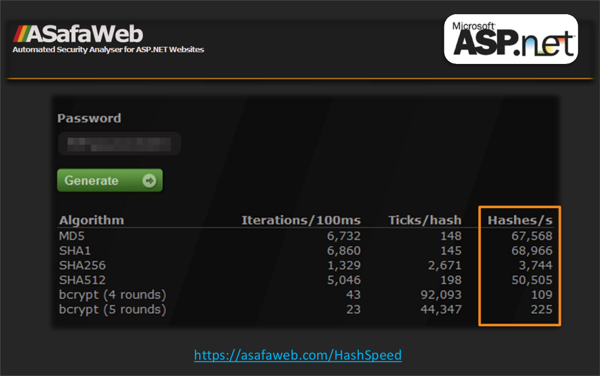

# Kompendium bezpieczeństwa haseł – atak i obrona (część 3.)

## Budowanie słowników

W tym rozdziale zostaną opisane podstawowe wskazówki dotyczące budowy słowników haseł.

### 1. Słownik podstawowy i rozszerzony

Rozmiar słownika ma bezpośredni wpływ na czas ataku. Im większy słownik, tym bardziej zbliżamy się do wariantu ataku siłowego, a właśnie tego chcemy zazwyczaj uniknąć.

Aby skutecznie przeprowadzać ataki słownikowe warto posiadać nie jeden, a kilka słowników. Minimalnym zaleceniem jest korzystanie ze słownika podstawowego oraz rozszerzonego.

Słownik podstawowy powinien posiadać najczęściej występujące hasła, najlepiej pisane małymi literami i bez dodatków takich jak cyfry występujące na końcu i tym podobne. Słownik taki służy do przeprowadzania szybkich testów sprawdzających najpopularniejsze frazy oraz do przeprowadzania ataków hybrydowych. Używając mniejszych słowników, można odnaleźć stosunkowo dużo skomplikowanych haseł, wykorzystując do tego *Rule Based Attack*. Mimo że niektóre reguły bardzo wydłużają czas ataku, to dzięki nim możemy znaleźć wiele haseł, a mały słownik pozwoli nam przeprowadzić atak w zadowalającym czasie.

Przeciętne wielkości słowników podstawowych nie powinny przekraczać 1GB. Mogą być one wykorzystane zarówno w atakach online, jak i offline.

Słownik rozszerzony powinien zawierać duże zbiory kombinacji słów z różnych języków oraz wyrazy powstające w wyniku prostych ataków siłowych (np. cyfry 000000 -- 999999 i podobne). Do dużych słowników powinno dopisywać się nie tylko mniejsze słowniki, ale również wszystkie hashe złamane przy pomocy reguł lub ataków hybrydowych.

Tego typu struktury danych często przewyższają rozmiary 10GB. Zapisywane są zazwyczaj w wielu plikach, ponieważ to ułatwia ich edycję. Z powodu dużej liczby generowanych kandydatów, słowniki rozszerzone nie nadają się do ataków online.

#### Filtrowanie słowników

Słowniki to ogromne zbiory danych, w których często występują duplikaty, długie wpisy lub po prostu śmieci. Dzieje się tak, ponieważ te zbiory budowane są często przez różne narzędzia analizujące słowa ze stron internetowych i innego rodzaju narzędzia automatyczne. Przez to w słownikach można natknąć się np. na składnię HTML, dane binarne i inne niepotrzebne rzeczy. Wszystko to należy co jakiś czas odfiltrowywać. Dzięki temu zyskujemy skuteczniejsze źródło danych, które może zauważalnie skrócić czas ataku.

Oto przykład optymalizacji słownika.

Celem jest przeprowadzenie szeregu szybkich ataków słownikowych na hashe haseł jednego z polskich for młodzieżowych, które zostały opublikowane w 2012 roku.

Informacje o liście hashy:

-   28 513 hashy,
-   algorytm MD5 bez soli oraz wielokrotnego hashowania,
-   hasła generowane są przez polskich użytkowników (grupa docelowa: młodzież).

Słownik `vizzdic.0` jest słownikiem składającym się z wielu małych słowników oraz uzupełnionym o wiele hashy złamanych w przeszłości. Początkowy rozmiar tego słownika to `10.2 GB`. Nie ma w nim duplikatów.

Najpierw ze słownika usunięto wszystkie wyrazy, które nie zawierały znaków z przestrzeni `mixalpha-number-special-space` (wliczając w to polskie znaki diakrytyczne). Rozmiar nowo utworzonego słownika `vizzdic.1` to `9.1 GB`.

Najprostszy *Straight Attack*, przy wykorzystaniu tych dwóch słowników miał następującą skuteczność (czas ataku ~10 min):

-   `vizzdic.0 (10.2GB), Straight Attack, 21760 hashes cracked (76.3%),`
-   `vizzdic.1 (9.1GB), Straight Attack, 21760 hashes cracked (76.3%).`

Oba słowniki są w stanie złamać dokładnie tą samą liczbę hashy (w tym trybie). Tak prosta optymalizacja zmniejszyła rozmiar początkowy o ponad 1GB, co skróciło czas *Straight Attack* o niemal 10%.

Kolejna optymalizacja polegała na usunięciu wyrazów dłuższych od 16 znaków oraz wszystkich nieznaczących znaków białych. Powstały po tej operacji słownik `vizzdic.2`miał wielkość `7.8GB`. Skuteczność ataku przy jego użyciu była następująca:

-   `vizzdic.2 (7.8GB), Straight Attack, 21760 hashes cracked (76.3%)`

Wynik jest mocno zaskakujący -- skuteczność pozostała na pierwotnym poziomie, mimo sporej optymalizacji. Okazało się, że w słowniku było kilka tysięcy długich wpisów, które zostały połączone w nieefektywny sposób. W tym momencie słownik zmniejszył rozmiar o 24%. Filtrowanie do 16 znaków ma też tę zaletę, że wielokrotnie przyśpiesza *Rule Based Attack* (liczba kandydatów generowanych przez reguły jest bardzo duża dla długich wyrazów).

Ostatnią zastosowaną optymalizacją było usunięcie ze słownika wyrazów zawierających znaki specjalne, które nie są zbyt często używane podczas generowania hasła.

Aby sprawdzić, które znaki nie są popularne przeprowadzono następujące badanie: zliczono w słowniku liczbę wystąpień wyrazów zawierających pewien znak specjalny, usunięto te wyrazy, a następnie sprawdzono, o ile mniej hashy zostało złamanych. Dzięki temu zebrano informacje przedstawione w poniższej tabeli:


Informacje te jednoznacznie wykazują, że ze słownika można usunąć wszelkie wyrazy, które zawierają znaki:

```text
? ] ; " { | ~ ` [ \ ‚ .
```

Wyrazy te w ogóle nie wpływają na skuteczność słownika.

Reszta znaków specjalnych również nie wpływa *znacząco* na skuteczność słownika. Współczynnik w ostatniej kolumnie tabeli pokazuje proporcję złamanych haseł do wystąpień wyrazów w słowniku (pomnożony jest przez milion). Każdy musi zastanowić się, czy opłaca się usunięcie ze słownika 4 milionów wyrazów kosztem nie złamania 6 hashy. W przykładzie optymalizacji słownika `vizzdic.2` przyjęto, że współczynnik większy od 5 sugeruje, że warto zostawić dane wyrazy w słowniku.

Po powyższej optymalizacji powstał słownik `vizzdic.3` o rozmiarze `7.24GB`. Skuteczność łamanych haseł: `vizzdic.2 (7.24GB), Straight Attack, 21685 hashes cracked (76.1%)`

#### Jak budować słowniki

-   zacznij od dostępnych słowników,
-   dodaj słowa kluczowe związane z serwisem, z którego masz listę hashy (Information Gathering),
-   wyczyść słownik z haseł, które nie spełniają kryteriów stawianych przez serwis (np. zbyt krótkie lub zbyt długie wpisy). Możesz do tego wykorzystać narzędzia takie jak `sed`, `tr`, `awk`,
-   wynik zapisz jako *słownik podstawowy* oraz *słownik rozszerzony*.

Na podstawie słownika podstawowego przeprowadź *Rule Based Attack*:

-   wybierz reguły, rozszerzające słownik dla każdego hasła:
    -   dodawanie cyfr z zakresu 1900 -- 2012,
    -   dodawanie cyfr 00-99,
    -   l33tSpeak Transform -- zamiana e-3, a-4, o-0 itd.,
    -   dodawanie ! na końcu,
    -   zamiana pierwszej litery na dużą,
    -   wiele, wiele innych...
-   po złamaniu hasha dodaj nowo wygenerowane hasła do *słownika rozszerzonego*oraz *słownika podstawowego*,
-   w słowniku podstawowym staraj się nie przechowywać wyrazów, które można wygenerować z reguł (np. zapisz `admin` a nie `admin` oraz `adm1n001`); od razu też usuwaj duplikaty,
-   raz na jakiś czas usuwaj duplikaty ze słownika rozszerzonego i filtruj go, pozbywając się zbyt długich wyrazów.

Proces generowania słownika trwa wiele lat. Przydatne są do tego listy złamanych haseł, które można znaleźć na przykład na forum InsidePRO, we wklejkach Pastebin lub w informacjach medialnych mówiących o wyciekach baz danych.

## Hasła statyczne -- porady

### 1. Porady dla programisty

#### Sole statyczne a dynamiczne

Sól statyczna to stała wartość dodawana do *każdego* hasła. Jest to bardzo popularne rozwiązanie, gdyż jest bardzo proste w implementacji.

Stosowanie soli statycznych niestety nie chroni przed atakami (może z wyjątkiem prostych ataków *rainbow tables*). Atakujący, przełamując zabezpieczenia, poznaje też sól statyczną i dodaje ją do każdego testowanego ciągu.

Projektując system, pamiętaj, żeby używać soli dynamicznych -- nieprzewidywalnych ciągów znaków dodawanych osobno do każdego hasła. Warto zadbać też o to, aby były to wartości unikatowe.

#### Którą funkcję skrótu wybrać? Zrób testy!

Liczba bezpiecznych funkcji hashujących jest dość duża, każda z nich zapewnia określony poziom bezpieczeństwa. Wybór nie jest prosty.

Warto zacząć od przejrzenia publikacji naukowych w celu określenia, które funkcje zostały złamane, a które uważane są za bezpieczne.

Po wybraniu kandydatów należy przeprowadzić testy wydajnościowe, które posłużą do określenia szybkości implementacji funkcji. Pozwoli to nie tylko zapobiegać atakom DoS spowodowanym przez nadmierną liczbę obliczeń, ale również da pogląd, w jakim tempie crackerzy będą mogli przeprowadzić ataki.

Poniżej znajduje się zestawienie kosztów, jakie muszą ponieść crackerzy, gdy chcą przeprowadzić udany atak na hasła. Dane te zostały oszacowane przez twórców scrypta w 2010 roku:


Testy wydajnościowe funkcji skrótu są konieczne, ponieważ czas obliczeń hashy w różnych bibliotekach może okazać się zaskakujący. Weźmy na przykład implementacje SHA2 w domyślnych bibliotekach .NET:



Listing poniżej przedstawia skrypt pozwalający wstępnie oszacować koszt pojedynczego przetworzenia wybranej funkcji hashującej:


```python
import sys
import hashlib
from passlib import hash

if len(sys.argv) != 4:
    print "Usage: python hash-benchmark KEY HASH_FUNCTION ITERATIONS"
    print "HASH_FUNCTION = [md5|sha1|sha2-224|sha2-256|sha2-384|sha2-512|bcrypt-5|bcrypt-10|bcrypt-11]
    exit(1)

key = sys.argv[1]
hashtype = sys.argv[2]
rounds = int(sys.argv[3])

if hashtype == "md5":
    for i in range (1, rounds):
        hashlib.md5(key)
elif hashtype == "sha1":
    for i in range (1, rounds):
        hashlib.sha1(key)
elif hashtype == "sha2-256":
    for i in range (1, rounds):
        hashlib.sha256(key)
elif hashtype == "sha2-512":
    for i in range (1, rounds):
        hashlib.sha512(key)
elif hashtype == "bcrypt-5":
    for i in range (1, rounds):
        hash.bcrypt.encrypt(key, rounds = 5)
elif hashtype == "bcrypt-10":
    for i in range (1, rounds):
        hash.bcrypt.encrypt(key, rounds = 10)
elif hashtype == "bcrypt-11":
    for i in range (1, rounds):
        hash.bcrypt.encrypt(key, rounds = 11)
else: print "[-] WRONG HASh2"
```

> Pamiętaj: **Szybka funkcja hashująca jest Twoim wrogiem**, ale pamiętaj również o wydajności systemu.

#### Key stretching

Key stretching jest metodą polegającą na zwiększenia kosztu ataku na klucz lub funkcję skrótu.

Metoda ta zazwyczaj polega na wielokrotnym hashowaniu funkcji. Jest to proste w implementacji i daje bardzo dobre efekty. Ogólny algorytm przedstawia poniższy listing:

```js
function multihash(numrounds, password){
    for (i=0; i<numrounds; ++i)
        password = hashfunction(password);
    return password
}
```

Niektóre algorytmy funkcji skrótu posiadają wbudowany key stretching, całkowicie zwalniając programistów z pracy (np. BCrypt).

Metoda ta jest głównie kojarzona z wielokrotnym hashowaniem zwiększającym moc obliczeniową algorytmów. Jest to jednak ogólna technika zwiększająca koszt ataku dowolnej funkcji hashującej czy szyfrującej.

Mimo wielu mocnych zalet, key stretching trzeba wdrażać ostrożnie. Jeśli system nie ogranicza liczby prób logowania, wtedy zagrożony jest atakiem DoS: nadmierną liczbą obliczeń spowodowanych atakiem siłowym.

#### Nie implementuj sam!

Pierwsza zasada kryptografii: nie implementuj niczego własnoręcznie. Jeżeli nie jesteś kryptologiem, korzystaj ze sprawdzonych rozwiązań.

Rada może i oczywista, jednak trzeba uważać na różnego rodzaju biblioteki pisane przez „entuzjastów" lub studentów, które działają poprawnie tylko dla niektórych danych.

#### Testuj

Upewnij się, czy używana implementacja jest poprawna.

Przeprowadź testy zarówno dla danych tekstowych, jak i binarnych (jeżeli funkcja umożliwia ich stosowanie). Nie zapomnij o przetestowaniu znaków specjalnych (w szczególności takich jak `< > " ' &`) oraz egzotycznych alfabetów.

Najlepszym sposobem na testy jest napisanie unit testów automatycznie sprawdzających wyniki zaimplementowanych funkcji hashujących. Dane do unit testów można wygenerować w innych bibliotekach, narzędziach online lub przez polecenia systemu operacyjnego.

#### Pozwól na XSS w haśle

Ostatnia rada adresowana jest do programistów mających świadomość bezpieczeństwa kodu webaplikacji.

Textbox służący do wpisywania hasła powinien mieć wyłączone wszelkie filtry antyXSS. Serio! Niech użytkownicy w tym małym fragmencie aplikacji wpisują dowolne dane.

Porada może być troszkę szokująca, jednak hasło i tak nigdy nie może być ani wyświetlane ani wysyłane w żadnej formie. Dane z pola hasła powinny być od razu hashowane przez odpowiedni kontroler. W momencie jakiegokolwiek błędu nie można odsyłać użytkownikowi wpisanego hasła (np. przez tzw. *callback*).

Jeżeli nie wyłączymy filtrów XSS może okazać się, że przechowujemy hash hasła „`I%20<3%20you`" zamiast „`I <3 you`„. Aplikacja może działać dalej poprawnie, ponieważ formularz logowania prawdopodobnie będzie korzystał z tych samych filtrów. Problem pojawi się, gdy będziemy chcieli zintegrować kilka aplikacji ze sobą -- wtedy hasła części użytkowników mogą okazać się błędne.

Kodowanie znaków to nie jedyny problem. Znacznie gorzej, gdy filtr lub system zabezpieczający odetnie request użytkownika używającego w haśle znaków specjalnych, które są używane w atakach XSS. Problem taki może wystąpić na przykład w aplikacjach ASP:


Jak widać użytkownik jest blokowany przez filtr `HttpRequestValidation`, który można dodać do strony ASP. Jest to domyślnie dostępny filtr, który działa w następujący sposób (tłumaczenie z dyskusji [SO](http://stackoverflow.com/questions/2200788/asp-net-request-validation-causes-is-there-a-list)):

```text
* szukaj znaku < lub &. Jeśli go nie ma lub jeśli jest to ostatni znak - uznaj ciąg za poprawny,
* jeśli znak & znajduje się w ciągu &# (np. &#160; dla niełamliwej spacji) - uznaj ciąg za niebezpieczny,
* jeśli znak < znajduje się w ciągu <x (gdzie x = [a-z]) lub <!, </, <? - uznaj ciąg za niebezpieczny,
* jeśli żadna z powyższych reguł nie jest spełniona - znaj ciąg za poprawny.
```

Wartości sprawdzane są w następujących żądaniach:

-   nazwa pliku podczas upload POST,
-   przychodzące, surowe wywołanie URL,
-   część nazwy lub wartości ciastka,
-   część nazwy lub wartość parametru GET lub POST.

### 2. Porady dla audytora

Sprawdzając bezpieczeństwo mechanizmów uwierzytelnienia trzeba zwrócić uwagę na następujące rzeczy:

-   **Czy hasła są hashowane?** Hasła nie mogą być zapisane otwartym tekstem lub szyfrowane.
-   **Czy użyta funkcja skrótu jest jeszcze bezpieczna?** Obecnie MD5 oraz SHA1 nie zapewniają dużego poziomu bezpieczeństwa.
-   **Czy użyto soli dynamicznych?** Sól powinna być generowana osobno dla każdego hasła z losowych ciągów.
-   **Czy użyto Key Stretchingu?** Najlepiej, żeby możliwość np. wielokrotnego hashowania została wbudowana w sam algorytm.
-   **Czy należy przehashować hasła?** Jeśli liczba rund wielokrotnego hashowania jest już za mała, trzeba ją zwiększyć przy następnej zmianie haseł.
-   **Czy istnieje możliwość łatwej enumeracji loginów?** Czy identyfikatory są kolejnymi liczbami całkowitymi? Czy loginy wszystkich użytkowników są wypisywane w listach lub rankingach?
-   **Czy minimalne złożoności haseł są odpowiednie?** Czy hasła użytkowników nie są zbyt krótkie? Czy można używać haseł: pustych, takich samych jak login/e-mail/nazwisko?
-   **Czy system ogranicza dostęp po nieudanym logowaniu?** System powinien odcinać próby ataku brutalnego.
-   **Czy użytkownik może użyć *dowolnego* hasła?** Czy filtry poprawnie przepuszczają znaki takie jak `< > & " '` ? Czy hasła używające znaków specjalnych i znaków różnych alfabetów (`ą Ź Ö a ç ?`) są interpretowane poprawnie?

### 3. Porady dla każdego użytkownika

Oto zbiór porad dotyczących każdego z nas -- niezależnie od tego czy jesteśmy administratorami czy zwykłymi użytkownikami dowolnego systemu.

-   **Używaj długich, nieprzewidywalnych haseł**. Zyskasz dzięki temu dużo czasu, gdy baza danych zostanie wykradziona. Będziesz miał też pewność, że ataki skierowane wyłącznie w Ciebie (a nie w serwis) się nie powiodą.
-   **Używaj osobnego hasła w każdej usłudze**. W najgorszym wypadku cyberprzestępcy uzyskają dostęp tylko do jednego konta (a nie do skrzynki pocztowej, serwisu społecznościowego, banku...)
-   **Używaj systemu do zarządzania hasłami**. Prosty program pozwoli Ci przestrzegać dwóch pierwszych reguł i zaoszczędzi sporo Twojego czasu. Opisy systemów zarządzania hasłami znajdują się w dalszej części artykułu.
-   **Zapamiętaj tylko kilka haseł i nigdy ich nie zapisuj**. Wybierz tylko kilka usług, z których często korzystasz, i zapamiętaj do nich hasła. Mogą to być hasła Keepass, hasło głównej skrzynki pocztowej, bankowości, PIN telefonu i karty płatniczej. Resztę haseł -- do for, portali czy nawet smyczy roweru -- zapamiętaj w systemie zarządzania hasłami.
-   **Zmieniaj hasła**. W szczególności, gdy dowiesz się o wycieku bazy danych w serwisie, z którego korzystasz.
-   **Włącz podwójne uwierzytelnianie tam, gdzie to możliwe**. W szczególności dla swojej skrzynki pocztowej. Po pierwsze udaremnisz ataki skierowane na Ciebie, po drugie dowiesz się, ilu masz wrogów.
-   **Rób backup swoich haseł**. Ludzie dzielą się na dwie grupy -- tych, co robią backup i tych, co będą go robić. Upewnij się, że należysz do tej pierwszej grupy.

### 4. Odzyskiwanie haseł jako hobby?

Na forach twórców najlepszych programów do łamania haseł istnieją prawdziwe markety hashy. Oczywiście pierwsze skojarzenie z tego typu serwisami jest bardzo negatywne -- jednak warto zaznaczyć, że taki proceder wcale nie jest nielegalny. Użytkownicy tych serwisów to zazwyczaj entuzjaści, badacze lub informatycy śledczy, którzy chcą podzielić się swoją wiedzą lub mocą obliczeniową. Czasem za darmo, czasem za pieniądze.

Bardzo popularnym miejscem tego rodzaju, jest forum InsidePRO -- <http://forum.insidepro.com/>. Forum jest znane z tego, że nie tylko posiada tysiące prywatnych hashy do złamania, ale również listy hashy z wycieków baz największych serwisów na świecie. Dane takie idealnie nadają się do analiz statystycznych bezpieczeństwa haseł internautów oraz pomagają tworzyć skuteczniejsze słowniki.

Forum Insidepro jest dokładnie moderowane. Najmniejsze próby udostępnienia zrzutów baz danych pochodzących z włamań są szybko wykrywane, a użytkownicy są blokowani. Forum służy tylko do wymiany informacji na temat hashy -- jakiekolwiek prywatne dane (nazwy użytkowników, e-maile itd.) nie mogą być tam umieszczane.


Transakcje gotówkowe przeprowadzane są przeważnie za pomocą kryptowalut (bitcoin) lub walut internetowych (webmoney). Nad bezpieczeństwem transakcji czuwają `trusted members`, którzy działają jako pośrednik w transakcji, dzięki czemu obie strony zawsze są bezpieczne:


Najpopularniejszą walutą webmoney na forum jest [LR](http://www.libertyreserve.com/ "LibertyReserve"). Liberty Reserve nie jest bankiem -- jest procesorem płatności internetowych. LR jest popularną instytucją, gdyż do założenia tu konta nie jest wymagana weryfikacja danych -- zapewnia to pewną anonimowość. Pieniądze wpłaca się i wypłaca przez specjalne kantory internetowe. W Polsce takim kantorem jest [Lilion Transfer](http://liliontransfer.org/).

Ceny za złamanie pojedynczego hasha zazwyczaj opiewają w przedziale 1-100 LR, czyli 3-300 zł.

## Podsumowanie

Z jednej strony wszędzie jesteśmy atakowani wskazówkami dotyczącymi metod przechowywania haseł, z drugiej -- porady te zazwyczaj puszczamy mimo uszu, narażając się na duże niebezpieczeństwo. Bezpieczna implementacja procesu uwierzytelniania jest nie lada wyzwaniem. Z tego powodu używa się gotowych rozwiązań, zapewniających zbyt niski poziom bezpieczeństwa.

Programista musi mieć świadomość, że hasło jest jednym z najważniejszym zasobów systemu. Cyberprzestępca próbuje sforsować wszystkie zabezpieczenia tylko po to, aby przejąć kontrolę nad tym krótkim ciągiem znaków.

Każde hasło może zostać złamane w skończonym przedziale czasu. Za wszelką cenę trzeba więc zadbać, aby atak był procesem żmudnym i długotrwałym. W tym celu należy poznać najnowsze funkcje skrótu, zbadać ich wydajność oraz przewidzieć, jak ich bezpieczeństwo może wyglądać w przeciągu najbliższych lat.

Wydłużanie czasu ataku najłatwiej zrealizować przez użycie algorytmów, które cechują się wbudowanym *Key Stretchingiem* oraz soleniem haseł. Świadoma kontrola złożoności obliczeniowej i pamięciowej bezpiecznych funkcji hashujących odgrywa znaczącą rolę w bezpieczeństwie systemu i wszystkich jego użytkowników.

Crackerzy natomiast mają coraz trudniejsze zadanie do wykonania. Jest to spowodowane nadchodzącym zmierzchem funkcji MD5 czy SHA1. W tym momencie popularne systemy takie jak WordPress, Drupal, PHPBB3 czy Linux oferują mechanizmy na tyle bezpieczne, że odzyskiwanie z nich haseł staje się praktycznie niemożliwe w domowych warunkach.

Oczywiście w wielu rozwiązaniach dalej korzysta się z wydajnych funkcji skrótu z pojedynczą iteracją i też na próżno szukać wielu nowych aplikacji używających funkcji takich jak BCrypt czy SCrypt.

Współcześnie cracking haseł polega na przeprowadzaniu skomplikowanych ataków offline, wykorzystujących nie tylko moc obliczeniową kart graficznych (GPGPU), ale również przetwarzanie rozproszone. W niedalekiej przyszłości crackerzy zaczną wynajmować klastry GPU i chmury obliczeniowe do tych celów. Dzisiaj nie jest to jeszcze opłacalne.

Na polu walki programista-cracker najbardziej cierpi zwykły użytkownik. W czasach, w których prawie każdy aspekt naszego życia uzależniony jest od technologii, jesteśmy strasznie narażeni na niebezpieczeństwo spowodowane przez nieostrożność programistów usług, z których korzystamy.\
Nasza tożsamość na czarnym rynku warta jest dosłownie parę złotych i trafia tam przez czyjeś zaniedbanie.

Trzeba zdać sobie sprawę, że cracker nie tylko może przejąć konto do pewnej usługi, ale przy odrobinie szczęścia przy jej pomocy może spróbować wykasować nasze życie z cyberprzestrzeni.

Dziś w szczególny sposób należy dbać o bezpieczeństwo haseł. Unikatowy ciąg w każdej usłudze o odpowiednio dużej złożoności jest wszystkim, co wystarczy zrobić, aby czuć się bezpiecznie. Aby wdrożyć tę zasadę potrzeba niestety dużo samozaparcia, ale z pomocą przychodzą systemy zarządzania hasłami. Programy te automatyzują żmudne czynności i pozwalają nam prawie całkowicie odciąć się od problemu zapamiętywania haseł.

Nieważne, czy utożsamiasz się z kreatywnym programistą, agresywnym crackerem czy zwykłym użytkownikiem. Jedno jest pewne -- Twoim wrogiem zawsze będzie pośpiech, lenistwo i przyzwyczajenie. To właśnie przez te czynniki programiści używają funkcji MD5, crackerzy bezskutecznie używają ataków bruteforce, a zwykli użytkownicy rejestrują się z hasłem `qwerty`.

Należy pamiętać, że odzyskiwanie haseł nie musi być po prostu etapem nielegalnej penetracji systemu. Proces ten może być intelektualnym wyzwaniem i hobby. Pisanie nowych algorytmów, konfiguracja klastrów obliczeniowych czy overclocking jest przecież pasją wielu ludzi.

### Źródła

-   Andrew S. Tanenbaum -- Systemy Operacyjne, wydanie III (Helion, 2010)
-   Shakeel Ali, Tedi Heriyanto -- BackTrack 4: Assuring Security by Penetration Testing (Packt Publishing, 2011)
-   Morris, Thompson -- Password Security: A Case History (ACM, 1979), [cached documents](http://citeseerx.ist.psu.edu/viewdoc/summary?doi=10.1.1.127.8377)
-   [The UNIX Encrypted Password System](http://www.diablotin.com/librairie/networking/puis/ch08_06.htm)
-   [SHA1 -- wikipedia](http://en.wikipedia.org/wiki/SHA-1)
-   [Charset configuration file by Martin Westergaard](http://tbhost.eu/charset.txt)
-   [Passlib bcrypt library](http://packages.python.org/passlib/lib/passlib.hash.bcrypt.html#format-algorithm)
-   [Do you allow xss in your passwords?](http://www.troyhunt.com/2012/09/do-you-allow-xss-in-your-passwords-you.html)
-   [ASafaweb Project](https://asafaweb.com/HashSpeed)
-   [phpass library](http://www.openwall.com/phpass/)
-   [phpass -- Should I Use Them?](http://stackoverflow.com/questions/5343611/portable-phpass-password-hashes-should-i-use-them)
-   [Hashes Algorithms used in different web applications](http://trueliarx.blogspot.com/2010/04/hashes-algorhitms-used-in-different.html)
-   [A closer look at WordPress Password Hashes](http://resources.infosecinstitute.com/wordpress-password-hashes/)
-   [WhatWeb](http://www.morningstarsecurity.com/research/whatweb)
-   [Fierce2](http://trac.assembla.com/fierce/wiki)
-   [Keepass](http://keepass.info/)
-   [Hashcat -- VCL support](http://hashcat.net/forum/thread-1541.html)
-   [py-bcrypt](http://www.mindrot.org/projects/py-bcrypt/)
-   [oclHashcat-plus 0.09 release info](http://hashcat.net/forum/thread-1541.html)
-   [ASP Request Validation Method in SO](http://stackoverflow.com/questions/2200788/asp-net-request-validation-causes-is-there-a-list)

--- *Adrian `Vizzdoom` Michalczyk*
