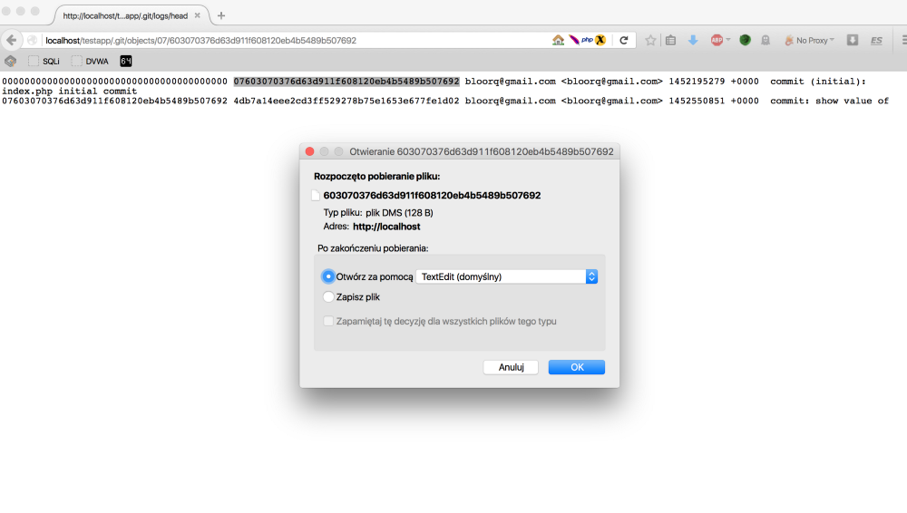
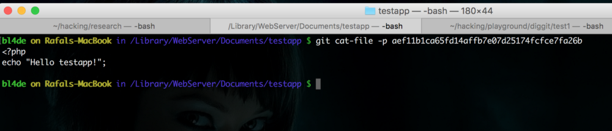

# Hidden directories and files as a source of sensitive information about web application

Hidden directories and files left accidentally on the web server might be a very valuable source of sensitive information. There can be a lot of hidden information in web application root folder: source code version systems folders and files (.git, .gitignore, .svn), project configuration files (.npmrc, package.json, .htaccess), custom configuration files with common extensions like config.json, config.yml, config.xml and many, many others.

In general, those resources can be divided into couple of common categories:

- **Source Code Version control systems**
- **IDE (Integrated Development Environment) configuration files**
- **Project and/or technology specific configuration and settings files**

Let’s take a look at them in more details — where to find them and what kind of information to expect from them.

## Source code version control systems

### Git

[Git](https://git-scm.com/) is “(…)a free and open source distributed version control system designed to handle everything from small to very large projects with speed and efficiency". With GitHub.com it’s one of the most popular source code version control system right now, especially in open source world. Also, a lot of companies use their own [GitLab](https://about.gitlab.com/) installations as well as GitHub Enterprise or [Bitbucket](https://bitbucket.org/).

#### Basic information about Git objects

Newly created Git repository contains some default folders and files, where all information are stored. Here’s sample .git folder, with one commit done already:


Let’s take a look at this from attacker point of view. Git repository content is written in objects. All of them are stored in *.git/objects* folder.

Objects can be one of three types: commit, tree and blob.

**Commit** is an information about commit, with current tree (folders and files structure) object hash.

**Tree** contains information about folders and files structure — and every single folder or file has its own object hash stored in tree object. It might be another tree (folder which is one level down in the folders structure) or file.

**Blob** is Git object type where files content are saved. In other way — if you know an object hash of the particular file, you can read content of this file using git *cat-file* command.

When you find *.git* folder on web server, there’s simple way to get content of any file, just by downloading and reading Git objects. Sometimes, if you’re lucky enough, you can try and clone repository using standard [git clone](https://git-scm.com/docs/git-clone) command or just run [wget command with -r option set to download all .git folder recursively](https://www.gnu.org/software/wget/manual/html_node/Recursive-Retrieval-Options.html). But this is not always possible, due to several reasons (like no required credentials or lack of wget command). Let’s assume that all those options are not possible.

To make sure that *.git* folder is available just check if you get HTTP 403 response (or similar, but not 404, because it means there’s no *.git* folder on this server or in this location):


#### Reflecting remote files and folders using local Git repository

To be able to do this, you have to create your own, local “dummy” .git repository with skeleton folder structure and download Git objects from remote server.

First, create dummy Git folder:

```console
$ git init
```

This will initialize empty Git repository with all required files and folders.

#### Retrieving and reading information about objects

To start retrieving information from Git repository, first we have to find starting point. Git saves all information in log file and this file is available at *.git/logs/head*


If *.git/logs/head* does not work, but .git returns Forbidden 403, which means it’s there, try *.git/logs/HEAD* instead

Let’s take a look a little bit closer to sample line of this file:

```text
0000000000000000000000000000000000000000 07603070376d63d911f608120eb4b5489b507692
bloorq@gmail.com <bloorq@gmail.com> 1452195279 +0000	commit (initial): index.php initial commit
```

First two strings are object hashes (previous and current commit) — and this is exactly what we are looking for. As this is the very first commit, first hash contains only 0 (as there is no previous commit obviously), second one contains information about current commit.

First we have to create valid path to object. Path contains common path to all objects in repository, which is *.git/objects* following by two parts build from hash — a directory name (first two characters of hash) and filename (the rest of the hash, starting from third character). So to get object identified by hash *07603070376d63d911f608120eb4b5489b507692*, we should try to open following url:

```text
localhost/testapp/.git/objects/07/603070376d63d911f608120eb4b5489b507692
```

And — here we are — file download popup:



Remember — you have to save this file in your dummy Git folder created earlier — this is the simplest way to be able to read content of Git objects as by default your **git** (program) will look for them there. So make sure that you saved it in exactly the same location:

```text
path-to-your-dummy-git-repository/.git/objects/07/603070376d63d911f608120eb4b5489b507692
```

Now, [git cat-file](https://git-scm.com/docs/git-cat-file) should become your best friend. To check **type** of the object, you can use following command:

```console
$ git cat-file -t <hash>
```

To display the **content** of the object, use command:

```console
$ git cat-file -p <hash>
```

Now, we can check the type and read content of previously saved object (I’m doing this in repository created on my localhost, but you will get exactly the same result on your machine for any Git repository — only hash will be different)


When you’ll take a look at commit description, you can find an information about actual **tree** object hash — as I mentioned earlier, tree contains information about current folder structure (to be more precise: folder structure at the moment when commit was done). Using the same method as above it’s simple to see how it looks like:


We’re very close. As you can see, currently there’s only one file, index.php, and also we know its object hash and type, which is blob. And this is what we need to see content of file using the same method as we’ve used to read content of commit and tree objects before (first you have to download object from web server, as described above):



Voila!

Now it is important to remember **that this is content of index.php as it was when commit described by object 07603070376d63d911f608120eb4b5489b507692 was done**. If you take a look at log file, you can see that there was second commit (identified by object hash *4db7a14eee2cd3ff529278b75e1653e677fe1d02*) and as it is last commit — it contains all last changes — maybe content of *index.php* differs from what we have seen so far?

Following all steps (read commit content to find tree hash, then read tree to find index.php hash and so on), we will see actual content of index.php:

```console
$ git cat-file -p a4215057b6545240452087ad4d015bf9b5b817c5
<?php
echo "Hello testapp!";

$i = 100;
echo "Value of i is $i";

bl4de on Rafals-MacBook in /Library/WebServer/Documents/testapp $
```

Because manual object retrieving is not efficient and very time consuming, I’ve created simple console tool in Python to automate this process. You can take a look at in here.

#### .gitignore file

There’s also one thing worth to mention if we’ve found *.git* folder abandoned on web server — **.gitignore** file. The purpose of this file is simple — it is the place where you can put names of all folders and files which should NOT be committed into repository (but it does not mean that they are not there — they just not exists as a part of Git repository, that’s all). So it’s the simplest way to find all the content which can not be reveal in the way described above.


### Subversion (SVN)

[Subversion (or SVN)](https://subversion.apache.org/) is a source code version control system created by Apache Software Foundation and it is still very popular and widely used, especially in enterprise environments with huge legacy codebase.

Sample structure of SVN folders and files looks like in the following example:


From our point of view, the most important are *SQLite* database **wc.db** file and content of **pristine/** directory. In *wc.db* we will find hashes used as filenames in *pristine/*, so we have to start from this file.

To get information from Subversion, first we need to make sure that wc.db file is available. Try to open following path in your web browser:

```text
http://server/path_to_vulnerable_site/.svn/wc.db
```

If you get download popup — it means there’s a chance that the rest of *.svn* files will be there. First, we need to read content of *wc.db* to get an information about files hashes (there is no *.logs* directory here, like it was in Git repository described above).

To read content of wc.db, you can use [SQLite console client](https://www.sqlite.org/cli.html) (or any other tool for managing SQLite databases):

```console
$ sqlite3 wc.db
SQLite version 3.8.10.2 2015-05-20 18:17:19
Enter ".help" for usage hints.
sqlite> .databases
seq  name             file
---  ---------------  ----------------------------------------------------------
0    main             /Users/bl4de/hacking/playground/wc.db
sqlite> .dump
PRAGMA foreign_keys=OFF;
BEGIN TRANSACTION;
CREATE TABLE REPOSITORY (   id INTEGER PRIMARY KEY AUTOINCREMENT,   root  TEXT UNIQUE NOT NULL,   uuid  TEXT NOT NULL   );
INSERT INTO "REPOSITORY" VALUES(1,'svn+ssh://192.168.1.4/var/svn-repos/project_wombat','88dcec91-39c3-4b86-8627-702dd82cfa09');

(...)

INSERT INTO "NODES" VALUES(1,'trunk',0,'',1,'trunk',1,'normal',NULL,NULL,'dir',X'2829','infinity',NULL,NULL,1,1456055578790922,'bl4de',NULL,NULL,NULL,NULL);
INSERT INTO "NODES" VALUES(1,'',0,NULL,1,'',1,'normal',NULL,NULL,'dir',X'2829','infinity',NULL,NULL,1,1456055578790922,'bl4de',NULL,NULL,NULL,NULL);
INSERT INTO "NODES" VALUES(1,'trunk/test.txt',0,'trunk',1,'trunk/test.txt',2,'normal',NULL,NULL,'file',X'2829',NULL,'$sha1$945a60e68acc693fcb74abadb588aac1a9135f62',NULL,2,1456056344886288,'bl4de',38,1456056261000000,NULL,NULL);
INSERT INTO "NODES" VALUES(1,'trunk/test2.txt',0,'trunk',1,'trunk/test2.txt',3,'normal',NULL,NULL,'file',NULL,NULL,'$sha1$6f3fb98418f14f293f7ad55e2cc468ba692b23ce',NULL,3,1456056740296578,'bl4de',27,1456056696000000,NULL,NULL);

(...)
```

See *INSERT* operations to *NODES* table? Each of them contains filename and SHA1 hash, which corresponds to entry in pristine/ folder:

```console
$ ls -lA pristine/94/
total 8
-rw-r--r--@ 1 bl4de  staff  38 Feb 21 12:05 945a60e68acc693fcb74abadb588aac1a9135f62.svn-base
```

To map value from NODES to filename, we need to perform some steps:

- remove **$sha1$** prefix
- add **.svn-base** postfix
- use first two signs from hash as folder name inside *pristine/* directory (94 in this case)
- create complete path, which in our sample case will be:

```text
http://server/path_to_vulnerable_site/.svn/pristine/94/945a60e68acc693fcb74abadb588aac1a9135f62.svn-base
```

When we try to open this path in the browser, we should be able to download file or display its content directly in browser:


Also, an entry in REPOSITORIES table point to original repository path, which is:

```text
svn+ssh://192.168.1.4/var/svn-repos/project_wombat
```

There’s a lot of information here. Leaving .svn folder on the web server is a huge mistake and can be very dangerous and it means full compromise of web application source code.

## IDE project files

IDE (Integrated Development Environment) used by many of developers have one thing in common — they save project’s settings and a lot of additional information in their own files, created for each project separately. If such folder has been left on web server — this is yet another source of information about web application.

Let’s take a look a little bit closer of JetBrains products first [https://www.jetbrains.com/](https://www.jetbrains.com/).

### JetBrains IDEs — IntelliJ IDEA, WebStorm, PHPStorm, RubyMine

Every project developed with one of JetBrains product creates its own hidden directory, .idea/. This directory contains all information about current project, its files, directories and IDE settings.


One of those files is extremely valuable from Security Researcher point of view. **workspace.xml** contains a lot of useful information, which allows to enumerate all files and folders of the application, source version control system information and many others.

We will investigate those information one by one :

```xml
<?xml version="1.0" encoding="UTF-8"?>
	(...)
	<component name="FileEditorManager">
	    <leaf>
	      <file leaf-file-name="README.md" pinned="false" current-in-tab="false">
	        <entry file="file://$PROJECT_DIR$/README.md">
				(...)
	</component>
(...)
```

All nodes in *component name=”FileEditorManager”* contains all files and their relative paths (to project’s root directory). Simply saying — it’s just XML-wrapped result of Bash command *ls* executed in main project folder :)

If you take a closer look at every *component* node, you’ll find information about used control version system, like in this example:

```xml
<component name="Git.Settings">
    <option name="UPDATE_TYPE" value="MERGE" />
    <option name="RECENT_GIT_ROOT_PATH" value="$PROJECT_DIR$" />
  </component>
```

Also, there are information about commits and other tasks executed on project files, in node *component name=”TaskManager”*:

```xml
(...)
    <task id="LOCAL-00211" summary="change WebSocket port to 1099">
      <created>1436206418000</created>
      <option name="number" value="00211" />
      <option name="project" value="LOCAL" />
      <updated>1436206418000</updated>
    </task>
(...)
```

Another interesting thing might be changes history, stored in *component name=”ChangeListManager”* node:

```xml
<component name="ChangeListManager">
		(...)
		<change type="DELETED" beforePath="$PROJECT_DIR$/chat/node_modules/socket.io/node_modules/socket.io-adapter/node_modules/debug/Makefile" afterPath="" />
		(...)
	</component>
```

as well as in component *name="editorHistoryManager"* node:

```xml
(...)
    <entry file="file://$PROJECT_DIR$/public_html/vendor/angular/angular.js">
      <provider selected="true" editor-type-id="text-editor">
        <state vertical-scroll-proportion="0.0">
          <caret line="3233" column="29" selection-start-line="3233" selection-start-column="29" selection-end-line="3233" selection-end-column="29" />
        </state>
      </provider>
    </entry>
(...)
```

If developer used to manage database with integrated DB manager, there are another very interesting files: *dataSources.ids* where you can find databases structure, *dataSource.xml*, *dataSources.xml*, *dataSources.local.xml* and *dbnavigator.xml* contains example information:

```xml
<database>
          <name value="database_name" />
          <description value="" />
          <database-type value="MYSQL" />
          <config-type value="BASIC" />
          <database-version value="5.7" />
          <driver-source value="BUILTIN" />
          <driver-library value="" />
          <driver value="" />
          <host value="localhost" />
          <port value="3306" />
          <database value="mywebapp" />
          <url-type value="DATABASE" />
          <os-authentication value="false" />
          <empty-password value="false" />
          <user value="root" />
          <password value="cm9vdA==" />   <!-- Base64 encoded -->
        </database>
```

or even more, like *dataSources.local.xml*:

```xml
<?xml version="1.0" encoding="UTF-8"?>
<project version="4">
  <component name="dataSourceStorageLocal">
    <data-source name="MySQL - mywebapp@localhost" uuid="8681098b-fc96-4258-8b4f-bfbd00012e2b">
      <secret-storage>master_key</secret-storage>
      <user-name>root</user-name>
      <schema-pattern>mywebapp.*</schema-pattern>
      <default-schemas>mywebapp.*</default-schemas>
    </data-source>
  </component>
</project>
```

Everything depends on project itself, used IDE plugins (like debugger, source version control or DB manager). In general, it is worth to take a look around and investigate every component node.

As you can see, this is very interesting source of information. I suggest you to download any JetBrains IDE (they offer 30 days trials of almost every product, even more - you can download IntelliJ Idea Community or PyCharm Community and use it for free), then create sample project, add some folders and files, try to manage Git or SVN, create sample database connection and play around with Database Manager - and then dig into .idea/ folder to see what you can find there.

### NetBeans IDE

NetBeans (https://netbeans.org/) is another very popular, free IDE for Java, C/C++, PHP, HTML5 and JavaScript development. Currently supported (and owned) by Oracle, NetBeans becomes an official IDE for Java applications and it’s absolutely free and open source.

NetBeans creates its own folder in project’s root folder, contains all project settings — *nbproject/* (similar to *.idea* folder create dby JetBrains IDEs)

NetBeans is not as verbose as IntelliJ, PHPStorm or WebStorm, but you can still find some interesting information, which might be helpful when you are looking for particular attack vector against vulnerable web application. *project.xml* is a good point to start investigating NetBeans project configuration.


## Miscellaneous configuration files

### NodeJS/JavaScript specific configuration files

If you’ve ever worked with modern project build with JavaScript, probably you have been amazed by how many different **.json*  and *.rc** files are in the root folder of such application.

There’s a lot of configuration files like this, contain a lot of information about used libraries. Some directories are not available directly from the browser or even not detectable by tools used to folder and files enumeration, but there are couple of them which are ubiquitous. Examples are [npm](https://www.npmjs.com/) configuration files (*package.json*, *package-lock.json*) which contains all application dependiences; linters configuration files for JavaScript, like [ESlint](http://eslint.org/) or [JShint](https://jshint.com/) or [Bower](http://bower.io/) package manager *bower.json* to name a few.

Let’s take a look at sample *bower.json* file, which contains configuration for Bower and contains list of packages used in web application (frontend side):

```json
{
  "name": "testapp",
  "version": "2.1.0",
  "authors": [
    "Rafal 'bl4de' Janicki <email@gmail.com>"
  ],
  "description": "test application",
  "main": "index.html",
  "moduleType": [
    "globals"
  ],
  "license": "MIT",
  "dependencies": {
    "angular": "1.4",
    "pure": "~0.5.0",
    "angular-route": "~1.2.26",
    "angular-ui-router": "~0.2.11",
    "angular-bootstrap-datetimepicker": "latest",
    "angular-translate": "~2.6.1"
  },
  "devDependencies": {}
}
```

Much more interesting from security point of view is similar file for *Node.js* or *io.js* backend application — *package.json*. As it is a list of server side details — used packages, like database connectors, middleware components and so on — this file could contains a lot of valuable information about potential vulnerable software.

If you can download *package.json* from the server, there is simple method to identify any potentially vulnerable npm package used by the application. Just follow those steps:

- make sure you have [NodeJS](https://nodejs.org/en/) installed, with [npm](https://www.npmjs.com/) version 6 or above
- save downloaded package.json and run following command in the same directory you’ve just saved it:

```console
$ npm install
```

- At the end of the process, you will get an information similar to this:

```text
audited 9307 packages in 8.417s
found 9 vulnerabilities (4 low, 1 moderate, 4 high)
  run `npm audit fix` to fix them, or `npm audit` for details
```

- now, run audit command (probably you will need [to register an account on npmjs.org website](https://docs.npmjs.com/cli/adduser) first to be able to do this step):

```console
$ npm audit
```

- when above command is executed, you will get the report, which contains all vulnerabilites identified by the tool:

```console
$ npm audit

                       === npm audit security report ===

# Run  npm install gulp@4.0.0  to resolve 5 vulnerabilities
SEMVER WARNING: Recommended action is a potentially breaking change
┌───────────────┬──────────────────────────────────────────────────────────────┐
│ High          │ Regular Expression Denial of Service                         │
├───────────────┼──────────────────────────────────────────────────────────────┤
│ Package       │ minimatch                                                    │
├───────────────┼──────────────────────────────────────────────────────────────┤
│ Dependency of │ gulp                                                         │
├───────────────┼──────────────────────────────────────────────────────────────┤
│ Path          │ gulp > vinyl-fs > glob-stream > glob > minimatch             │
├───────────────┼──────────────────────────────────────────────────────────────┤
│ More info     │ https://nodesecurity.io/advisories/118                       │
└───────────────┴──────────────────────────────────────────────────────────────┘
(...more dtails about every vulnerability...)

found 9 vulnerabilities (4 low, 1 moderate, 4 high) in 9307 scanned packages
  run `npm audit fix` to fix 1 of them.
  6 vulnerabilities require semver-major dependency updates.
  2 vulnerabilities require manual review. See the full report for details.
```

Probably it’s a good idea to save this output to separate file as sometimes you will find even hundreds of identified weaknesses across several npm modules. It’s important to not to get caught into “rabbit hole” — some of those issues are more theoretical than exploitable vulnerabilities, some modules might be even not used by the project.

Here’s a sample *package.json* shows that there’s probably MySQL database used and some client-server communication via WebSockets:

```json
{
  "name": "Test application server dependencies",
  "version": "1.0.0",
  "author": "bl4de",
  "dependencies": {
    "socket.io": "^1.3.5",
    "mysql": "^2.9.0"
  }
}
```

This kind of information allows you to quickly realize that trying common NoSQL injections is probably not the best idea as application utilizes standard relational SQL database and maybe you should try to check if application is vulnerable to SQL Injection.

There are also files like *.bowerrc*, *.eslintrc*, *.jshintrc* and similar. Even if they not contain very sensitive information, there’s always a chance that you can find some details about web application architecture, used libraries and/or frameworks, or even some valuable information put in comments. It’s always worth to look into if you found them during reconnaissance phase.

### GitLab CI/CD .gitlab-ci.yml configuration file

When project uses **GitLab Continous Integration** (GitLab CI/CD), one very special, fragile file exists in the project root folder: [**.gitlab-ci.yml**](https://docs.gitlab.com/ee/ci/yaml/README.html). This file can contain tons of very sensitive information: details about testing and building process with detailed commands run on every step of such processes and many other critical information.

You can find [an example of .gitlab-ci.yml file here](https://github.com/gitlabhq/gitlabhq/blob/master/.gitlab-ci.yml)

### Ruby on Rails database.yml file

If you’re lucky enough and you will find this file readable, it’s usually “game over” for [RoR (Ruby on Rails)](https://rubyonrails.org/) application. This is the main database configuration file contains everything you will need to connect to database: usernames, passwords and other configuration details.

### macOS .DS_Store file

The one special thing about macOS system is a file named [.DS_Store](https://en.wikipedia.org/wiki/.DS_Store). This file is created by macOS file explorer application Finder (but not only) and it’s very often commited by mistake into source version control repository.

What makes .DS_Store files very useful is the fact that they keep information about Finder window configuration, including layout of icons representing files and folders displayed in particular Finder window which means names of **files and folders in that window** as well. If you find .DS_Store file(s) on the web server, there is a chance it will reveal those information to you and allows to “enumerate” resources which you won’t be able to find in any other way (e.g. using folders and files enumeration tools). Make sure your dictionaries you are using with your Dirb, Dirbuster, wfuzz or any other tool contain .DS_Store as one of their entries.


The main issue with .DS_Store files is that they are using Apple-specific format and are not easily readable, although some tools to parse content can be found online. One of the best resource describing this format (and also Python library for parsing) is [**Parsing the .DS_Store file format**](https://0day.work/parsing-the-ds_store-file-format/) by [Sebastian Neef](https://twitter.com/gehaxelt).

## Discover hidden folders and files with ready-to-use dictionary for your favorite tool :)

One of the most common way to discover hidden folders and files is an enumeration tool ([DirBuster](https://www.owasp.org/index.php/Category:OWASP_DirBuster_Project), [Dirb](https://medium.com/tech-zoom/dirb-a-web-content-scanner-bc9cba624c86) or my personal favorite [wfuzz](https://wfuzz.readthedocs.io/en/latest/) to name a few) with dictionaries contain hundreds of thousands most popular folders and files names, robots.txt common entries etc. Some time ago I’ve compiled such dictionary from several other found online (e.g. here: [https://github.com/danielmiessler/SecLists](https://github.com/danielmiessler/SecLists) or here: [https://github.com/danielmiessler/RobotsDisallowed](https://github.com/danielmiessler/RobotsDisallowed) — **kudos for [Daniel Miessler](https://twitter.com/DanielMiessler) for maintaining those two awesome repositories!**) and I’ve added couple of entries on my own.

Currently this dictionary contain ~80k entries and I found it insanely effective when run against typical publicly available web server. If you are willing to try it on your own — feel free to [**download**](https://github.com/bl4de/dictionaries) it and use with tool of your choice.

It is always worth to check if any of described in this post folder exists on the web server. **Exposed Git or SVN repository is just a disaster**, as it allows to download source code of web application, as well as IntelliJ IDE project configuration folder. Sometimes, you won’t need anything else than one single “hit” of such resource to bring down the whole web application (along with the web server itself)

If you have any question or feedback — feel free to reach me on [Twitter](https://twitter.com/_bl4de).

Happy Hacking! :)

bl4de
