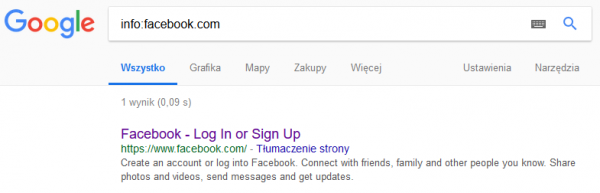
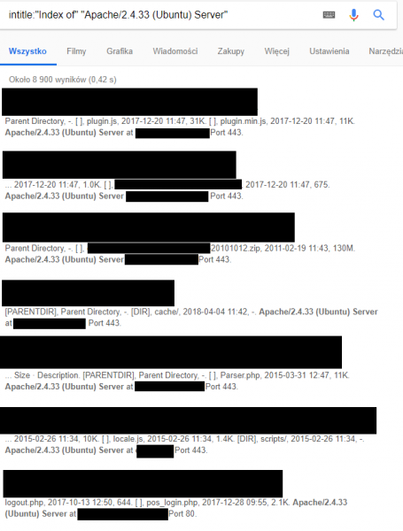
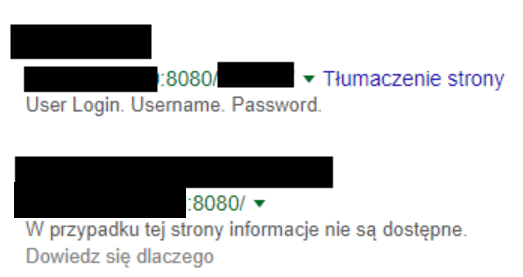
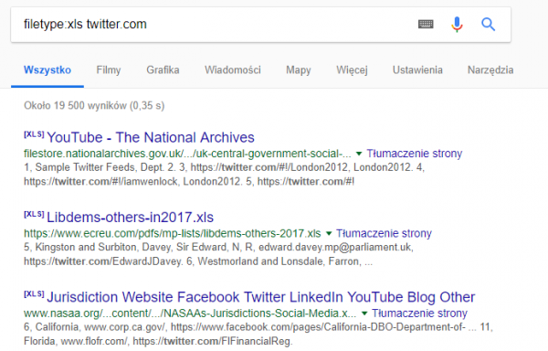
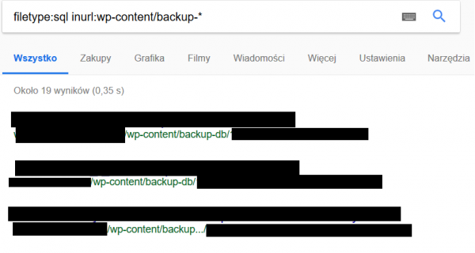
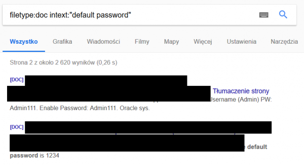

# Rekonesans infrastruktury IT – część 1 (google hacking)

> Original article: <https://sekurak.pl/rekonesans-infrastruktury-it-czesc-1-google-hacking/>

Podstawą testów bezpieczeństwa aplikacji webowej czy infrastruktury jest rekonesans, a więc zebranie wszystkich subdomen, adresów IP i innych ogólnodostępnych informacji. Dobrą praktyką jest jednoczesne wykorzystywanie kilku narzędzi w trakcie rekonesansu, co oczywiście bardzo zwiększy skuteczność tej fazy testów -- informacje pominięte przez jedno narzędzie, mogą zostać znalezione przez inne (różnice w algorytmie wyszukiwania czy docelowym zastosowaniu narzędzia). Powyższe jest dla nas motywacją do publikacji serii kilku artykułów o tematyce pasywnego (ale nie tylko) rekonesansu. Cykl ten rozpoczynamy zagadnieniem wykorzystywania wyszukiwarek jako jednego z narzędzi użytecznych w testach penetracyjnych.

> Zaprezentowane niżej informacje zostały przedstawione wyłącznie w celach edukacyjnych. Dostęp do danych zlokalizowanych w wyniku rekonesansu może wiązać się ze złamaniem prawa. Przed użyciem upewnij się, że działasz legalnie.

## Google

Najbardziej podstawowym źródłem informacji podczas wstępnego rekonesansu mogą być wyszukiwarki internetowe. Są one zazwyczaj bardzo dobrym punktem wyjścia do dalszych testów, paradoksalnie można tam znaleźć sporo ciekawych informacji, w krytycznych przypadkach wliczając nawet wrażliwe pliki (np. z fakturami, danymi osobowymi, hasłami itp.). Wielką zaletą takiego sposobu pasywnego rekonesansu jest fakt, że nie zostawiamy żadnego śladu swojej obecności na serwerze aplikacji, którą testujemy, w przeciwieństwie do aktywnej metody rekonesansu, która wręcz bombarduje serwery zapytaniami DNS czy poszukiwaniem ścieżek przez skanery podatności. Jako iż manualne przeszukiwanie wszystkich wyników wyszukiwania jest uciążliwe, a pożądane informacje często będą wyświetlać się na dalszych stronach wyszukiwania, bardzo istotnym narzędziem są filtry wyszukiwarek.

> Uwaga: Ponieważ różne wyszukiwarki używają niezależnych algorytmów, ważne by nie ograniczać się do jednej, lecz sprawdzać te same zapytania dla kilku z nich. Najbardziej popularne to Google, Bing, Yahoo.

Dla ułatwienia w artykule będę posługiwał się najbardziej popularną wyszukiwarką [www.google.pl](http://www.google.pl/). Natomiast listę najbardziej popularnych filtrów znajdziecie [tutaj](https://support.google.com/websearch/answer/2466433).

Zamiast opisywać wszystkie filtry z osobna skupię się na kilku interesujących i najbardziej przydatnych przykładach.

Zanim możliwe będzie hackowanie przy użyciu wyszukiwarek, trzeba zrozumieć działanie algorytmu wyszukiwania oraz sposób radzenia sobie z niechcianymi wynikami. Działanie filtrów w przeglądarkach można porównać do sortowania przedmiotów w sklepach internetowych. Zamiast przebijać się przez całe strony wyników możemy wyciągnąć te, które akurat nas interesują.

Abstrahując na chwilę od branży bezpieczeństwa, załóżmy że chcemy wyszukać wybraną stronę internetową i podstawowe informacje o niej. Jak wykluczyć subdomeny, podobne adresy i całe strony wyników?

W takim wypadku wystarczy użyć filtru *info*, dokładnie tak jak zostało to pokazane dla strony [www.facebook.com](http://www.facebook.com/) (Rysunek nr 1).

Filtry mogą zwyczajnie przyspieszyć wyszukiwanie, a często też doprecyzować wyszukiwaną frazę. Pozostając przy social mediach małe zadanie -- jak wyszukać strony social media podobne do Facebooka? Można wpisać w Google "strony podobne do Facebooka", jednak po pierwsze to czego się dowiemy jest zależne od stron, które opublikowały takie zestawienie, po drugie można to zrobić bardziej profesjonalnie. W takim zadaniu wystarczy użyć filtra related (dokładnie w taki sposób jak w info w przykładzie powyżej), który pokaże strony o podobnym charakterze do tej z zapytania.  Wracając do naszego zadania, wyniki takiego zapytania zostały pokazane na Rysunku nr 2.

Skoro proste przykłady mamy już za sobą, teraz kolejna ważna i ciekawa rzecz czyli operatory logiczne z którymi Google doskonale sobie radzi.

Najważniejsze operatory:

-   **" "** -- Google wyszukuje dokładnie taką frazę jaką zadaliśmy np. „sekurak hacking"
-   **OR/AND** -- operatory logiczne, to chyba każdy zna. Ciekawostka, znak  „|" czyli tzw. pipe często jest używany jako zamiennik do operatora OR
-   **() **-- używane podobnie jak w matematyce, pomagają używać operatorów i filtrów przy większej ilości fraz w zapytaniu
-   **--** -- odfiltruje wszystkie słowa podane po myślniku (ciekawy przypadek na Rysunku nr 3)
-   * -- używana jako wildcard, np. "sekurak bezpieczeństwo \*"

Powyższy przykład jest o tyle ciekawy, że zastosowany w niepoprawny sposób może „wyciąć" nam część poszukiwanej frazy.

To tylko proste przykłady potrzebne w drodze do Google hackingu. Polecam jednak zapoznać się z tym tematem, nawet osobom nie związanym ściśle z branżą bezpieczeństwa. Nierzadko podstawowe filtry ułatwiają życie przy klasycznych poszukiwaniach w wyszukiwarce Google.

Dobra wiadomość dla leniwych jest taka, że dzięki uprzejmości Google, udostępnione zostało specjalne GUI pozwalające na precyzowanie wyszukiwania: <https://www.google.com/advanced_search>.

Tak jak napisałem powyżej, nie warto ograniczać się do jednej wyszukiwarki, w takim wypadku do zbioru cennych linków powinna dołączyć lista filtrów np. dla Binga (<http://help.bing.microsoft.com/#apex/18/en-us/10001/-1>).\
Większość filtrów powtarza się z tymi, które można używać w wyszukiwarce Google. Wart  uwagi jest filtr nie stosowany przez inne przeglądarki: 'IP', który pozwala wyszukiwać strony po ich adresie [IP](https://www.bing.com/search?q=ip%3a178.32.219.59).

## Google hacking

W końcu dochodzimy do sedna tego artykułu, czyli tego jak hakować przy pomocy Googla i czy jest to w ogóle możliwe? Oczywiście, że to możliwe! Zabieg ten nazywa się Google Hacking/Google Dorking i przeważnie jest nieodłączną częścią testów bezpieczeństwa.

> Dla wszystkich czytelników poszukujących mistycznie wyglądających programów pozyskujących automatycznie informacje -- one też istnieją i zostaną wkrótce opisane. W dalszej części tej serii będziemy wykorzystywać specjalne narzędzia dedykowane poszczególnym zadaniom związanym z rekonesansem.

Dlaczego w ogóle rekonesans rozpoczyna się od wyszukiwarek? Często najprostsze rozwiązania są najlepsze, a największym problemem w tematyce bezpieczeństwa przecież jest czynnik ludzki. Drogie programy, skomplikowane skrypty i podobne temu pomoce pentestera mogą nic nie znaleźć, podczas gdy gwóźdź do trumny czeka w internecie i można go znaleźć jednym zapytaniem. Błędne konfiguracje, listing plików, backupy baz danych, hasła i loginy, czy faktury, to tylko część tematów do których może mieć swobodny dostęp osoba która wie jak je znaleźć.

Poniżej przedstawione zostały przykładowe schematy filtry:

Trzy filtry, które są najczęściej używane do Google hackingu to:

-   *intitle* -- wyszukiwanie określonych fraz w opisie tytule strony (Rysunek nr 4)
-   *inurl* -- wyszukiwanie określonych fraz w adresie URL (Rysunek nr 4)
-   *filetype* -- wyszukiwanie wybranych rodzajów plików dla danej frazy

## Intitle

W jaki sposób rozpocząć poszukiwania? Trzeba określić co nas, jako testerów bezpieczeństwa interesuje we wstępnej fazie rekonesansu.

Zaskakująco często w tytułach stron występują nazwy używanych technologii, wersje, porty, czyli na dobrą sprawę wszystkie kluczowe do zdobycia informacje pożądane w tym momencie.

Bez używania żadnego dodatkowego oprogramowania można szukać klasyki w branży bezpieczeństwa czyli nieaktualnego oprogramowania. Przykładowe zapytanie za pomocą którego możemy znaleźć strony używające najnowszej na ten moment wersji Apache, uruchomione na Ubuntu prezentuje Rysunek nr 5.

Dlaczego akurat ten filtr jest tak ważny? Możemy za jego pomocą uzyskać wyniki, których nie dałoby się znaleźć w przy pomocy analizy URL danej strony. Najczęściej używany jest z filtrem *inurl*, gdzie *inurl* definiuje nasz cel a *intitle* precyzuje czego dokładnie szukamy. Niżej pokażę kilka przykładów z tym związanych.

## Inurl

Tytuły stron są ważnym źródłem informacji, jednak często musimy odsiać ziarno od plew. Taki sposób wyszukiwania wielokrotnie generuje tzw. *false positives*.

Informacje wyszukiwane dzięki filtrowi *intitle *listuje dane dostępne pod danym adresem. Żeby takie dane znaleźć precyzyjnie bardzo pomocne może być użycie *inurl*.

Najprostsze użycie opcji inurl, to po prostu wpisanie frazy jaką chcielibyśmy ujrzeć w URLu. Dodatkowo poza cudzysłowem możemy dodawać przedzielone znakiem „|" (tzw. pipe) słowa klucze wokół których tematyki chcemy wyszukiwać.\
Warto tutaj dodać, że jeżeli chodzi o Google Hacking, często przydaje się wiedza i obycie z programowaniem. Chodzi o fakt, że przy pomocy takiej metody rekonesansu można trafnie szukać ciekawych ścieżek, miejsc na stronie, czy adresów bez używania metody brute force. Trzeba jednak wiedzieć, a bardziej przeczuwać jakie frazy mogą skrywać ciekawe informacje. Na poniższym przykładzie znajdujemy pola logowania do portfeli Bitcoin. Jednak dlaczego wybraliśmy jako słowo klucz user_login? To po prostu „strzał" na podstawie doświadczenia. Czasami nazw, URLi czy katalogów trzeba szukać w "na ślepo".

Na przykład dla składni: * inurl:"user_login/" bitcoin | crypto | wallet* otrzymamy z dużym prawdopodobieństwem linki logowania do portfeli Bitcoin, jak ten przykładowy na Rysunku nr 6.

W temacie rekonesansu i różnego typu wyszukiwarek (szczególnie tych wyszukujących urządzenia podpięte do internetu jak np. [Shodan](https://sekurak.pl/shodan-czyli-google-dla-urzadzen-sieciowych/)) flagowym przykładem ich użycia jest pokazywanie adresów nie zabezpieczonych hasłem kamer z dostępem do internetu. Wyszukiwarka Google  może nie będzie tak obfita w wyniki jak dedykowane do tego narzędzia, jednak wystarczy użyć filtru: *inurl:"ViewerFrame?Mode="*, by przekonać się o jej możliwościach. Wyszukane przez Google w ten sposób linki poprowadzą nas do kamer w trybie *live*, jak na Rysunku nr 7.

Po takim zabiegu dokładnie tak samo jak w dedykowanych do tego wyszukiwarkach, możemy znaleźć kamery z pełnym, całodobowym dostępem do internetu. Zdarza się, że można nimi sterować -- poruszać, powiększać obraz itp.

Skoro wspomniałem już o Shodanie to ubiegając pytanie, które zapewne padnie w komentarzach: tak, możliwe jest wyszukiwanie otwartych portów za pomocą Googla! Czasami zdarza się sytuacja, gdy URL wygląda w następujący sposób:

Oznacza to, że strona działa na jednym określonym przez administratora porcie (w tym wypadku jest to port 8080). Znalezienie adresów URL skonstruowanych w ten sposób za pomocą Google Hackingu nie będzie w żaden sposób trudne.\
Jedyne o co musimy tutaj zadbać, to wyciąć z tekstów wyszukanych stron zadany numer portu (w tym wypadku 8080 -- bez tej opcji lista niepożądanych wyników byłaby długa, 8080 użyte w nickach, nazwach własnych, czy opisie przedmiotów). Oczywiście port 8080 to tylko przykład, takie podejście umożliwia wyszukiwania dowolnych portów.

Dla zapytania *inurl:8080 -intext:8080* ujrzymy wyniki jak na Rysunku nr 8.

## Filetype

Ta opcja jest używana najczęściej podczas szukania wrażliwych dokumentów, konfiguracji czy logów które z niewiadomego powodu są dostępne publicznie.

W poniższym przykładzie (Rysunek nr 9) Google znajdzie wszystkie pliki o rozszerzeniu xls zawierające frazę twitter.com. Czasami w taki sposób można natchnąć się na tabele z rozliczeniami finansowymi, danymi pracowników i innymi poufnymi informacjami.

Oczywiście sprawdza się inne formaty, obowiązkowo .doc i .pdf, czasami warto przebrnąć przez setki zdjęć w formacie .jpg, ponieważ internet w takich formatach czasami skrywa poufne skany, które domyślnie nigdy nie powinny znaleźć się w internecie.

## Praktyczne przykłady z życia Pentestera

Na sam koniec zostawiłem trochę informacji o tym jak Google hacking jest używany przy prawdziwych testach bezpieczeństwa. Swoją przygodę z takim sposobem szukania wartościowych danych warto rozpocząć od <https://www.exploit-db.com/google-hacking-database/>, bazy danych wielu przydatnych fraz wraz z opisami.

Poniżej kilka praktycznych przykładów.

### **Poszukiwanie backupów baz danych SQL dla WordPressa**

### **Dokumenty w formacie .doc zawierające domyślne loginy i hasła**

### **Wyszukiwanie błędów składni SQL**

To zaledwie kilka przykładów ze studni możliwości, prawda jest taka, że podczas poszukiwań ogranicza nas jedynie wyobraźnia :). Nie sposób powiedzieć o wszystkich ciekawych zastosowaniach Google hackingu, ponieważ to co chcemy uzyskać warunkuje nasze podejście. Mam jednak nadzieję, że pokazałem czym jest ta technika i dlaczego została doceniona przez profesjonalistów z branży bezpieczeństwa.

--- *Michał Wnękowicz*
