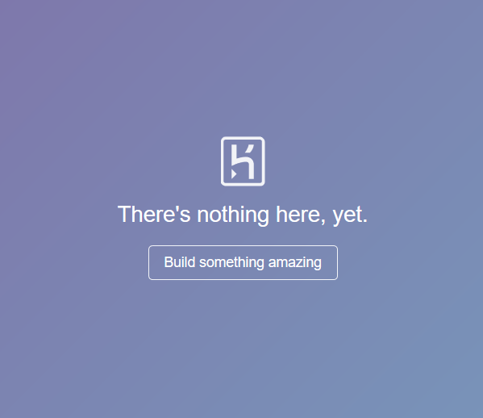

# Rekonesans infrastruktury IT – część 2 (Shodan, Censys, ZoomEye)

W [pierwszej](:note:6ccbdf74-834a-404a-ab2d-7e5706bd026b) części tej serii poruszyłem temat wykorzystania wyszukiwarek internetowych jako źródła informacji we wstępnej fazie rekonesansu. Jak wspomniałem w tamtym artykule, wyszukiwarki takie jak Google, Yahoo czy Bing mogą często pozwalać na wyszukanie informacji krytycznych dla testów bezpieczeństwa.

> Zaprezentowane niżej informacje zostały przedstawione wyłącznie w celach edukacyjnych. Dostęp do danych zlokalizowanych w wyniku rekonesansu może wiązać się ze złamaniem prawa. Przed użyciem upewnij się, że działasz legalnie.

Załóżmy że udało się przeprowadzić tę fazę poszukiwania, jaki zatem jest następny krok rekonesansu infrastruktury? Również wyszukiwarki, tylko takie stworzone pod kątem testów bezpieczeństwa, nie opierające swoich wyników tylko na adresach URL, a dodatkowo wspierające się banerami wychwyconych podczas skanowania portów. Wyszukiwarki te skanują, a właściwie używają specjalnych *crwalerów,* które zbierają dane na temat wszelakich urządzeń podłączonych do internetu (komputery, serwery, drukarki, routery, urządzenia IoT i całe mnóstwo innych rzeczy).

Czym jest właściwie baner, który jest wychwytywany przez taką wyszukiwarkę a następnie przetwarzany i udostępniany?

Załóżmy, że strona internetowa jest uruchomiona na serwerze, na serwerze  z dostępem do internetu. Wyszukiwarka sieciowa zbierze informację od takiego serwera (tzw. baner) z różnymi informacjami na jego temat. Banery będą się różnić między sobą zależnie od tego jakiej usługi czy urządzenia dotyczą.

Przykładowy baner serwera HTTP:

```http
HTTP/1.1 200 OK
Server: nginx/1.1.19
Date: Sat, 03 Oct 2015 06:09:24 GMT
Content-Type: text/html; charset=utf-8
Content-Length: 6466
Connection: keep-alive
```

Przykładowy baner urządzenia przemysłowego Siemens:

```http
Copyright: Original Siemens Equipment
PLC name: S7_Turbine
Module type: CPU 313C
Unknown (129): Boot Loader           A
Module: 6ES7 313-5BG04-0AB0  v.0.3
Basic Firmware: v.3.3.8
Module name: CPU 313C
Serial number of module: S Q-D9U083642013
Plant identification:
Basic Hardware: 6ES7 313-5BG04-0AB0  v.0.3
```

Jak łatwo zauważyć banery mogą bardzo się różnić, stąd wyszukiwarki udostępniają różne możliwości odfiltrowania tych informacji. W przypadku poszukiwania urządzeń z dostępem do internetu mamy do wyboru trzy potężne wyszukiwarki. Poznajcie wszystkie z nich: Shodana, Censys i Zoomeye.

## SHODAN

Shodan jest najbardziej popularną wyszukiwarką urządzeń sieciowych z wyżej wymienionych. Dla niewtajemniczonych polecam [artykuł](https://sekurak.pl/shodan-czyli-google-dla-urzadzen-sieciowych/) na Sekuraku poświęcony w całości Shodanowi i jego podstawowym funkcjom. Jako iż bazowe filtry i funkcjonalności tej strony zostały pokryte w powyższym artykule, tutaj skupię się na tym jak w odpowiedni sposób konstruować zapytania, czego warto szukać i w jaki sposób najszybciej to robić.

Zacznijmy od zastanowienia się jak Shodan może być pomocny w fazie rekonesansu infrastruktury czy serwisu?

Podstawową umiejętnością jeżeli chodzi o obsługę Shodana jest konstruowanie filtrów. Postaram się tutaj przedstawić sposób myślenia jakim warto się kierować podczas testów, oraz w jaki sposób precyzować swoje zapytania by wybrać perełki z całych setek milionów banerów, które przechowuje Shodan.

Załóżmy, że wykonujemy rekonesans portalu facebook.com, a naszym celem jest znaleźć oficjalne strony Facebooka z ogólnym dostępem.

Pierwszą komendą jakiej używam jest 200 OK hostname:facebook.com, gdzie „200 OK" oznacza kod odpowiedzi HTTP 200, czyli zwrócenie zawartości żądanego dokumentu.


Jako iż Shodan pozyskuje informacje m.in. z banerów, jeżeli dana strona posiada frazę „facebook" w nazwie hosta, zostanie ona wyświetlona w wynikach wyszukiwania. Duża część wyszukanych fraz są to pliki typu *octet-stream* (binarne), które w przypadku naszego celu wyszukiwania są zbędne. W tym wypadku najłatwiej będzie odfiltrować te pliki za pomocą znaku „!", składnia zapytania wygląda następująco: 200 OK hostname:facebook.com !application/octet-stream. 


By ograniczyć domeny tylko do tych oficjalnych, sygnowanych marką Facebook, wystarczy dodać odpowiedni filtr org. Całe zapytania wygląda w następujący sposób:200 OK hostname:facebook.com !application/octet-stream org:"facebook".


Możliwości wykorzystania Shodana w celu rekonesansu jest bardzo dużo, zapytania można dowolnie modyfikować i precyzować zależnie od oczekiwanych wyników wyszukiwania.

Bardzo przydatną funkcją odnośnie implementowania filtrów, jest możliwość "wyrzucania" niepożądanych informacji. Shodan nawet jeżeli użyjemy cudzysłowu, nie używa całej frazy do wyszukiwania, a dopasowuje poszczególne informacje z banerów do użytych słów-kluczy.  

Przykładowo dla zapytania „Server IIS 4.0", Shodan może zwrócić baner jak na Rysunku nr 4.


Jak możemy zauważyć na powyższym rysunku, takie banery nie spełniają do końca naszych oczekiwań. Shodan przeszukuje tak dużą ilość różnie skonstruowanych banerów, że precyzyjne wyszukiwanie jest praktycznie niemożliwe.

Jak sobie z tym poradzić? Ciekawą praktyką jest używanie myślnika do wykluczania niepożądanych fraz. Jest to metoda mozolna, natomiast bywa bardzo pomocna przy wielu nietrafionych wynikach.

W tym wypadku łatwiej było mi znaleźć serwer Microsoft IIS 4.0 wykluczając te bardziej popularne wersje, niż sposobem jaki pokazałem powyżej:  Server IIS  -"7.5" -"8.5" -"10.0" -"8.0".


Coś filtrujemy, czegoś szukamy, a tak w zasadzie to na czym warto się skupić i dlaczego?

Po pierwsze, pasywnie (bez żadnej ingerencji w logi serwera, czyli prościej mówiąc bez "pozostawiania śladów swojej aktywności") możemy ustalić adresy IP należące do danej firmy czy używane przez nich technologie:


Może nie jest to widowiskowe, ale w fazie rekonesansu takie informacje mogą być bardzo cenne, dają testerowi pogląd z jaką technologią będzie pracował, oraz wskazują pierwsze potencjalne wektory ataku.

Kluczowe są wszelkie informacje dotyczące jakiego oprogramowania oraz jakiej wersji używa nasz cel. Ta faza rekonesansu może być bardzo opłacalna, tym bardziej jeżeli uda się znaleźć nieaktualne oprogramowanie posiadające poważne podatności. Będzie to ważna informacja dla naszego klienta. Na pewno osoby związane z branżą bezpieczeństwa zwróciły uwagę na nagłówek „Server" na powyższym rysunku, który ujawnia pełną informację o wersji wykorzystywanego serwera WWW. W jaki sposób najłatwiej szukać takich luk i podatności?

Przykładowe możliwe zapytanie: org:"nazwa_audytowanej_firmy" Microsoft IIS. Shodan wylistuje wszystkie wyłapane banery zawierające nazwę "Microsoft IIS" w nagłówku Server. Następnie możemy odfiltrowywać kolejne wersje, lub ręcznie szukać ciekawych banerów, metoda nie ma większego znaczenia. Jednak jeżeli udałoby się znaleźć np: [Microsoft IIS 6.0](https://www.cvedetails.com/vulnerability-list/vendor_id-26/product_id-3436/version_id-13492/Microsoft-IIS-6.0.html) będzie to oznaczało, że administrator zapominał o aktualizacji danej usługi przez lata, co narażało firmę na ogromne ryzyko.

Skoro tekst dotyczy rekonesansu infrastruktury, oczywiste, że będą nas interesować urządzenia sieciowe takie jak switche czy routery. Prosty sposób na wyszukanie urządzeń danego dostawcy: org:"nazwa_audytowanej_firmy" cisco  (lub nazwa innej firmy, której urządzenia nas interesują):


Kolejnym zapytanie, które możemy użyć w ramach poznawania możliwości Shodana jest „cisco default", ma ono na celu wyszukanie domyślnych loginów i haseł.


W temacie rekonesansu urządzeń sieciowych mamy naprawdę szerokie pole do popisu, a pokazane przeze mnie przykłady są tylko kroplą w morzu możliwości.

Z perspektywy testów infrastruktury ważną sprawą, którą można sprawdzić za pomocą Shodana jest weryfikacja możliwości przeprowadzenia  [Subdomain Takeover](https://blog.sweepatic.com/subdomain-takeover-principles/), czyli przejęcia domeny należącej do testowanej firmy i umieszczenie tam dowolnej treści.

Pozornie wyszukanie takich domen może wydawać się trudne, jednak w praktyce wystarczy trochę sprytu. Heroku na przykład dla domeny, którą można zagospodarować wyświetla w tytule strony "No such app". Szybkie zapytanie w Shodanie, i naszym oczom ukazuje się wynik jak na Rysunku nr 9.


Jeżeli po wejściu w taki adres pojawia się strona jak na rysunku poniżej, prawdopodobnie wykryliśmy podatność.



Na końcu nie sposób nie wspomnieć o [wtyczce](https://addons.mozilla.org/en-US/firefox/addon/shodan_io/) Shodana do np. Mozilli Firefox. Po wejściu na daną stronę od razu możemy wyświetlić podstawowe informacje, takie jak adres IP, czy używane porty.


## Censys

Czym jest Censys? Jest to wyszukiwarka urządzeń podłączonych do internetu, kolejny często nierozłączny element rekonesansu. Zacznę od pytania, które pada w tej tematyce często: czym Censys różni się od Shodana?

Sytuacja w tym wypadku wygląda trochę jak w przypadku wyszukiwarek internetowych, każde ze stosowanych narzędzi używa innych algorytmów wyszukiwania, ma inny interfejs oraz każde z nich udostępnia jakieś funkcjonalności, których brakuje pozostałym.

Jak chodzi o Censys bardzo podoba mi się [Data Definitions](https://censys.io/ipv4/help/definitions?q=&collection=), jest to wbudowany *mini tutorial * dotyczący tego, jakie mamy możliwości filtrowania informacji dla wybranych portów czy protokołów. Jest to rozwiązanie intuicyjne i daje możliwość na bardzo szczegółowe wyszukiwanie, co nie jest możliwe na taką skalę w Shodanie. Na poniższym rysunku prezentuję tę opcję dla portu 80 czyli wszystkim dobrze znanego protokołu HTTP.


Jeszcze jedną opcją, którą osobiście często wykorzystuję są tagi, z których w Censysie możemy dowolnie korzystać, a w Shodanie możliwe są tylko dla wersji Enterprise.

Dlaczego bywa to przydatne? Pokażę to na różnicy między dwoma zapytaniami odnoszącymi się do słowa „printer". W pierwszym z nich użyłem tagu "printer", w drugim natomiast wpisałem "printer" w pole wyszukiwania.


Jak można zauważyć, tag pokazał mniej wyników, ale za to są one bardziej precyzyjne, często dają możliwość na wykluczenie "śmieci", czyli banerów w ogóle nie związanych z naszym celem wyszukiwania.

Wyszukiwarka posiada trzy kategorie wyszukiwania:

-   IPv4 hosts -- klasyczne wyszukiwanie hostów jak w Shodanie,
-   Websites -- podstawowe informacje o stronach względem rankingu "Alexa Top", można tam zajrzeć jednak nie skrywają się tam tak ciekawe informacje jak w dwóch pozostałych kategoriach,
-   Certificates -- coś czego Shodan również nie posiada, ogromna baza danych na temat certyfikatów.

Skoro zakreśliłem już profil i możliwości Censys czas zabrać się za jego praktyczne wykorzystanie.

**IPv4 hosts**

Zakładka IPv4 hosts pozwala na taki sam rodzaj wyszukiwania jak Shodan, wykorzystuje banery, które możemy przeszukiwać dzięki odpowiednim filtrom.

Na samym początku postarajmy się znaleźć (podobnie jak w przypadku Shodana) wszystkie hosty, które dają odpowiedź serwera 200 (tzn. są to teoretycznie dostępne źródła) oraz należą do organizacji Facebook:


Tak jak wspomniałem powyżej, te gotowe filtry (zaznaczone na czerwono na powyższym rysunku) bardzo ułatwiają użytkownikowi zawężanie wyników.  Co ciekawego można znaleźć po kliknięciu w dany adres? Informacje o sieci, stosowanych protokołach, informacje o podatnościach związanych z TLS czy dokładną lokalizację, co zostało pokazane na Rysunku nr 15


Censys zbiera także informacje takie takich jak nazwa organizacji, adresy kontaktowe czy numery telefonów do firmy lub administratorów. Poniżej przedstawione zostały informacje dla Facebooka:


Dzięki *data definitions* mamy dostęp to wszystkich szczegółowych opcji wyszukiwania co jest niewątpliwym plusem tej wyszukiwarki na tle innych.

Do pełnego opisu funkcjonalności tego narzędzia brakuje jeszcze informacji, że Censys obsługuje podstawowe operatory logiczne np. OR czy AND.

Z tą wiedzą wyszukiwanie interesujących nas w trakcie rekonesansu informacji to już tylko kwestia umiejętności zbudowania odpowiedniego zapytania. Dla treningu, wyobraźmy sobie że poszukujemy serwerów Apache (80.http.get.headers.server: Apache), z dostępnym telnetem ("23/telnet") i jednocześnie należących do [systemu autonomicznego](https://pl.wikipedia.org/wiki/System_autonomiczny_(Internet)) Amazon.com, Inc. (autonomus_system.organization: Amazon.com, Inc.). Całość wystarczy połączyć ze sobą operatorem „and" i oto wynik naszego wyszukiwania:


Ciekawym tematem jest branie na cel drukarek, które występują w prawie każdej infrastrukturze. Sprawdźmy więc co związanego z testami bezpieczeństwa można tam znaleźć. Zacznijmy od wylistowania drukarek po tagu printer, jak na Rysunku nr 18.


Jak możemy zauważyć wyników jest sporo, co ciekawego jednak można znaleźć podczas takich poszukiwań? Jak pokazano  na Rysunku nr 19 możemy nawet uzyskać dostęp do całego panelu danej drukarki.


W przypadku tych urządzeń o bezpieczeństwo praktycznie zupełnie się nie dba, panele bezpieczeństwa większości z nich wyglądają w następujący sposób:


Łatwo zauważyć, że poziom bezpieczeństwa jest w tym (i wielu innych przypadkach) zerowy.

**Certificates**

Ta opcja jest kopalnią wiedzy na temat stron internetowych. Informacje jakie można uzyskać za jej pomocą to:

-   certyfikaty używane przez daną stronę
-   subdomeny używające tego samego certyfikatu lub inne domeny dla których zarejestrowany jest dany certyfikat
-   filtrowanie za pomocą tagów pozwala wyszukać np. certyfikaty, które wygasły
-   odfiltrowanie certyfikatów wystawionych przez dane organizacje


Wiedząc w jaki sposób i jakich opcji użyć, teraz można dowolnie szukać interesujących fraz. Prosty przykład jak wylistować zaufane certyfikaty dla facebook.com:


Moim zdaniem Censys w temacie certyfikatów jest aktualnie jednym z najlepszych serwisów zawierających informacje na temat certyfikatów. Wyróżnia się dużą ilością informacji i świetnym interfejsem do ich filtrowania i sortowania (czego zdecydowanie brakuje znanemu w środowisku crt.sh).

Po wejściu w dany wynik wyszukiwania wszystko zebrane jest jak na Rysunku nr 23.


Jest to świetne miejsce do sprawdzania certyfikatów czy wyszukiwania innych domen dla danego certyfikatu. Często takie domeny są pomijane przez narzędzia stworzone do ich odnajdywania, a czasami to właśnie w takich "zapomnianych" domenach można szukać krytycznych błędów, które sumarycznie doprowadzą nas do celu testów.

## Zoomeye

Zoomeye jest już ostatnią z omawianą wyszukiwarką urządzeń internetowych. Moim zdaniem to najbardziej '"hakerska" ze wszystkich opisywanych przeze mnie wyszukiwarek. Jako ciekawostkę na samym początku dodam, że po wpisaniu w Google frazy "zoomeye" otrzymałem wynik jak poniżej. Zoomeye nie lubi się z pozycjonowaniem Google, czy bez powodu?


Zoomeye jest często nazywany lepszym Shodanem, o czym pisaliśmy [tutaj](https://sekurak.pl/chinska-konkurencja-niszczy-shodana-uniwersalne-narzedzie-do-rekonesanu/).

Zoomeye moim zdaniem jest połączeniem "niebezpieczeństwa" jakie według legend miejskich niesie Shodan i wygodnego interfejsu z możliwością używania tagów. Dodatkowo dla wielu zapytań Zoomeye pokazuje nawet 10 razy tyle wyników co pozostałe dwie wyszukiwarki. Nie sposób o nim nie wspomnieć.

Jako iż o ten portal dostajemy sporo pytań, najwięcej o to jak go używać i jakie frazy mogą pomóc w wyszukiwaniu dodajemy małą ściągę :).

**app:** Nazwa aplikacji

**ver:** Wersja aplikacji

Przykład: app:"Apache httpd" +ver:"2.4.33"

**country:** Skrót nazwy państwa  (np: US, PL, UK, FR, itp.)

**city:** Nazwa miasta (Z doświadczenia polecam sprawdzać nazwy z polskimi znakami, bez polskich znaków oraz anglojęzyczne np: kraków, krakow i cracov)

Przykład: country:PL +city:krakow

**port:** Numer portu

**os:** Nazwa używanego systemu operacyjnego

Przykład: os:linux +port:22 +country:US

**service:** Używany service  ( wszystkie możliwości: <https://svn.nmap.org/nmap/nmap-services>)

Przykład: service:ftp

**hostname:** Nazwa hosta

Przykład: www.facebook.com +service:ftp

**ip:** adres ip

Przykład: ip:8.8.8.8

**cidr:** segment cidr dla danego adresu IP

Przykład: cidr:8.8.8.8/24

Dla zalogowanych użytkowników możliwe jest używanie tej opcji 5 razy dziennie.

**site:** nazwa strony

Przykład: domain name site:google.com

**headers:** nazwa nagłówka HTTP

Przykład: site:google.com +headers:Server

**keywords:** szukanie za pomocą słów kluczowych, bez określania w której części baneru mogą się znaleźć

Przykład: keywords:Drupal

**desc:** poszukiwanie frazy w opisie

Przykład: desc:Wordpress

**title:** tytuł strony

Przykład: title:hacked

O charakterze tej wyszukiwarki może świadczyć fakt, iż obok zakładki "Result", gdzie wylistowane są wyniki wyszukiwania, istnieje zakładka "Vulnerability", która zawiera listę podatności dla najbardziej popularnych programów, technologii czy serwerów (Rysunek nr 25).


Popatrzmy na zaznaczoną na powyższym obrazku podatność,  w takim wypadku wystarczy poszukać serwerów Nginx w wersji 1.4.0 lub 1.3.9 i dla wygody wykluczyć odpowiedzi HTTP 403 -- Forbidden oraz 301 -- Moved Permanently i wszystko mamy podane jak na tacy (Rysunek nr 26).


Podobną metodą zostały znalezione defaultowe hasła do urządzeń DVR o których pisaliśmy [tutaj](https://sekurak.pl/nie-aktualizuja-urzadzen-od-lat-a-zoomeye-zbiera-ich-hasla/).

## Podsumowanie

W tym artykule starałem się pokazać jak ogromne możliwości podczas fazy pasywnego rekonesansu dają wyspecjalizowane wyszukiwarki. Można szukać właściwie wszystkiego z zakresu informacji potrzebnych podczas testów bezpieczeństwa, od adresów i subdomen do routerów i switchy nie wymagających żadnego uwierzytelnienia. W zasadzie ograniczeniem jest czas i umiejętność "drążenia" w poszukiwaniu informacji.

Moim celem w tym artykule było pokazanie schematu myślenia jakim warto podążać podczas testów. To właśnie sprawia, że cały czas w wyszukiwarkach tego typu znajdują się rzeczy, które zadziwiają całą branżę. Ktoś krok po kroku tworzy zapytanie dzięki któremu dochodzi do niesamowitych odkryć. Pamiętajmy o tym, że nie można faworyzować żadnej z opisanych przeglądarek, każda ma swoje zalety i wady, oraz inne *crwalery*. Nie ma najlepszej, ale razem tworzą bardzo potężne narzędzie.

--- *Michał Wnękowicz*
