# Rekonesans infrastruktury IT – część 3

> Original article: <https://sekurak.pl/rekonesans-infrastruktury-it-czesc-3/>

W [poprzednich](01-google-hacking.md) [częściach](02-shodan-censys-zoomeye.md) serii omówiłem różne rodzaje wyszukiwarek przydatne w fazie rekonesansu, oraz ciekawostki, które można znaleźć za ich pomocą. Podczas realnych testów bywa jednak różnie, czasami ta faza może zaowocować krytycznymi błędami, często jednak udaje się pozyskać tylko szczątkowe informacje o badanym celu. Niezależnie od tych wyników kolejnym krokiem, który wykonuje Pentester jest właściwa faza rekonesansu, czyli rozpoznanie infrastruktury klienta. Chodzi tutaj o ustalenie jak może wyglądać cała sieć, jakich rozwiązań należy się spodziewać oraz jaki jest zakres testów. Mam tutaj na myśli sytuację, kiedy tester otrzymuje określone adresy IP do testów, a następnie szuka odpowiadających im serwisów, stron czy ekranów logowania. Na tej podstawie tester może ustalić podstawowe wektory ataku. Dla osób chcących poznać tę tematykę z bardziej praktycznej strony zapraszamy na nasze [szkolenie z testów infrastruktury](https://securitum.pl/szkolenia/bezpieczenstwo-sieci-testy-penetracyjne/).

Metodyka prawdziwych testów najczęściej wygląda następująco, tester gromadzi zakres adresów IP oraz domen, na podstawie tej wiedzy tworzymy listę subdomen a następnie kolejnych ścieżek. Jak szybko i efektywnie szukać takich informacji? Można tutaj zastosować dwie metodyki rekonesansu:

-   **pasywny** -- poszukiwanie informacji dostępnych w internecie, bez żadnej ingerencji czy zostawiania śladów swojej obecności po stronie klienta,
-   **aktywny** -- używanie narzędzi i metod, które w celu pozyskania informacji wymagają interakcji z systemami po stronie klienta

Pomijając na chwilę metodę której chcemy użyć, trzeba się zastanowić skąd w ogóle można pozyskiwać takie informacje. Co może łączyć ofiarę, adresy IP oraz nazwy domen? Serwery DNS, które zawierają to czego potrzebujemy w tej fazie. Drogi są różne, cel jeden -- możliwie jak najdłuższa lista domen.

Wychodząc naprzeciw osobom nie zajmującym się profesjonalnie tym zagadnieniem najpierw poruszę jeszcze jedną ważną kwestię, która wyjaśni czym jest faktyczny rekonesans. Załóżmy że mamy serwer i główną domenę firmy google.com. W celu poznania zakresu adresów do testów i wielkości infrastruktury wyszukujemy kolejne subdomeny: translate.google.com, cloud.google.com, ads.google.com itd. W tej fazie, nie udało się znaleźć żadnych ciekawych danych, które mogłyby być swoistą "drogą na skróty" w fazie testów. Czy to oznacza koniec rekonesansu i rozpoczęcie klasycznych testów? Nie koniecznie, ponieważ dowiadujemy się, że właściciel example.com nie dość, że posiada domenę w języku niemieckim oraz polskim, to jest też właścicielem domen gmail.com i youtube.com, które być może znajdują się na tym samym serwerze. Okazuje się jednak, że ostatnie dwie wymienione powyżej domeny od lat nie są rozwijane, a błędy jakie tam występują dają duże możliwości do łatwej eskalacji dalszych testów.

Można wyróżnić poszukiwanie domen w dwóch płaszczyznach (Rysunek nr 1).

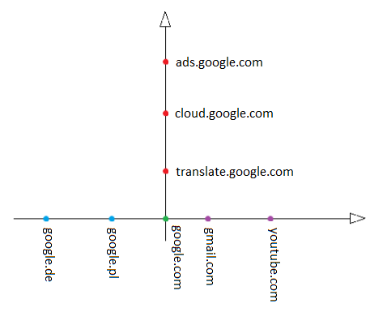

Może również dojść do sytuacji, że dwie wersje językowe aplikacji różnią się nie tylko treścią strony, ale również funkcjonalnościami, przez co przykładowo na niemieckojęzycznej stronie tester będzie w stanie wykorzystać do ataku pole, które w polskiej wersji językowej nie istnieje.

Jak można zauważyć, zadanie jakim jest wyszukanie największej ilości domen i subdomen nieco się komplikuje, nie da się jedną prostą metodą znaleźć wszystkich wyników należących do obu osi.

Metody jakimi możemy skutecznie prowadzić takie poszukiwania będą się przewijać przez ten artykuł. Dla zachowania logicznego ciągu rozpocznę od pasywnego rekonesansu, który można stosować zarówno w przypadku osi x jak i y (Rysunek nr 1).

## VirusTotal

Portal <https://www.virustotal.com/>  jest zapewne znany większości czytelników, jednak w temacie rekonesansu nie sposób o nim nie wspomnieć. Jego najważniejszą i podstawową funkcjonalnością jest wykorzystywanie ponad 60 programów antywirusowych w celu sprawdzenia bezpieczeństwa wskazanego adresu URL czy pliku, który można wgrać z komputera. Taka opcja jest bardzo przydatna kiedy chcemy pobrać plik z niezaufanego źródła, bądź upewnić się czy plik, który posiadamy na komputerze jest bezpieczny zanim go otworzymy.

Przykład działania VirusTotal dla potencjalnie „niebezpiecznego programu" można zobaczyć [tutaj](https://www.virustotal.com/#/file/7c82091c655357ae11be9794fa8346f30d350a0b1c3b5789c3667ed8d62e0c2f/detection).

Jednak poza analizą bezpieczeństwa plików, VirusTotal daje bardzo ciekawe możliwości związane z rekonesansem wybranej domeny. W zakładce URL wystarczy wpisać interesującą nas domenę, przykładowo 'google.com'. VirusTotal udostępnia sporo danych, które ułatwiają zbieranie informacji o naszym celu.

Musimy pamiętać, że Google posiada gigantyczną infrastrukturę, zapytania dla domeny google.com będą generować ogromną listę wyników wyszukiwań. Jest to tylko poglądowy przykład, którego spokojnie można użyć na potrzeby artykułu. Podczas realnych testów ilość wyników jest na tyle mała, że trochę praktyki pozwala testerowi odnaleźć się w gąszczu znalezionych informacji i stworzyć roboczy model infrastruktury czy zdefiniować potencjalne cele.

Pierwsza rzecz jaka się rzuca w oczy to adresy IP dla wyszukiwanego adresu URL (Rysunek nr 2).

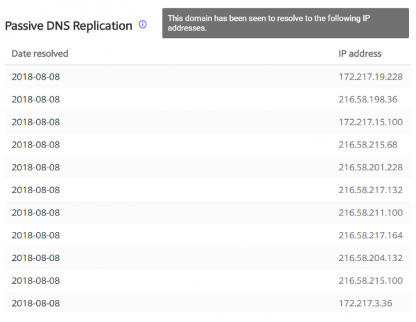

Adresy IP to już jakiś trop, który może wykorzystać Pentester. W tym przypadku zauważamy, że podsieć 216.58.217.0/24 ze sporym prawdopodobieństwem może należeć do naszego celu, często skutkuje to "poszukiwaniem" dalszych celów w całej podsieci.

Następnie otrzymujemy zbiór danych typu Whois, czyli solidną garść informacji związanych z rejestracją danej strony:

-   data zarejestrowania domeny
-   data wygaśnięcia domeny
-   dane właściciela
-   email użyty podczas rejestracji domeny
-   dane rejestratora
-   nazwy serwerów na których hostowana jest dana strona

Tego typu informacje mogą być bardzo przydatne podczas testów socjotechnicznych czy *red teamingu*, jednak mają też swoje zastosowanie przy testach infrastruktury.

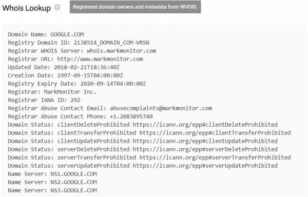

Łatwym sposobem na poszukiwanie domen wzdłuż osi X z Rysunku nr 1 jest użycie danych osoby rejestrującej bądź jej adresu email, by za pomocą narzędzi typu reverse Whois znaleźć (<https://viewdns.info/reversewhois/>) inne domeny zarejestrowane przy pomocy tych samych danych. Następnie (w zależności od zakresu testów) można próbować zdobyć kontrolę nad serwerem, używając podatności na stronach znalezionych powyżej opisaną metodą.

VirusTotal to świetne źródło do pozyskiwania wszystkich subdomen dla interesującej nas domeny. Poniżej zostały przedstawione przykładowe subdomeny, które VirusTotal wylistował dla domeny głównej google.com.

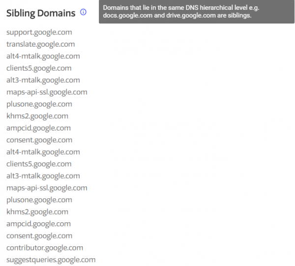

Każdy z rekordów wylistowany przez VirusTotal można "rozwinąć" klikając na niego. Spowoduje to przekierowanie na stronę gdzie dla danego adresu zostaną pokazane powiązane strony (Rysunek nr 5).

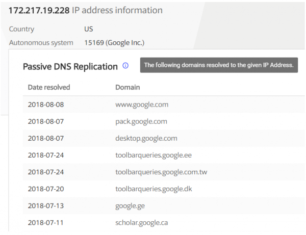

Analogiczna sytuacja tyczy się każdej z wyszukanych subdomen, dla której możemy zobaczyć powiązane adresy IP (Rysunek nr 6).

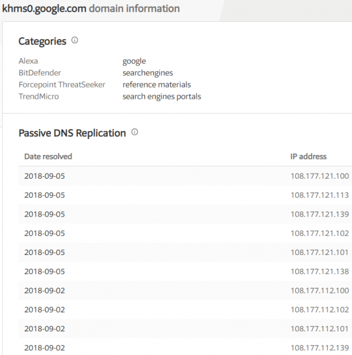

Jak możemy zauważyć, wszystko jest ze sobą skomplikowanie powiązane, daje to tylko dobry pogląd, że bez nakreślenia struktury infrastruktury i rozpoznania czego można się w niej spodziewać nie można liczyć na rzetelne testy.

Takie informacje we wczesnej fazie rekonesansu zebrane razem mogą być bardzo przydatne i stanowić grunt do dalszych poszukiwań.

Polecam we własnym zakresie przeanalizować działanie VirusTotal, na przykład dla domeny Google: <https://www.virustotal.com/#/domain/google.com>.

## RiskIQ

RiskIQ to strona oferująca wachlarz produktów związanych z bezpieczeństwem. Wśród bezpłatnych produktów wartym uwagi jest [RiskIQ Community Edition](https://community.riskiq.com/), dające spore możliwości rekonesansu.

Jest to świetna alternatywa dla VirusTotal, zaskakująco często udaje mi się tam znaleźć wyniki, które pomijają inne wyszukiwarki tego typu. Dodatkowo narzędzie zbiera w jednym miejscu funkcje z kilku innych narzędzi opisanych w tej serii.\
Początkowo złożoność wyników wyszukiwania może przerażać, jednak naprawdę warto poświęcić chwilę by się zainteresować tym narzędziem. Jest to bardzo przydatna pozycja w arsenale Pentestera.

Przykładowy wynik wyszukiwania (a raczej pierwsze kilka subdomen ze znalezionych 45 tysięcy!) widzimy poniżej:

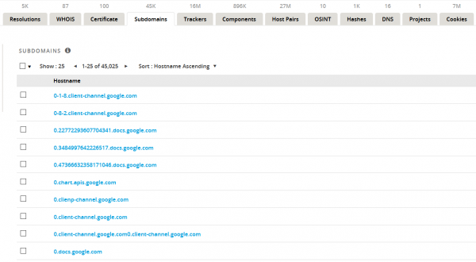

Nie wszystkie z tych domen muszą być dostępne, czy w ogóle istnieć, jednak to już kwestia prawdopodobieństwa. Szansa na znalezienie wartościowej domeny jest większa dla 45 tysięcy wyników niż na przykład dla tysiąca.

Zachęcam każdego czytelnika do sprawdzenia możliwości, filtrów oraz innych zakładek oferowanych przez RiskIQ, oraz by stał się on jednym z podstawowych narzędzi używanych w do rekonesansu.

## CRT.SH

Załóżmy, że potrafimy zebrać dostępne subdomeny za pomocą gotowych baz danych (takich jak np. posiada VirusTotal). Można się zastanowić, czy istnieje jeszcze jakiś sposób by powiększyć posiadaną listę subdomen, najlepiej o takie pozwalające uskutecznić atak na całą infrastrukturę?

By nie dawać odpowiedzi na tacy, pomyślmy o stronach internetowych z całkiem innej perspektywy. Popatrzmy na przykładowy adres jaki widzimy w przeglądarce:

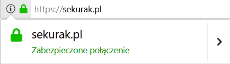

Używanie przez strony szyfrowania SSL/TLS podnosi poziom bezpieczeństwa użytkowników, sami użytkownicy (nawet Ci zupełnie niezaznajomieni z tematyką bezpieczeństwa) zwracają uwagę na zieloną kłódkę obok adresu URL, a od nie dawna strony nie używające szyfrowania przez Chrome są oznaczane jako "niezabezpieczone" (<https://sekurak.pl/chrome-zaczal-flagowac-strony-dostepne-przez-http-jako-niezabezpieczone/>). Po części zachęca, po części wymusza to na właścicielach stron czy administratorach używania szyfrowania SSL/TLS. Żeby taka implementacja była możliwa aktualnie wymagane jest dodanie certyfikatu do bazy Certificate Transparency. Pokrótce, CT działa na zasadzie serwerów logów do których każdy z urzędów certyfikacji może wysyłać informacje o wydawanych certyfikatach. Oznacza to że dla każdej strony (wliczając w to subdomeny) używającej certyfikatu SSL/TLS powinien zostać uczyniony wpis do publicznej bazy, która zawiera również informacje o certyfikatach, które wygasły.

Wracając do tematu poszukiwania możliwie największej liczby subdomen. Certyfikaty nie zawsze będą najlepszym źródłem informacji. Administrator strony może zapewnić stronie certyfikat z tzw. *wildcardem*, co oznacza, że rejestruje w urzędzie certyfikacji adres *.example.com, taki rekord znajduje się w CT, a wszystkie subdomeny "zawierają się" w tym i nie występują w bazie. Okazuje się jednak, że zamawianie certyfikatów tylko dla określonych subdomen (a przez to ujawnienie ich istnienia w CT) jest bardzo popularną praktyką. Wracając do tematu poszukiwania możliwie największej liczby subdomen, czemu nie wykorzystać tego jako jednej z technik rekonesansu?

Najpopularniejszym narzędziem, które może zostać wykorzystane w tym celu jest wyszukiwarka [www.crt.sh](http://www.crt.sh/). Pozwala ona wyszukać zarejestrowane certyfikaty dla danej domeny. Bardzo pomocną, oraz przeważnie wykorzystywaną opcją podczas testów bezpieczeństwa jest *wildcard*, który daje możliwość wyszukiwania subdomen dla domeny głównej.

Najprostszym przykładem użycia może być *%.facebook.com*, polecenie to wylistuje po prostu wszystkie subdomeny serwisu facebook.com, których certyfikaty są lub były odnotowane w bazie CT.

Kawałek listy wyszukiwarki crt.sh dla takiego zapytania widoczny jest poniżej:

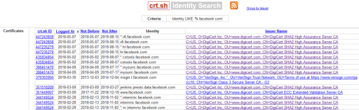

Poza zwyczajną listą subdomen, która może nie wydawać się ciekawa do momentu zweryfikowania znajdujących się tam rekordów, można od razu szukać ciekawych elementów infrastruktury. Przykładowo użycie komendy vpn%.domena.com może pozwolić wyszukać potencjalne subdomeny służące do obsługi usługi VPN (Rysunek nr 10).

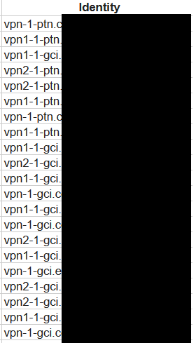

Ta może na pierwszy rzut oka niepozornie wyglądająca wyszukiwarka jest naprawdę warta uwagi. Metoda wyłuskiwania dodatkowych subdomen danej infrastruktury za pomocą bazy Certificate Transparency powinna zawsze być w wachlarzu obowiązkowych narzędzi testerów bezpieczeństwa.

## DNS trails

Przy okazji omawiania tematu rekonesansu  nie sposób nie wspomnieć o poszukiwaniu cennych informacji w historii DNS. Na czym to polega?\
W internecie są dostępne serwisy, które udostępniają pełną historię DNS, możemy dzięki temu przeglądać historię zmian dla danego adresu. Czasami pozostają tam informacje, które nie figurują już w wyszukiwarkach, oraz nie da się ich znaleźć w inny sposób.

Przyjmijmy, że istnieje serwer testowy, na którym przygotowuje się nową wersję strony. Nowa strona zostanie wdrożona, a stara pozostaje na serwerze testowym. Taki serwer może nawet nie mieć swojej nazwy domeny a jedynie adres IP, jednak z powodu nieuwagi programistów, może on nadal być dostępny z internetu. Mając dostęp do testowej, deweloperskiej wersji aplikacji możemy uzyskać dostęp do informacji, które później mogą być krytyczne dla testowania wdrożonej wersji.

W takim przypadku bardzo przydatne może się okazać użycie: [www.securitytrails.com](http://www.securitytrails.com/). Jak sama nazwa (oraz pierwsza zakładka która otwiera się po wyszukaniu rekordu) wskazuje, podstawową funkcjonalnością portalu jest wyświetlanie informacji DNS o danej domenie.

Mamy tutaj informacje o poszczególnych rekordach DNS:

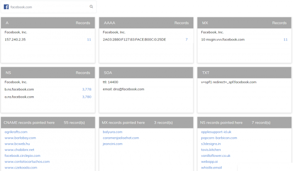

Warto poświęcić na to kilka minut, często przeklikanie odpowiednich rekordów daje testerowi lepszy pogląd na to jak może wyglądać cała testowana topologia.

Oczywiście skoro serwis udostępnia dane powiązane z tematem DNS mamy tutaj zakładkę pozwalającą na wylistowanie wszystkich subdomen powiązanych z wyszukiwanym serwisem.

Moim zdaniem użycie tego serwisu to dobry początek rekonesansu. Pomimo, że często poszczególne informacje które można tutaj znaleźć mogą nie być tak szczegółowe jak na innych serwisach, securitytrails jest dobrym punktem wyjściowym do kolejnych faz rekonesansu, oraz świetnym miejscem do rozpoznania jak wyglądają odpowiednie rekordy DNS.

## DNSdumpster

DNSdumpster to kolejny serwis zajmujący się pasywnym rekonesansem, z tym że ten skupia się głównie na informacjach ściśle związanych z serwerami DNS. Za pomocą DNS dumpster możemy uzyskać dane takie jak:

-   Serwery DNS
-   Rekordy MX
-   Rekordy TXT
-   Rekordy Host (A)

Bardzo ciekawą usługą tej wyszukiwarki jest rysowanie grafów dla wyszukiwanej frazy, na których łączy ze sobą adresy IP, serwery DNS, informacje o rekordach oraz domeny co daje świetny pogląd na to jak mniej więcej taka topologia może wyglądać.

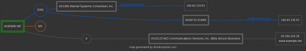

Rekonesans to złożony proces, w którym chodzi o zgromadzenie jak największej liczby informacji o celu, nie można zakładać, że rekonesans skupia się tylko wokół wyszukania wszystkich możliwych adresów czy domen.

Interesującymi informacjami, które często pomagają zaplanować wektor ataku jest poznanie jakie technologie zostały użyte w całej testowanej infrastrukturze. Początkowo testerzy starają się pozyskać jak najwięcej informacji tylko z zewnętrznych, ogólnie dostępnych źródeł.

## BuiltWith

Ta część rekonesansu pozwala na określenie z jakimi technologiami przyjdzie pracować testerowi, jakich rozwiązań technologicznych może się spodziewać oraz na powolne formowanie wektora ataku na daną infrastrukturę. Dodatkowo częstym zadaniem testera podczas testów (nawet przy testach aplikacji webowych) jest sprawdzenie czy można w jakiś sposób pozyskać informacje na temat stosowanego przez klienta oprogramowania czy jego wersji. BuiltWith może być dobrym punktem wyjścia do takich zadań.

Rekonesans to zadanie dość złożone, które (jak wspomniałem we wstępie) ma na celu zgromadzenie jak największej ilości informacji o celu testów. Załóżmy, że temat subdomen, adresów IP oraz serwerów DNS (i informacjami z nimi związanymi) jest zamknięty, czego jeszcze można szukać? Czegoś, co jest bardzo przydatne podczas testów, czyli technologii oraz oprogramowania używanego w infrastrukturze przeznaczonej do testów. Są to informacje, które można pozyskać z narzędzi wymienionych powyżej, na przykład:

**Securitytrails**

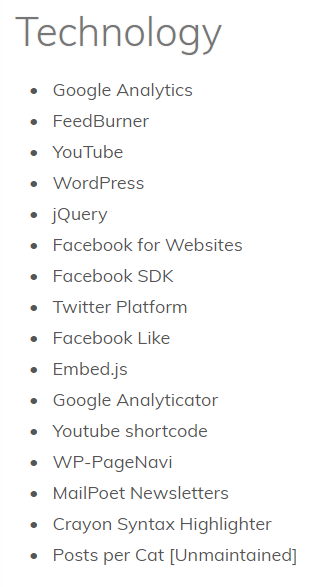

**RiskIQ**

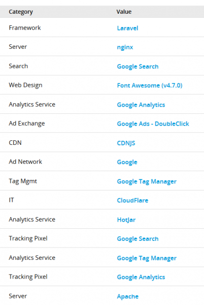

Dobrym i przygotowanym specjalnie do takich celów miejscem jest [www.builtwith.com](http://www.builtwith.com/), którego zadaniem jest dla wyszukanej strony dopasować jak największą ilość zastosowanych technologii.

Przykładowe informacje oferowane przez builtwith:

-   Analytics and Tracking (Obecność Facebook pixela, AdWords, aktywność userów)
-   Widgets (dodatki WordPressa, wtyczki)
-   Frameworks (używane frameworki)
-   Content Management Systems
-   JavaScript Libraries
-   SSL Certificate
-   Web Server
-   Document Information (np. nagłówki X-XSS-Protection czy X-Frame-Options, czy HSTS)

Przykładowe ciekawe informacje, które mogą być przydatne podczas dalszych testów zostały przedstawione na rysunku poniżej:

Dla czytelników ciekawych działania BuiltWith oraz tego jak wyglądają wyniki wyszukiwania, lista wyników dla google.com <https://builtwith.com/?https%3a%2f%2fwww.google.com%2f>.

## WebArchive

W kontekście poszukiwania informacji, tym bardziej tych, które zostały zapomniane, a mogą być bardzo pożyteczne, nie sposób nie wspomnieć o Web Archive ([https://web.archive.org](https://web.archive.org/)).

Jest to strona, która od 1996 roku przy użyciu specjalnych crawlerów 'zapisuje' informacje pojawiające się w internecie. Na moment pisania artykułu jest to ponad 300 miliardów stron, 16 milionów plików tekstowych, 3 miliony zdjęć i wiele innych plików!

Wpisując wybrany adres URL na samym początku mamy podgląd na to kiedy i ile razy kolejne wersje danej strony były zapisywane przez crawler, tak jak na Rysunku nr 16.

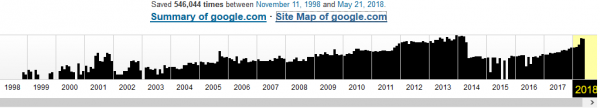

W tym wypadku to bardziej ciekawostka, ale możemy zobaczyć jak strona wyglądała podczas któregokolwiek z zapisów. Przykładowo tak prezentowała się strona Google w 1999 roku (Rysunek nr 17):

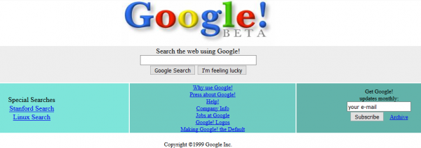

Teraz czas zająć się tym jak to potężne narzędzie może zostać użyte podczas rekonesansu. Wykorzystując Web Archive można szukać cennych plików o których zapomnieli administratorzy, starej dokumentacji czy informacji o starych metodach API.  Następnie podczas testów warto sprawdzić, czy aby na pewno te metody zostały usunięte z kodu, czy tylko ktoś usunął je z dokumentacji.

W poszukiwaniu takich informacji przydatne może być udanie się w hyperlink: "Summary of", naszym oczom ukażą się posegregowane szczegóły, które zostały zapisane w obrębie danej strony, jak na Rysunku nr 18.

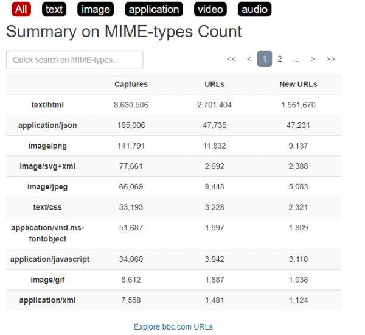

Opcja dostępna na dole listy 'Explore URLs' pozwala wyświetlić adresy wszystkich zapisanych zasobów. Jest tam również dostępna wyszukiwarka, która pomaga segregować odpowiednie pliki, oraz szukać interesujących nas źródeł (Rysunek nr 19).

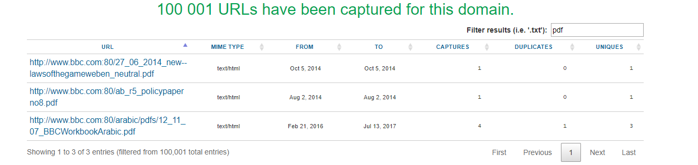

Żeby udowodnić, że nie Web Archive jest naprawdę przydatne pokażę teraz scenariusz w którym może ono posłużyć do rekonesansu (rekonesansu na pograniczu testów).

Często zdarza się, że wybrana strona zmienia front-end, czyli na przykład zmienia się oprawa graficzna, jednak ze strony back-endowej przez długi czas nic nie jest modyfikowane. Idąc tym tropem, warto przeanalizować wszystkie zrzuty w web.archive i spojrzeć na ich kod. Może się okazać, że administrator w pewnym momencie zainstalował lub włączył określoną wtyczkę (co będzie widoczne w kodzie), ale obecnie w kodzie nie ma żadnej informacji na jej temat. Dla Pentestera to może być cenna informacja. Można przypuszczać, że administrator nie usunął wtyczki tylko ją wyłączył. W takim przypadku jeżeli dla danej wtyczki istnieje jakaś podatność, która nie wymaga by wtyczka była włączona, może ona zostać wykorzystana jako wektor ataku. Przykładowo Pentester może bezpośrednio odwołać się do katalogu danej wtyczki i spróbować wykonać błąd, lub pozyskać cenne dla dalszych testów informacje.

## Zakończenie

Metod przeprowadzania rekonesansu jest wiele, nie ma na to jednej sprawdzonej recepty. Każdy tester na podstawie swojego doświadczenia tworzy osobistą bazę narzędzi, które później wykorzystuje do testów.

Wydaje mi się jednak, że ważne podczas przeprowadzania takich testów jest zrozumienie jak cały proces rekonesansu działa i jakiego typu informacje można znaleźć dla odpowiedniej techniki testowania.  Posiadając taką wiedzę można dobierać narzędzia zależnie od preferencji, czy nawet pisać swoje autorskie skrypty.

W następnej części przybliżę właśnie skrypty i programy, które ułatwiają obsługę narzędzi opisanych w tej serii, oraz takie które umożliwiają aktywny rekonesans.

--- *Michał Wnękowicz*
