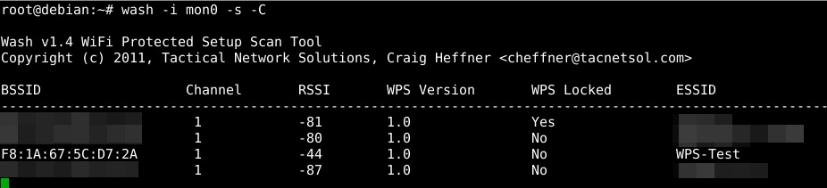
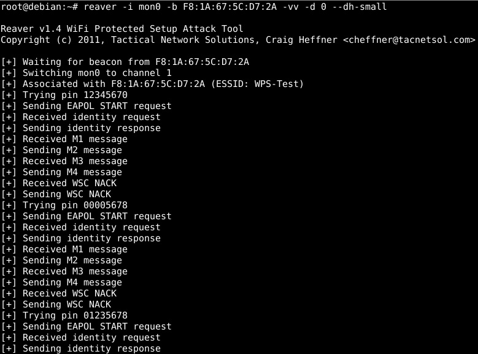
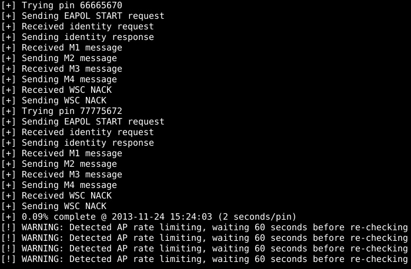
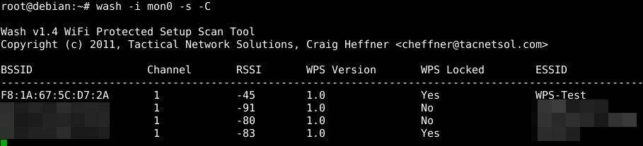
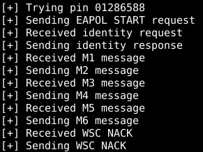
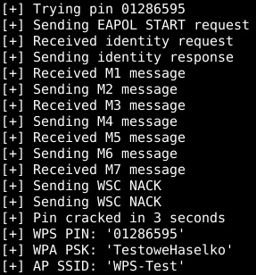
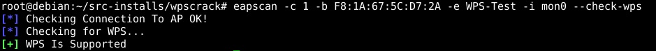

# Bezpieczeństwo WPS

> Original article: <https://sekurak.pl/bezpieczenstwo-sieci-wi-fi-czesc-6-bezpieczenstwo-wps/>

## Wstęp

Parę lat temu ktoś stwierdził, że konfigurowanie sieci Wi-Fi przy pomocy haseł WPA jest zbyt skomplikowane i potrzebne jest opracowanie nowej, znacznie prostszej metody dostępu. Niektórych Czytelników tego portalu zapewne takie podejście zdziwi, ale najwyraźniej przeciętny użytkownik oczekuje rozwiązania wygodniejszego od konfigurowania SSID i hasła na domowym routerze/AP, a następnie wpisywania tego hasła na każdym urządzeniu. Możliwe także, że lobbowali za tym producenci sprzętu dostarczanego masowo przez ISP pod strzechy, tj. Livebox. Każde z takich urządzeń przygotowane jest do używania „out of the box", czyli posiada predefiniowane, mniej lub bardziej losowe hasło WPA i SSID.

Zapewne uznano, że wprowadzanie skomplikowanego hasła jest niewygodnie dla użytkownika i potrzebne jest prostsze rozwiązanie. W ten oto sposób w 2007 roku powstał **WPS**, czyli **Wi-Fi Protected Setup**.

## Zasada działania

Głównym celem twórców WPS było opracowanie metody pozwalającej łatwo dodać nowe urządzenie do sieci Wi-Fi. Należy zaznaczyć, że WPS nie jest nową metodą zabezpieczana transmisji, lecz protokołem pozwalającym na łatwe skonfigurowanie urządzeń w sieciach chronionych przy pomocy WPA/WPA2. Nowa metoda miała pozwolić na automatyczne uzyskanie hasła. W związku z tym opracowano dwa podejścia do realizacji postawionego celu:

-   konfiguracja w paśmie (ang. „in-bound"),
-   konfiguracja poza pasmem (ang. „out-of-band").

Celem **konfiguracji w paśmie** jest zapewnienie ochrony przed podsłuchiwaniem. Dane dostępowe do sieci bezprzewodowej są przesyłane w ramach standardu 802.11 z użyciem EAP. Pomiędzy urządzeniem chcącym przyłączyć się do sieci, a urządzeniem autoryzującym następuje wymiana kluczy przy użyciu algorytmu Diffiego-Hellmana. Jest ona autoryzowana przy pomocy tzw. „hasła urządzenia", które zna urządzenie autoryzujące, a na urządzeniu podłączanym należy je wprowadzić. Wi-Fi Alliance pozwala na wprowadzanie hasła z klawiatury, dostarczenie go na pamięci USB lub przez token NFC.

W przypadku **konfiguracji poza pasmem** dane dostępowe do sieci przesyłane są za pomocą protokołu UPnP (Universal Plug-and-Play) z wykorzystaniem pamięci USB (odpowiednie pliki konfiguracyjne zapisane na nośniku) lub NFC. Dane te mogą być wymieniane w postaci szyfrowanej lub nie. W tym przypadku konieczne jest zachowanie bezpieczeństwa nośnika użytego do przekazania danych, ponieważ istnieje ryzyko ponownego ich użycia i nieautoryzowanego podłączenia innego urządzenia.

W ramach konfiguracji w paśmie zdefiniowano dwie metody uwierzytelniania podłączanego urządzenia:

-   PIN -- przy użyciu 8-cyfrowego PIN-u,
-   PBC (ang. Push-Button-Connect) -- inicjacja konfiguracji pomiędzy urządzeniami po naciśnięciu guzika.

Aktualnie tylko te dwie metody są uwzględniane w ramach certyfikacji WPS:

-   każde certyfikowane urządzenie musi obsługiwać metodę PIN,
-   wszystkie certyfikowane AP muszą obsługiwać metodę PBC, w przypadku urządzeń klienckich nie jest to wymagane.

Opisane powyżej metody konfiguracji poza pasmem nie są elementem certyfikacji WPS.

### 1. Autoryzacja bazująca na PIN-ie

W tej konfiguracji obsługa WPS jest aktywna cały czas. Podłączane urządzenie musi potwierdzić swoją tożsamość przy użyciu 8-cyfrowego PIN-u, na podstawie którego generowane jest hasło urządzenia.  Dostępne są dwa warianty:

-   wewnętrzna -- w konfiguracji AP należy wpisać PIN podany przez urządzenie chcące podłączyć się do sieci,
-   zewnętrzna -- na urządzeniu chcącym podłączyć się do sieci należy wpisać PIN skonfigurowany w AP.

Od razu widać, że metoda wewnętrzna wymaga dostępu do panelu konfiguracyjnego AP i w związku z tym jest bardziej skomplikowana. Osobiście nie widziałem urządzenia działającego w ten sposób, co nie jest dziwne, bo w samym WPS chodziło przecież o prostotę przyjętego rozwiązania.

W praktyce stosowane jest drugie podejście. AP najczęściej posiada wydrukowany PIN znajdujący się na nalepce z danymi urządzenia. Wystarczy odczytać PIN z AP, do którego powinniśmy mieć dostęp, i wpisać go do podłączanego urządzenia. Bezpieczeństwo tej metody opiera się na założeniu, że fizyczny dostęp do urządzenia jest ograniczony do „zaufanych osób".

### 2. Tryb PBC

W tym rozwiązaniu nie jest wymagana znajomość sekretu, tak jak to było w przypadku autoryzacji z wykorzystaniem PIN. Uproszczono jeszcze bardziej model zaufania do osób mających fizyczny dostęp do urządzenia i w tym rozwiązaniu na AP wystarczy tylko nacisnąć przycisk, który aktywuje protokół WPS i skonfiguruje oczekującego klienta. W tym trybie WPS jest aktywowany tylko na moment podłączania nowego urządzenia. W momencie aktywacji tego trybu, zarówno AP, jak i klient skanują otoczenie w poszukiwaniu drugiego urządzenia przełączonego w tryb konfiguracji. Po wzajemnym wykryciu się urządzeń następuje nawiązanie sesji analogicznie jak w przypadku uwierzytelniania opisanego powyżej, tylko z użyciem domyślnej wartości PIN składającej się z ośmiu zer. W przypadku braku aktywności w tym zakresie, AP po upływie 2 minut wyłącza tryb konfiguracji WPS.

Metoda ta napotyka na problem, kiedy kilka urządzeń chce równolegle skorzystać z protokołu WPS. Specyfikacja zakłada nieuruchamianie sesji konfiguracji, jeśli w otoczeniu znajduje się więcej urządzeń w trybie konfiguracji PBC. W taki sposób omija się to utrudnienie.

## Bezpieczeństwo

Omówiłem już pokrótce zasadę działania WPS. Nie jest to specjalnie skomplikowany protokół. Teraz przejdę do analizy jego bezpieczeństwa.

WPS w założeniach wygląda bardzo ładnie, jednak autorom najprawdopodobniej zabrakło wiedzy lub pominęli analizę kryptograficzną proponowanego rozwiązania. Kolejny błąd popełnili producenci sprzętu, wprowadzając szybką i nieprzemyślaną implementację WPS.

Odpowiedzią na ich błędy jest praca z 2011 roku pt. „[Brute forcing Wi-Fi Protected Setup: When poor design meets poor implementation](http://sviehb.files.wordpress.com/2011/12/viehboeck_wps.pdf)„, rozkładająca całe bezpieczeństwo WPS na łopatki.

> Niestety, ponieważ WPS pozwala na uzyskanie hasła WPA, spowodowało to drastyczne obniżenie bezpieczeństwa sieci zabezpieczonych WPA.

Opisywana podatność dotyczy trybu PIN w wariancie konfiguracji zewnętrznej, czyli rozwiązania dominującego na rynku. W tym przypadku nie ma żadnej metody pozwalającej na ograniczenie prób podłączenia się do sieci, ponieważ potencjalny atakujący nie musi mieć fizycznego kontaktu z urządzeniem.

> Jeśli w jakiś sposób uda mu się uzyskać poprawną wartość PIN, uzyska hasło WPA. Podatność ta pozwala na przeprowadzanie ataków siłowych na PIN.

### 1. Teoria kryptografii, czyli różnica między mnożeniem a dodawaniem

Według specyfikacji WPS PIN składa się z 8 cyfr dziesiętnych, co daje 10^8 różnych wartości. Ze względu na użycie tylko cyfr, można by się pokusić o przeprowadzenie ataku siłowego na konkretny PIN, sprawdzając wszystkie dostępne kombinacje. Jednak liczba10^8 możliwości praktycznie wyklucza sensowność takiego ataku.

Po wczytaniu się w dokumentację WPS okazuje się jednak, że ostatnia cyfra stanowi sumę kontrolną poprzednich 7 cyfr. Celem tego podejścia było umożliwienie wykrywania błędów we wprowadzonym przez użytkownika PIN-ie zanim zostanie wysłany do sieci. Moim zdaniem założenie, że użytkownik nie potrafi poprawnie wprowadzić 8 cyfr, nawet mając na to kilka prób, jest już lekką przesadą.

> Konsekwencją takiego podejścia jest fakt, że liczba dostępnych wartości PIN-u spada do 10^7, czyli dziesięciokrotnie. W kontekście bezpieczeństwa kryptograficznego jest to znaczący spadek i moim zdaniem całkowicie niewart funkcjonalności uzyskanej z tego powodu. Spadek ten jest jednak jeszcze niewystarczający do praktycznego wykorzystania ataku siłowego.

Jak to w kryptografii zwykle bywa, diabeł tkwi w szczegółach. Okazuje się, że weryfikacja poprawności PIN-u w WPS odbywa się dwuetapowo. W pierwszej kolejności następuje sprawdzenie poprawności 4 pierwszych cyfr kodu. Jeśli AP odpowie, że przedstawiona połówka PIN jest poprawna, następuje weryfikacja poprawności pozostałych 3 cyfr.

Zatem w pierwszej kolejności należy znaleźć pierwsze 4 cyfry PIN-u, a potem pozostałe 3, zamiast szukania wszystkich 7 po kolei. W wariancie pesymistycznym należy sprawdzić 10^4 wartości dla pierwszego etapu i 10^3 wartości dla drugiego. Daje to sumaryczną złożoność 10^4+10^3, wynoszącą 11 000 kombinacji.

> Ta drobna zmiana mnożenia na dodawanie spowodowała, że liczba dostępnych kombinacji jest ponad 900 razy mniejsza niż początkowe 10^7!

> W związku z tym kolosalnym błędem przeprowadzenie ataku siłowego na 11k wartości nie powinno stanowić problemu. Średni czas potrzebny na próbę podłączenia wynosi od 0.5 do 3 sekund. Innymi słowy: jeśli średni czas wynosi 1.3s/próbę, to czas potrzebny na sprawdzenie wszystkich wartości to ok. 4h.

Sam protokół WPS realizowany w ramach sesji EAP składa się z wymiany 8 wiadomości, określanych M1 do M8:

-   M1--M3 -- wymiana kluczy Diffie-Hellman,
-   M4--M5 -- udowodnienie posiadania poprawnej pierwszej połowy PIN-u i potwierdzenie od AP,
-   M6--M7 -- udowodnienie posiadania poprawnej drugiej połowy PIN-u i potwierdzenie od AP,
-   M8 -- decyzja o przyznaniu dostępu do sieci.

> Jeśli proces wymiany powyższych informacji się nie uda w którymkolwiek z etapów, AP wysyła komunikat EAP-NACK do klienta. Zatem otrzymanie tego komunikatu po M4 oznacza niepoprawną pierwszą połowę PIN, a otrzymanie go po M6 -- niepoprawną drugą połowę PIN.

### 2. Szybkie wdrożenie = dużo błędów

Niestety, problemy z WPS nie kończą się tylko na opisanej powyżej podatności kryptograficznej. Okazuje się, że większość producentów nie zaimplementowała standardu WPS do końca. Jedną z kluczowych pominiętych funkcjonalności jest tzw. „Lock down", czyli blokada protokołu WPS na pewien czas po pewnej liczbie nieudanych prób dostępu. Jest to funkcja analogiczna do procedur bezpieczeństwa stosowanych przez bankowość elektroniczną, ponieważ lepiej zablokować konto niż pozwolić na kontynuowanie ataku.

> Niestety większość urządzeń pozwala na przeprowadzanie ataku siłowego na PIN w trybie ciągłym lub okresy przerwy są zbyt krótkie, aby taki atak stał się niepraktyczny nawet przy 11k kombinacji do sprawdzenia.

Wprowadzenie 60 sekundowej blokady po 3 nieudanych próbach podłączenia urządzenia z niepoprawnym PIN-em wydłuża atak do niecałych 3 dni. Jest to jeszcze praktycznie wykonalne, ale już dużo mniej atrakcyjne dla potencjalnego atakującego. Jednak dla zachowania pełniejszego bezpieczeństwa wskazane byłoby użycie np. okresu blokady wynoszącego 60 min po 5 nieudanych próbach, co daje czas ataku ok. 90 dni przy 1.3s/próbę.

> Po opublikowaniu tak poważnych podatności w większości przypadków zaleca się wyłączenie danej funkcjonalności. Niestety wielu producentów nie dało użytkownikom takiej możliwości lub zaimplementowało ją niepoprawnie, pozostawiając ciągle dostępny protokół WPS.
>
> Oznacza to, że użytkownicy nie mają możliwości zabezpieczenia swoich sieci inaczej niż przez wymianę sprzętu lub skorzystanie z nieoryginalnego oprogramowania, np. OpenWRT.

### 3. Reaver

Jednym z najpopularniejszych programów do przeprowadzania ataków na WPS jest Reaver. Dostępne są także inne pakiety, ale są mniej dojrzałe lub bardzo niestabilne. Instalacja Reavera jest bardzo prosta -- wystarczy ściągnąć źródła ze [strony projektu](http://code.google.com/p/reaver-wps/), rozpakować i postępować zgodnie z instrukcją zawartą w README.

Do kompilacji wymagane są pakiety sqlite3-devel i libpcap-dev. Niestety w skrypcie sprawdzającym konfigurację jest błąd -- w przypadku zainstalowanego w systemie libpcap-dev i braku sqlite3-devel, zostaniemy poinformowani komunikatem o braku libpcap. Instalując wspomniane pakiety na początku, można łatwo pozbyć się tego problemu.\
W ramach pakietu Reaver otrzymujemy dwa narzędzia: reaver i wash. Pierwsze z nich służy do przeprowadzania ataku siłowego na WPS, drugie pozwala na identyfikację sieci bezprzewodowych posiadających włączoną funkcję WPS.

## Próba ataku

Przejdźmy teraz do praktycznego wykorzystania zdobytej wiedzy.

1. Całą pracę z pakietem Reaver należy rozpocząć od przełączenia karty w tryb monitor. Używam tej samej konfiguracji sprzętowej co w poprzednich częściach artykułu:

    ```console
    root@debian:~# airmon-ng start wlan1
    ```


2. Rozpocznę od sprawdzenia, które sieci z mojego otoczenia posiadają włączoną funkcjonalność WPS. W tym celu posłużę się programem wash z pakietu reavera:

    ```console
    root@debian:~# wash -i mon0 -s -C
    ```

    Opcja -i oznacza interfejs w trybie monitor. Użyłem 2 dodatkowych przełączników:

    -   -s służący do skanowania otoczenia oraz
    -   -C, który oznacza ignorowanie niepoprawnych sum kontrolnych ramek, pozwalając na wykrycie większej liczby sieci.

    Uzyskany wynik jest przedstawiony na poniższym zrzucie:

    

    Wynik przedstawiony jest w postaci czytelnej tabelki wraz z wszystkimi niezbędnymi danymi o sieci. Dodatkowo dostępna jest kolumna „WPC Locked" z informacją, czy AP jest w stanie blokady protokołu WPS, np. ze względu na za dużą liczbę nieudanych połączeń. Niestety, zarówno wash, jak i reaver nie zawsze poprawnie potrafią rozpoznać, że AP wyszedł ze stanu zablokowania, co wstrzymuje dalszy postęp ataku. Na szczęście jest rozwiązanie pozwalające poradzić sobie z tym problemem i napiszę o nim poniżej.


3. Wybieram do dalszych działań sieć WPS-Test i zapisuję jej BSSID.


4. Uruchamiam reavera do ataku wybranej sieci:

    ```console
    root@debian:~# reaver -i mon0 -b F8:1A:67:5C:D7:2A -vv -d 0 --dh-small
    ```

    Opcje:

    -   -i oznacza mój interfejs w trybie monitor,
    -   -b to BSSID atakowanego AP,
    -   -vv oznacza wyświetlanie większej ilości danych o ataku,
    -   -d 0 oznacza brak przerwy pomiędzy poszczególnymi próbami PIN,
    -   --dh-small oznacza użycie małych kluczy Diffie-Hellman, co przyspieszy atak, gdyż ich generowanie jest czasochłonne.

    Działanie programu widoczne jest na poniższym zrzucie ekranu:

    

    Widać na nim wyraźnie poszczególne etapy ataku wraz z przesyłaniem komunikatów M1, M2 pomiędzy AP a klientem oraz komunikatem NACK po M4, świadczącym o niepoprawnej wartości pierwszej połówki PIN.

    > Dodatkowo należy wspomnieć, że reaver testuje w pierwszej kolejności pewne popularne wartości PIN, co może znacząco skrócić czas całego ataku. Kolejną wygodną funkcją reavera jest to, że zapisuje stan ataku, czyli które wartości PIN zostały już sprawdzone, by w przypadku przerwania jego działania, a następnie wznowienia -- rozpocząć działanie od momentu, w którym skończył.


5. Po kilku/kilkunastu nieudanych próbach AP może zablokować protokół WPS na pewien czas, co będzie widoczne podczas działania reavera w poniższy sposób:

    

    Można to potwierdzić, uruchamiając washa:

    

    Stan zablokowania AP widać w kolumnie „WPS locked".

    W tym przypadku reaver oczekuje na odblokowanie AP, po czym powinien kontynuować atak. Niestety ze względu na wspomniany błąd nie zawsze się tak dzieje.

    > Jeśli reaver nie będzie chciał wznowić ataku, można użyć przełącznika -L, który spowoduje ignorowanie blokady AP i pozwoli wznowić atak.


6. Jeżeli uda się już odnaleźć poprawną pierwszą połówkę PIN-u, reaver zaczyna wyświetlać także informację o wymianie komunikatów M5--M6, co jest widoczne na poniższym zrzucie ekranu.

    

    Ponieważ po M6 przychodzi komunikat NACK, oznacza to, że druga połówka PIN jest niepoprawna.


7. Ostatecznie po dotarciu do poprawnej wartości PIN, reaver wyświetla informację o komunikacie M7 i wszystkie informacje o konfiguracji sieci. **Wraz z hasłem WPA**.

    

    Czas ataku zależy bardzo od tego, czy i, jeśli tak, to na jak długo AP ustawia blokadę na WPS oraz od tego, jak „daleko" skonfigurowany PIN znajduje się na liście sprawdzanych po kolei wartości. W praktyce w większości przypadków czas nie stanowi poważnego ograniczenia.

    Reaver posiada także bardzo przydatną opcję do testowania pozwalającą na sprawdzenie konkretnej wybranej wartości PIN przy pomocy przełącznika -p. W przypadku podania PIN-u z niepoprawną wartością cyfry kontrolnej, reaver ją obliczy i podmieni.

## Dodatki

### 1. Pakiet eapeak

Test, czy dany AP posiada włączony protokół WPS, można także wykonać przy pomocy programu eapscan z [pakietu eapeak](https://code.google.com/p/eapeak/). Jego instalacja jest bardzo prosta: wystarczy wykonać kroki z krótkiej instrukcji. W przypadku AP używanego w tym artykule taki test wyglądałby następująco:

```console
root@debian:~# eapscan -c 1 -b F8:1A:67:5C:D7:2A -e WPS-Test -i mon0 --check-wps
```

Opcja -c oznacza kanał, na którym pracuje AP, a pozostałe opcje są jasne. Wynik działania przedstawiony jest na poniższym zrzucie:



### 2. WPScrack

Autor wspomnianego wcześniej dokumentu o podatności WPS napisał „Proof of Concept" w pythonie pozwalający przeprowadzać atak siłowy na WPS. Wpis na [jego blogu](http://sviehb.wordpress.com/2011/12/27/wi-fi-protected-setup-pin-brute-force-vulnerability/) zawiera link do kodu (wpscrack.zip) napisanego w Pythonie. Korzysta on ze wspominanej już nie raz na łamach Sekuraka z biblioteki Scapy. Niestety w mojej konfiguracji sprzętowej nie udało mi się zmusić tego kodu do współpracy -- wieszał się bardzo szybko po uruchomieniu.

### 3. Obliczanie wartości cyfry kontrolnej PIN

Do pracy z WPS może być także przydatna wiedza o sposobie obliczania sumy kontrolnej PIN-u. Przyjmijmy, że każda z cyfr PIN-u oznaczona będzie Px, gdzie P1 oznacza cyfrę pierwszą od lewej, a P8 ostatnią po prawej, czyli PIN wygląda następująco: P1P2P3P4P5P6P7P8. P8 to suma kontrolna wartości P1--P7, którą można obliczyć wg następującego wzoru:

> P8 = 10 -- ((3 \* P7 + P6 + 3 \* P5 + P4 + 3 \* P3 + P2 + 3 \* P1) % 10).

## Podsumowanie

W tej części artykułu pokazałem, jak z powodu prostych błędów kryptograficznych i implementacyjnych WPS znacząco obniżył bezpieczeństwo WPA2. W większości przypadków oznacza to możliwość przeprowadzenia praktycznego ataku na protokół WPS w akceptowalnym czasie. **Najgorszym wnioskiem płynącym z powyższej analizy jest brak możliwości obrony przed tym zagrożeniem w przypadku wielu urządzeń zakupionych w ostatnich latach.**

Najnowsze domowe AP posiadają już opcję wyłączenia WPS, ale jestem przekonany, że znikoma liczba osób to robi. W związku z krótkimi czasami blokady WPS nadal istnieje możliwość przeprowadzenia praktycznego ataku. Jeśli ktoś koniecznie chce używać WPS, to jego zabezpieczenie wymagałoby ustawienia dużych ograniczeń czasowych na blokadę protokołu, lecz niestety domowe AP nie dają takiej możliwości.

> Zatem znów wracamy do jedynego sensownego zalecenia dotyczącego bezpieczeństwa: **należy wyłączyć WPS**.

## Bibliografia

-   Stefan Viehböck, [Brute forcing Wi-Fi Protected Setup: When poor design meets poor implementation](http://sviehb.files.wordpress.com/2011/12/viehboeck_wps.pdf)
-   [Wi-Fi Alliance --- Wi-Fi Protected Setup Specification](http://www.wi-fi.org/knowledge-center/articles/wi-fi-protected-setup%E2%84%A2)
-   [reaver](http://code.google.com/p/reaver-wps/)
-   [eapeak](https://code.google.com/p/eapeak/)
-   [Wi-Fi Protected Setup PIN brute force vulnerability](http://sviehb.wordpress.com/2011/12/27/wi-fi-protected-setup-pin-brute-force-vulnerability/)

--- *Adam Smutnicki*
