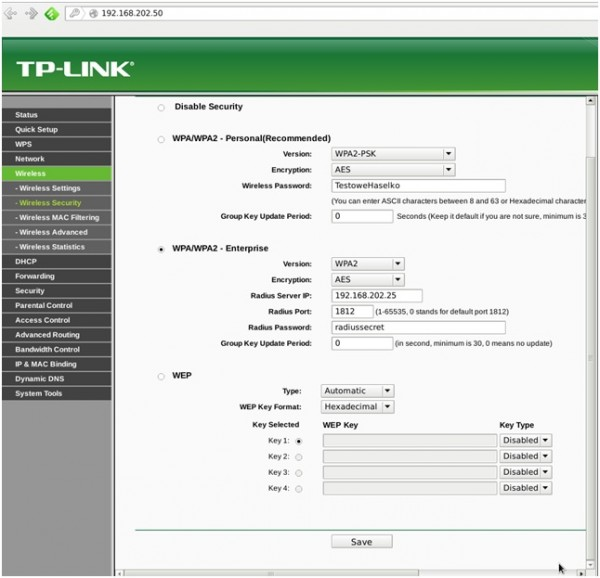
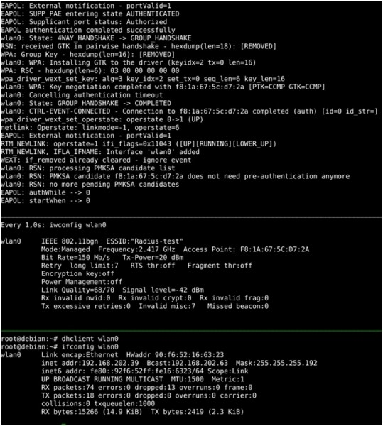
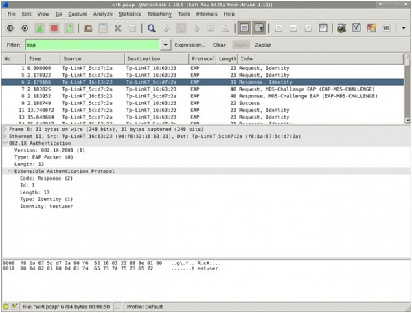

# Budowa sieci WPA/WPA-2 Enterprise z wykorzystaniem FreeRadius

## Wstęp

FreeRadius jest najpopularniejszą darmową implementacją serwera RADIUS. Może być użyty do uwierzytelniania użytkowników w ramach różnych usług, a nie tylko sieci Wi-Fi. Przykładem takiego użycia może być dostęp do sieci VPN. W związku z tym w tej części cyklu niewiele będzie elementów bezpośrednio związanych z sieciami Wi-Fi, ponieważ samo podłączenie infrastruktury sieciowej (AP) do serwera uwierzytelniającego nie jest skomplikowane.

Budowanie infrastruktury do WPA/WPA2-Enterpriste z wykorzystaniem FreeRadiusa będzie wyglądało następująco:

1.  instalacja serwera,
2.  testowanie instalacji -- pierwsze próby uzyskania udanego uwierzytelnienia z wykorzystaniem czystego protokołu RADIUS,
3.  dodanie obsługi użytkowników z zewnętrznej bazy danych,
4.  opakowanie zapytań uwierzytelniających w protokół EAP,
5.  dodanie obsługi AP do uwierzytelniania urządzeń Wi-Fi.

## Wprowadzenie do serwera FreeRadius

FreeRadius jest bardzo zaawansowanym serwerem z dużym spektrum możliwości. Oto ich przegląd:

-   pełna obsługa standardów AAA dla protokołu RADIUS,
-   obsługa dużej liczby metod EAP,
-   obsługa wielu źródeł danych o użytkownikach,
-   dane księgowania mogą być zapisywane w wielu różnych formatach i bazach danych;
-   obsługa VSA (Vendor Specific Attributes) dla ponad 100 producentów,
-   wysoka wydajność pozwalająca budować wieloserwerowe rozwiązania, potrafiące obsłużyć milion zapytań dziennie i pracujące z bazą danych o rozmiarze 10 milionów użytkowników,
-   obsługa trybu „proxy", czyli przesyłania zapytań do innych serwerów,
-   obsługa load balancingu pozwalająca definiować grupy serwerów, które będą obsługiwały konkretne zapytania,
-   obsługa „fail-over" pozwalająca na wykrywanie awarii innych serwerów w grupie i odpowiednie przełączanie się na zapasowe serwery, aby zapewnić dostępność usługi.

Konfiguracja i administracja serwerem FreeRadius jest dość skomplikowana, co przyznają nawet sami autorzy w dokumentacji. Jednak nie wynika to z nieodpowiednio zaprojektowanego modelu konfiguracji, lecz z tego, że FreeRadius to bardzo rozbudowany system pozwalający na tworzenie skomplikowanych i zaawansowanych rozwiązań. Z tego powodu najczęściej popełnianym błędem podczas implementacji jest wykonanie dużej liczby modyfikacji plików konfiguracyjnych bez testowania ich po kolei. **Konfigurację należy modyfikować tylko w tych miejscach, które rozumiemy.**

Autorzy zalecają przyjęcie następującego podejścia podczas konfiguracji FreeRadiusa:

1.  rozpoczęcie pracy z domyślnymi wartościami plików konfiguracyjnych;
2.  zrobienie kopii zapasowej domyślnej konfiguracji, ponieważ na pewno będzie działała i bezwzględnie nie należy jej modyfikować;
3.  potwierdzenie, że serwer uruchamia się poprawnie (najlepiej w trybie debugowania, aby wykryć potencjalne problemy);
4.  przesłanie testowych pakietów do serwera przy użyciu „radclient" lub NAS/AP;
5.  sprawdzenie, czy serwer działa zgodnie z oczekiwaniami:
    1.  jeśli nie, należy zmodyfikować konfigurację i przejść do kroku 3; jeśli utknąłeś, należy użyć ostatniej działającej konfiguracji. Zawsze należ wykonywać tylko małe zmiany -- drogę do docelowej konfiguracji należy podzielić na kilka etapów, w których dodajemy nowe elementy konfiguracji;
    2.  jeśli działa poprawnie, należy przejść do punktu 6;
6.  zapisanie kopii działającej poprawnie konfiguracji wraz z komentarzem, jakie zmiany zostały wprowadzone, gdzie i dlaczego. Do tego celu świetnie nadają się systemy kontroli wersji, takie jak git, svn, mercurial, bzr czy csv (do wyboru według upodobań);
7.  Powtórzyć od kroku 3.

Powyższa metoda wydaje się dość długa, ale zapewnia sekwencyjne wprowadzanie zmian, które po kolei będą testowane. Na każdym kolejnym etapie dostępna będzie działająca konfiguracja z poprzedniego etapu, do której można zawsze wrócić. Szybkie nanoszenie wielu zmian doprowadzi do frustracji i zmusi do rozpoczęcia wszystkiego od początku.

Na szczęście wraz z instalacją dostarczana jest bardzo rozbudowana domyślna konfiguracja. Obsługuje ona od razu najpopularniejsze przypadki użycia. Włączenie dodatkowych opcji zazwyczaj wymaga tylko wczytania się w komentarze w plikach konfiguracyjnych i odkomentowania odpowiednich sekcji przygotowanej konfiguracji domyślnej. Najpopularniejsze metody EAP oraz źródła danych o użytkownikach są już skonfigurowane. Dzięki temu w praktyce możliwe jest uruchomienia serwera spełniającego podstawowe funkcjonalności zaraz po instalacji, bez potrzeby budowania konfiguracji od zera.

Budowa aplikacji i działanie serwera FreeRadius są podobne do serwera Apache:

-   obsługiwane są tzw. „serwery wirtualne" -- potrafiące emulować wiele instancji serwera z różną konfiguracją, dzięki czemu jedna aplikacja może realizować rozłączne funkcje dla kilku grup/instytucji;
-   poszczególne funkcjonalności realizowane są przez dedykowane moduły, które zazwyczaj wystarczy włączyć w odpowiednim miejscu w głównej konfiguracji; funkcjonalności realizowane przez te moduły posiadają swoje własne pliki konfiguracyjne, co ułatwia pracę.

## Pierwsze uruchomienie

### 1. Instalacja serwera

Moje środowisko testowe jest analogiczne do używanego w poprzednich częściach artykułu: czysta i zaktualizowana instalacja systemu GNU/Linux Debian testing w wersji z podstawowym zestawem pakietów. Jako NAS, użyję domowego routera z wbudowanym AP: TP-Link TL-WR841N.

> W październiku 2013 pojawiła się nowa, trzecia wersja FreeRadiusa. Przynosi dużo poprawek i nowych funkcjonalności w stosunku do wersji drugiej. Z tego powodu zajmę się instalacją najnowszej wersji. Niestety ze względu na niedawną publikację, nie są dostępne jeszcze paczki systemowe dla Debiana, dlatego zmuszony jestem do instalacji ze źródeł.

Dodatkowo należy pamiętać o tym, że autorzy zalecają tworzenie konfiguracji do wersji 3.0 od początku, zamiast kopiowania konfiguracji z wersji 2.0.

Sam proces instalacji ze źródeł jest bardzo prosty.

1. Należy ściągnąć źródła z strony projektu:

    ```console
    root@debian:~/freeradius# wget ftp://ftp.freeradius.org/pub/freeradius/freeradius-server-3.0.0.tar.gz
    ```


2. Warto zapoznać się z informacjami zawartymi w plikach README.rst oraz INSTALL.rst.


3. Szczegółowe informacje o opcjach kompilacji są dostępne po wywołaniu:

    ```console
    root@debian:~/freeradius/freeradius-server-3.0.0# ./configure --help
    ```


4. Postanowiłem użyć domyślnych opcji konfiguracji, wywołując:

    ```console
    root@debian:~/freeradius/freeradius-server-3.0.0# ./configure
    ```


5. Podczas procesu konfiguracji okazało się, że brakuje mi następujących bibliotek: libssl-dev libtalloc-dev. Po ich doinstalowaniu ponownie uruchomiłem ./configure.


6. Warto zapoznać się z wynikiem procesu konfiguracji, w szczególności z komunikatami WARNING mówiącymi, które biblioteki nie zostały znalezione i ewentualnie co warto doinstalować, ponieważ może to być potrzebne w przyszłości.

Zdecydowałem się doinstalować następujące paczki: libsqlite3-dev libpam-dev libmysqlclient-dev libpcap-dev, dające możliwość korzystania z RADIUS sniffera, obsługę biblioteki PAM, SQLite i MySQL.


7. Ponownie uruchamiam ./configure, aby uwzględnić nowo zainstalowane biblioteki.


8. Kompiluję serwer:

    ```console
    root@debian:~/freeradius/freeradius-server-3.0.0# make
    ```


9. Instaluję:

    ```console
    root@debian:~/freeradius/freeradius-server-3.0.0# make install
    ```

    Po udanej instalacji pliki konfiguracyjne znajdują się w katalogu: /usr/local/etc/raddb/. Najbardziej interesujące nas w tej chwili pliki to:

    -   **clients.conf** -- konfiguracja urządzeń/aplikacji, które mogą być klientami serwera, czyli przesyłać zapytania o uwierzytelnienie użytkownika,
    -   **users** -- obsługa użytkowników,
    -   **sites-available/default** -- definicja domyślnego serwera wirtualnego,
    -   **sites-available/inner-tunel** -- definicja dodatkowego serwera wirtualnego do obsługi tuneli TLS.

    Zgodnie z tym, o czym wspomniałem powyżej, postanowiłem użyć gita do zapewnienia kontroli wersji dla wszystkich plików konfiguracyjnych:

    ```console
    root@debian:/usr/local/etc/raddb# git init ./
    Initialized empty Git repository in /usr/local/etc/raddb/.git/
    root@debian:/usr/local/etc/raddb# git add ./*
    root@debian:/usr/local/etc/raddb# git commit -a -m "Initial default config"
    [master (root-commit) b809839] Initial default config
    Committer: root <root@debian>
    ```


### 2. Weryfikacja instalacji

Skoro już zainstalowałem serwer i domyślną konfigurację, pozostało mi teraz jego uruchomienie w celu sprawdzenia poprawności instalacji.

W dokumentacji wszędzie zalecane jest uruchamianie i testowanie serwera przy użyciu trybu pracy „debug". Uruchamiając go w ten sposób, otrzymuje się wiele użytecznych informacji wskazujących, gdzie i jak można naprawić wykryte błędy. Pozwala to także śledzić dokładnie proces analizy pakietów i obsługi zgłoszeń otrzymywanych przez serwer.

Tryb debugowania uruchamia się w następujący sposób:

```console
root@debian:~# radiusd -X
```

Po uruchomieniu tego polecenia, na ekranie pojawi się bardzo dużo informacji, m.in. o parsowaniu plików konfiguracyjnych. Jeśli na końcu pojawi się komunikat: „Ready to process requests.", oznacza to, że serwer działa poprawnie i że można rozpocząć przesyłanie do niego zapytań.

Skoro serwer FreeRadius działa poprawnie, to teraz można rozpocząć testowanie obsługi zapytań uwierzytelniających.

Otwieram osobną konsolę, w której wyślę testowe zapytanie do serwera. Można do tego celu użyć programu radtest, który jest automatycznie instalowany wraz z serwerem FreeRadius:

```console
root@debian:~# radtest test test localhost 0 testing123
```

Kolejne użyte argumenty to:

-   obie wartości „test" stanowią login oraz hasło,
-   localhost jest to adres serwera Radius -- test wykonujemy na tym samym hoście, zatem można użyć tego adresu,
-   0 jest to tzw. nas-port-number (czyli wartość AVP NAS-Port), który w tym przypadku nie ma znaczenia,
-   testing123 -- jest to sekret autoryzujący nasze zapytanie.

W tym przypadku program radtest działa jako klient serwera Radius i musi się uwierzytelnić właśnie przy pomocy sekretu/hasła. Metoda ta jest stosowana dla każdego klienta serwera Radius po to, aby uwierzytelnić urządzenia wysyłające zapytania i tym samym zapewnić bezpieczeństwo serwera. W domyślnej konfiguracji FreeRadiusa wpisany jest jeden klient, zdefiniowany jako localhost z powyższym hasłem.

Dzięki temu mam możliwość lokalnego testowania konfiguracji:

```console
root@debian:/usr/local/etc/raddb# cat clients.conf | grep -v "^$" | grep -v "^[[:space:]]*#"
client localhost {
            ipaddr = 127.0.0.1
            proto = *
            secret = testing123
            require_message_authenticator = no
            nas_type = other # localhost isn't usually a NAS...
            limit {
                        max_connections = 16
                        lifetime = 0
                        idle_timeout = 30
            }
}
```

Wracając do powyższego testu, wynik wykonanego polecenia jest następujący:

```console
root@debian:~# radtest test test localhost 0 testing123
Sending Access-Request of id 78 from 0.0.0.0 port 47173 to 127.0.0.1 port 1812
User-Name = 'test'
User-Password = 'test'
NAS-IP-Address = 127.0.1.1
NAS-Port = 0
Message-Authenticator = 0x00
rad_recv: Access-Reject packet from host 127.0.0.1 port 1812, id=78, length=20
```

Radtest wyświetlił wartości odpowiednich pól wysłanego zapytania Radius, a na końcu widać odpowiedź odmowną: Access-Reject.

W tym samym czasie w konsoli, w której uruchomiłem wcześniej serwer, powinny pojawić się informacje dotyczące obsługi otrzymanego zapytania (przypominam, że serwer działa w trybie debug).

Ilość informacji jest spora, lecz pozwala obejrzeć proces obsługi zapytania:

```console
rad_recv: Access-Request packet from host 127.0.0.1 port 47173, id=78, length=74
User-Name = 'test'
User-Password = 'test'
NAS-IP-Address = 127.0.1.1
NAS-Port = 0
Message-Authenticator = 0x0114416718db59288d897832290a9145
(0) # Executing section authorize from file /usr/local/etc/raddb/sites-enabled/default
(0) authorize {
(0) filter_username filter_username {
(0) ? if (User-Name != "%{tolower:%{User-Name}}")
(0) expand: "%{tolower:%{User-Name}}" -> 'test'
(0) ? if (User-Name != "%{tolower:%{User-Name}}") -> FALSE
(0) ? if (User-Name =~ / /)
(0) ? if (User-Name =~ / /) -> FALSE
(0) ? if (User-Name =~ /@.*@/ )
(0) ? if (User-Name =~ /@.*@/ ) -> FALSE
0) ? if (User-Name =~ /\\.\\./ )
(0) ? if (User-Name =~ /\\.\\./ ) -> FALSE
(0) ? if ((User-Name =~ /@/) && (User-Name !~ /@(.+)\\.(.+)$/))
(0) ? if ((User-Name =~ /@/) && (User-Name !~ /@(.+)\\.(.+)$/)) -> FALSE
(0) ? if (User-Name =~ /\\.$/)
(0) ? if (User-Name =~ /\\.$/) -> FALSE
(0) ? if (User-Name =~ /@\\./)
(0) ? if (User-Name =~ /@\\./) -> FALSE
(0) } # filter_username filter_username = notfound
(0) [preprocess] = ok
(0) [chap] = noop
(0) [mschap] = noop
(0) [digest] = noop
(0) suffix : No '@' in User-Name = "test", looking up realm NULL
(0) suffix : No such realm "NULL"
(0) [suffix] = noop
(0) eap : No EAP-Message, not doing EAP
(0) [eap] = noop
(0) [files] = noop
(0) [expiration] = noop
(0) [logintime] = noop
(0) WARNING: pap : No "known good" password found for the user. Not setting Auth-Type.
(0) WARNING: pap : Authentication will fail unless a "known good" password is available.
(0) [pap] = noop
(0) } # authorize = ok
(0) ERROR: No Auth-Type found: rejecting the user via Post-Auth-Type = Reject
(0) Failed to authenticate the user.
(0) Using Post-Auth-Type Reject
(0) # Executing group from file /usr/local/etc/raddb/sites-enabled/default
(0) Post-Auth-Type REJECT {
(0) attr_filter.access_reject : expand: "%{User-Name}" -> 'test'
(0) attr_filter.access_reject : Matched entry DEFAULT at line 11
(0) [attr_filter.access_reject] = updated
(0) eap : Request didn't contain an EAP-Message, not inserting EAP-Failure
(0) [eap] = noop
(0) remove_reply_message_if_eap remove_reply_message_if_eap {
(0) ? if (reply:EAP-Message && reply:Reply-Message)
(0) ? if (reply:EAP-Message && reply:Reply-Message) -> FALSE
(0) else else {
(0) [noop] = noop
(0) } # else else = noop
(0) } # remove_reply_message_if_eap remove_reply_message_if_eap = noop
(0) } # Post-Auth-Type REJECT = updated
(0) Finished request 0.
Waking up in 0.3 seconds.
Waking up in 0.6 seconds.
(0) Sending delayed reject
Sending Access-Reject of id 78 from 127.0.0.1 port 1812 to 127.0.0.1 port 47173
Waking up in 4.9 seconds.
(0) Cleaning up request packet ID 78 with timestamp +68
Ready to process requests.
```

W skrócie od góry mamy:

-   wyświetlenie otrzymanego zapytania,
-   sprawdzenie kilku reguł dopasowania dla użytkownika,
-   uruchomienie kilku modułów (chap, mschap) i sprawdzenie wyniku ich działania (zwracają noop, czyli nie wykonały żadnych akcji),
-   określenie realmu -- w tym przypadku jest to NULL, ponieważ wysłany login nie zawierał realmu,
-   uruchomienie modułu EAP, który także tutaj nie zwrócił żadnego wyniku, ponieważ wysłane zapytanie nie zawierało danych EAP,
-   moduł PAP (do realizacji Password Authentication Protocol) także nic nie zwraca, co oznacza że nie udało się uwierzytelnić użytkownika przez żaden z modułów, o czym świadczy komunikat:

    ```text
    (0) ERROR: No Auth-Type found: rejecting the user via Post-Auth-Type = Reject
    (0) Failed to authenticate the user.
    ```

-   budowany jest komunikat odmowny „Access-Reject", który następnie jest wysyłany do klienta.

W tym przypadku fakt otrzymania odpowiedzi odmownej nie oznacza niepoprawnego działania serwera. Wręcz przeciwnie -- jest to zgodne z oczekiwaniami, ponieważ podane dane nie są wpisane w konfiguracji FreeRadiusa ani w żadnej dołączonej bazie użytkowników. Celem powyższego testu było sprawdzenie, czy FreeRadius poprawnie analizuje zapytania przesyłane od klienta -- co jak widać, działa poprawnie.

### 3. Prosty mechanizm AA

W poprzednim punkcie udało mi się z powodzeniem przesłać zapytanie uwierzytelniające do serwera, który je przetworzył i przesłał odpowiedź. Kolejnym testem będzie próba uzyskania odpowiedzi „Access-Accept" od serwera.

Do tego celu potrzebny mi jest poprawny login i hasło. Jedną z najprostszych metod uzyskania poprawnych danych jest ich ręczne wpisanie do pliku konfiguracyjnego FreeRadiusa. W tym celu należy zmodyfikować plik ./users, który od wersji 3.0 (dla zgodności z wersją 2.0) jest linkiem do ./mods-config/files/authorize.

Dodaję nowy wpis opisujący użytkownika ‚testuser' wraz z hasłem ‚testpass' oraz chcę, aby serwer odesłał komunikat „Hello testuser". Wpis będzie wyglądał następująco (wynik uzyskany przy pomocy funkcjonalności diff z gita, + oznacza linie dopisane przeze mnie):

```console
root@debian:/usr/local/etc/raddb# git diff mods-config/files/authorize
diff --git a/mods-config/files/authorize b/mods-config/files/authorize
index 9b51032..bca0ba2 100644
--- a/mods-config/files/authorize
+++ b/mods-config/files/authorize
@@ -87,6 +87,9 @@
#"John Doe" Cleartext-Password := "hello"
# Reply-Message = "Hello, %{User-Name}"
+"testuser" Cleartext-Password := "testpass"
+ Reply-Message = "Hello, %{User-Name}"
+
#
```

Teraz ponownie uruchamiam serwer w trybie debug (zabijając wcześniej działającą instancję) i wysyłam następujące zapytanie (z nowym loginem i hasłem, pozostałe parametry pozostają bez zmian):

```console
root@debian:~# radtest testuser testpass localhost 0 testing123
Sending Access-Request of id 8 from 0.0.0.0 port 46487 to 127.0.0.1 port 1812
User-Name = 'testuser'
User-Password = 'testpass'
NAS-IP-Address = 127.0.1.1
NAS-Port = 0
Message-Authenticator = 0x00
rad_recv: Access-Accept packet from host 127.0.0.1 port 1812, id=8, length=37
Reply-Message = 'Hello, testuser'
```

Podobnie jak poprzednio widać dane wysłane w zapytaniu. Tym razem otrzymałem odpowiedź „Access-Accept" wraz z dodatkowym komunikatem: „Hello, testuser". Tutaj widać już namiastkę szerokiego spektrum możliwości protokołu RADIUS wynikającą z różnych AVP i wygody ich konfiguracji.

Po stronie serwera obsługa przesłanego zapytania wygląda bardzo podobnie do poprzedniego zapytania. Zaznaczyłem tylko to, co nowe i interesujące dla analizy tego przypadku:

```text
rad_recv: Access-Request packet from host 127.0.0.1 port 46487, id=8, length=78
User-Name = 'testuser'
User-Password = 'testpass'
NAS-IP-Address = 127.0.1.1
NAS-Port = 0
Message-Authenticator = 0x0c03a37da37af788c0653d31aa4745c9
(0) # Executing section authorize from file /usr/local/etc/raddb/sites-enabled/default
(0) authorize {
(0) filter_username filter_username {
(0) ? if (User-Name != "%{tolower:%{User-Name}}")
(0) expand: "%{tolower:%{User-Name}}" -> 'testuser'
(0) ? if (User-Name != "%{tolower:%{User-Name}}") -> FALSE
(0) ? if (User-Name =~ / /)
(0) ? if (User-Name =~ / /) -> FALSE
(0) ? if (User-Name =~ /@.*@/ )
(0) ? if (User-Name =~ /@.*@/ ) -> FALSE
(0) ? if (User-Name =~ /\\.\\./ )
(0) ? if (User-Name =~ /\\.\\./ ) -> FALSE
(0) ? if ((User-Name =~ /@/) && (User-Name !~ /@(.+)\\.(.+)$/))
(0) ? if ((User-Name =~ /@/) && (User-Name !~ /@(.+)\\.(.+)$/)) -> FALSE
(0) ? if (User-Name =~ /\\.$)
(0) ? if (User-Name =~ /\\.$/) -> FALSE
(0) ? if (User-Name =~ /@\\./)
(0) ? if (User-Name =~ /@\\./) -> FALSE
(0) } # filter_username filter_username = notfound
(0) [preprocess] = ok
(0) [chap] = noop
(0) [mschap] = noop
(0) [digest] = noop
(0) suffix : No '@' in User-Name = "testuser", looking up realm NULL
(0) suffix : No such realm "NULL"
(0) [suffix] = noop
(0) eap : No EAP-Message, not doing EAP
(0) [eap] = noop
(0) files : users: Matched entry testuser at line 90
(0) files : expand: "Hello, %{User-Name}" -> 'Hello, testuser'
(0) [files] = ok
(0) [expiration] = noop
(0) [logintime] = noop
(0) [pap] = updated
(0) } # authorize = updated
(0) Found Auth-Type = PAP
(0) # Executing group from file /usr/local/etc/raddb/sites-enabled/default
(0) Auth-Type PAP {
(0) pap : login attempt with password "testpass"
(0) pap : Using clear text password "testpass"
(0) pap : User authenticated successfully
(0) [pap] = ok
(0) } # Auth-Type PAP = ok
(0) # Executing section post-auth from file /usr/local/etc/raddb/sites-enabled/default
(0) post-auth {
(0) [exec] = noop
(0) remove_reply_message_if_eap remove_reply_message_if_eap {
(0) ? if (reply:EAP-Message && reply:Reply-Message)
(0) ? if (reply:EAP-Message && reply:Reply-Message) -> FALSE
(0) else else {
(0) [noop] = noop
(0) } # else else = noop
(0) } # remove_reply_message_if_eap remove_reply_message_if_eap = noop
(0) } # post-auth = noop
Sending Access-Accept of id 8 from 127.0.0.1 port 1812 to 127.0.0.1 port 46487
Reply-Message = 'Hello, testuser'
(0) Finished request 0.
Waking up in 0.3 seconds.
Waking up in 4.6 seconds.
(0) Cleaning up request packet ID 8 with timestamp +36
Ready to process requests.
```

W tym przypadku widać, że moduł PAP dokonał aktualizacji przetwarzanego zgłoszenia, co sygnalizuje następujący komunikat:

```text
(0) [pap] = updated
```

W konsekwencji pozwala wiec serwerowi na stwierdzenie, że udało się znaleźć odpowiedni moduł do obsługi zapytania:

```text
(0) Found Auth-Type = PAP
```

Następnie widać login i hasło przetwarzane przez moduł PAP oraz wynik poprawnego uwierzytelnienia:

```text
(0) pap : User authenticated successfully
(0) [pap] = ok
(0) } # Auth-Type PAP = ok
```
Na koniec budowana jest odpowiedź „Access-Accept".

Pragnę przypomnieć, że cały czas testuję „czysty" protokół RADIUS, bez elementów EAP. Zajmuję się sprawdzaniem funkcjonalności uwierzytelniania z wykorzystaniem różnych źródeł danych przy użyciu najprostszej metody PAP. Kiedy mechanizm uwierzytelniania będzie działał poprawnie, zostanie opakowany w EAP, aby realizował zaplanowany modelu bezpieczeństwa.

### 4. Uwierzytelnianie na podstawie zewnętrznego źródła danych o użytkownikach

Udało mi się już zmusić serwer FreeRadius do zaakceptowania przesłanych danych dostępowych. Jednak użyta metoda nie jest najwygodniejsza, ponieważ wymaga wpisywania każdego użytkownika z osobna do pliku konfiguracyjnego FreeRadiusa.

Buduję element infrastruktury, który ma służyć do realizacji WPA/WPA2-Enterprise i należy się spodziewać konieczności obsługi dużej liczby użytkowników (jak sama nazwa Enterprie sugeruje). Duże instytucje mają najczęściej centralną bazę danych o użytkownikach, do której podłączone są różne usługi. Dzięki temu zapewnione jest wygodne i szybkie zarządzanie nimi.

Analogicznie w praktyce dane dostępowe użytkowników najczęściej nie są przechowywane w samym FreeRadiusie lecz w zewnętrznej bazie danych, np.:

-   passwd -- systemy z grupy *nix,
-   ldap,
-   mysql,
-   active directory -- Windows.

Skoro mój serwer FreeRadius działa na Linuxie, to najprościej będzie mi podłączyć bazę użytkowników systemowych z plików /etc/passwd i /etc/shadow.

W tym celu:

1. tworzę nowego użytkownika systemowego:

    ```console
    root@debian:/usr/local/etc/raddb# useradd passwduser
    ```


2. i ustawiam mu hasło:

    ```console
    root@debian:/usr/local/etc/raddb# passwd passwduser
    ```


3. Mam teraz poprawnie skonfigurowanego użytkownika systemowego:

    ```console
    root@debian:/usr/local/etc/raddb# cat /etc/{passwd,shadow} | grep passwduser
    passwduser:x:1000:1000::/home/passwduser:/bin/sh
    passwduser:$6$.oyO2rEm$NLFEhubceLsKNt1uytTZl.QnsdPE5ie4563f3/DB0zBWi8pNX2.l9b/nOmTPhmmd3NJxpfBXUD9NUPYYSVBoq0:16061:0:99999:7:::
    ```


W FreeRadiusie za obsługę użytkowników z systemów klasy *nix odpowiedzialny jest moduł nazywający się ‚unix'. W domyślnej konfiguracji, z którą pracujemy, moduł ten jest wyłączony. Należy go włączyć przez odkomentowanie go w pliku z konfiguracją domyślnego serwera wirtualnego sites-available/default (minus oznacza starą linię przed zmiana, a plus po moich zmianach):

```console
root@debian:/usr/local/etc/raddb# git diff sites-available/default
diff --git a/sites-available/default b/sites-available/default
index 1b9e50d..20cbe77 100644
--- a/sites-available/default
+++ b/sites-available/default
@@ -324,7 +324,7 @@ authorize {
# to read /etc/passwd or /etc/shadow directly, see the
# passwd module in radiusd.conf.
#
-# unix
+ unix
#
```

Teraz ponownie uruchamiam serwer w trybie debug, a następnie wysyłam zapytanie z nowymi danymi uwierzytelniającymi:

```console
root@debian:~# radtest passwduser passwdpass localhost 0 testing123
Sending Access-Request of id 66 from 0.0.0.0 port 37931 to 127.0.0.1 port 1812
User-Name = 'passwduser'
User-Password = 'passwdpass'
NAS-IP-Address = 127.0.1.1
NAS-Port = 0
Message-Authenticator = 0x00
rad_recv: Access-Accept packet from host 127.0.0.1 port 1812, id=66, length=20
```

Jak widać otrzymałem odpowiedź „Access-Accept", czyli moja konfiguracja działa poprawnie. Obsługa po stronie serwera została przedstawiona na poniższym listingu. Pogrubieniem zostały zaznaczone elementy pokazujące, podobnie jak poprzednio, uwierzytelnianie metodą PAP z wykorzystaniem danych użytkowników z passwd i shadow.

```text
rad_recv: Access-Request packet from host 127.0.0.1 port 37931, id=66, length=80
User-Name = 'passwduser'
User-Password = 'passwdpass'
NAS-IP-Address = 127.0.1.1
NAS-Port = 0
Message-Authenticator = 0x8d814c76e8996df8dc637cfba418304f
(0) # Executing section authorize from file /usr/local/etc/raddb/sites-enabled/default
(0) authorize {
(0) filter_username filter_username {
(0) ? if (User-Name != "%{tolower:%{User-Name}}")
(0) expand: "%{tolower:%{User-Name}}" -> 'passwduser'
(0) ? if (User-Name != "%{tolower:%{User-Name}}") -> FALSE
(0) ? if (User-Name =~ / /)
(0) ? if (User-Name =~ / /) -> FALSE
(0) ? if (User-Name =~ /@.*@/ )
(0) ? if (User-Name =~ /@.*@/ ) -> FALSE
(0) ? if (User-Name =~ /\\.\\./ )
(0) ? if (User-Name =~ /\\.\\./ ) -> FALSE
(0) ? if ((User-Name =~ /@/) && (User-Name !~ /@(.+)\\.(.+)$/))
(0) ? if ((User-Name =~ /@/) && (User-Name !~ /@(.+)\\.(.+)$/)) -> FALSE
(0) ? if (User-Name =~ /\\.$/)
(0) ? if (User-Name =~ /\\.$/) -> FALSE
(0) ? if (User-Name =~ /@\\./)
(0) ? if (User-Name =~ /@\\./) -> FALSE
(0) } # filter_username filter_username = notfound
(0) [preprocess] = ok
(0) [chap] = noop
(0) [mschap] = noop
(0) [digest] = noop
(0) suffix : No '@' in User-Name = "passwduser", looking up realm NULL
(0) suffix : No such realm "NULL"
(0) [suffix] = noop
(0) eap : No EAP-Message, not doing EAP
(0) [eap] = noop
(0) [unix] = updated
(0) [files] = noop
(0) [expiration] = noop
(0) [logintime] = noop
(0) [pap] = updated
(0) } # authorize = updated
<strong>(0) Found Auth-Type = PAP</strong>
(0) # Executing group from file /usr/local/etc/raddb/sites-enabled/default
<strong>(0) Auth-Type PAP {
(0) pap : login attempt with password "passwdpass"
(0) pap : Using CRYPT password "$6$.oyO2rEm$NLFEhubceLsKNt1uytTZl.QnsdPE5ie4563f3/DB0zBWi8pNX2.l9b/nOmTPhmmd3NJxpfBXUD9NUPYYSVBoq0"
(0) pap : User authenticated successfully
(0) [pap] = ok
(0) } # Auth-Type PAP = ok</strong>
(0) # Executing section post-auth from file /usr/local/etc/raddb/sites-enabled/default
(0) post-auth {
(0) [exec] = noop
(0) remove_reply_message_if_eap remove_reply_message_if_eap {
(0) ? if (reply:EAP-Message && reply:Reply-Message)
(0) ? if (reply:EAP-Message && reply:Reply-Message) -> FALSE
(0) else else {
(0) [noop] = noop
(0) } # else else = noop
(0) } # remove_reply_message_if_eap remove_reply_message_if_eap = noop
(0) } # post-auth = noop
Sending Access-Accept of id 66 from 127.0.0.1 port 1812 to 127.0.0.1 port 37931
(0) Finished request 0.
Waking up in 0.3 seconds.
Waking up in 4.6 seconds.
(0) Cleaning up request packet ID 66 with timestamp +5
Ready to process requests.
```

Na tym przykładzie widać wyraźnie, że modularna konfiguracja FreeRadiusa pozwala stosunkowo łatwo dodawać nowe funkcjonalności przez włączanie dedykowanych modułów. Domyślna konfiguracja stanowi bardzo dobrą bazę do dalszych modyfikacji i powinna obsłużyć większość przypadków.

## Obsługa EAP

Udało się już uruchomić prosty mechanizm uwierzytelniania, bazujący na danych użytkowników przechowywanych w systemie operacyjnym. Chciałbym teraz przejść do realizacji obsługi protokołu EAP, który jest niezbędny do zbudowania naszej infrastruktury WPA/WPA2-Enterprise.

### 1. eapol_test

Przed rozpoczęciem pracy z EAP konieczne jest zainstalowanie narzędzia pozwalającego na wygodne testowanie konfiguracji EAP, zarówno po stronie klienta, jak i serwera.

Niestety radclient się do tego nie nadaje ze względu na to, że posiada wsparcie tylko dla EAP-MD5 (które i tak w wersji 3.0 FreeRadiusa nie działa). Dużo wygodniejszy jest program eapol_test z pakietu wpa_supplicant, używanego do obsługi uwierzytelniania w sieciach Wi-Fi z wykorzystaniem 802.1X i EAP w systemach z rodziny *nix.

Domyślne kompilacje wpa_supplicanta dostępne w repozytoriach niestety nie zawierają eapol_test. Z tego powodu trzeba sobie go skompilować samemu:

1. Pobieram [źródła paczki](http://hostap.epitest.fi/wpa_supplicant/):

    ```console
    root@debian:~/freeradius/wpa_supplicant-2.0/wpa_supplicant# wget http://hostap.epitest.fi/releases/wpa_supplicant-2.0.tar.gz
    ```


2. Kopiuję domyślną konfigurację:

    ```console
    root@debian:~/freeradius/wpa_supplicant-2.0/wpa_supplicant# cp defconfig .config
    ```


3. Teraz należy odkomentować linię CONFIG_EAPOL_TEST=y

    ```console
    root@debian:~/freeradius/wpa_supplicant-2.0/wpa_supplicant# diff -u .config defconfig
    --- .config 2013-12-22 17:47:28.071295167 +0100
    +++ defconfig 2013-01-12 16:42:53.000000000 +0100
    @@ -226,7 +226,7 @@
    #CONFIG_HT_OVERRIDES=y
    # Development testing
    -CONFIG_EAPOL_TEST=y
    +#CONFIG_EAPOL_TEST=y
    # Select control interface backend for external programs, e.g, wpa_cli:
    # unix = UNIX domain sockets (default for Linux/*BSD)
    ```


4. Konieczne jest doinstalowanie kilku bibliotek, bez których kompilacja się nie uda:

    ```console
    root@debian:~/freeradius/wpa_supplicant-2.0/wpa_supplicant# aptitude install libnl1 libnl-dev
    ```


5. Kompiluję:

    ```console
    root@debian:~/freeradius/wpa_supplicant-2.0/wpa_supplicant# make eapol_test
    ```


6. Instaluję:

    ```console
    root@debian:~/freeradius/wpa_supplicant-2.0/wpa_supplicant# cp eapol_test /usr/local/bin
    ```


### 2. Obsługa EAP w serwerze FreeRadius

Domyślna konfiguracja serwera FreeRadius ma włączoną obsługę EAP, co widać przez odkomentowaną linię z modułem eap w pliku sites-enabled/default.

Oznacza to, że nie muszę modyfikować konfiguracji serwera, aby opakować używane wcześniej zapytania uwierzytelniające w protokół EAP. Domyślnie włączone są następujące metody:

-   MD5,
-   LEAP,
-   TLS,
-   TTLS,
-   PEAP.

Jak już wspominałem [w poprzedniej części](http://sekurak.pl/bezpieczenstwo-sieci-wi-fi-czesc-8-wpawpa2-enterprise-radius/), metody EAP tj. TTLS czy PEAP, posiadają tożsamość zewnętrzną i wewnętrzną. Domyślna konfiguracja FreeRadiusa posiada dwa serwery wirtualne:

-   default,
-   inner-tunel.

Serwer default, jest tym, który przyjmuje domyślne zapytania adresowane na porty 1812-1814. W przypadku otrzymania zapytania np. EAP-TTLS obsługuje zewnętrzną tożsamość, a następnie, działając jako proxy, przesyła tunel TLS oraz znajdującą się w nim wewnętrzną tożsamość do wirtualnego serwera „inner-tunel". Takie rozdzielenie funkcjonalności nie jest niezbędne do poprawnej obsługi zapytań z tunelami TLS, lecz pozwala na wygodną separację zewnętrznej tożsamości i aktywnych dla niej metod EAP od wewnętrznej tożsamości.

Jedyną zmianą w konfiguracji, która może być nam potrzebna, jest włączenie obsługi użytkowników z passwd. Wykonuje się to przez włączenie modułu ‚unix' w konfiguracji serwera inner-tunel, analogicznie jak to było zrobione poprzednio dla serwera default.

### 3. Profile EAP dla suplikanta

Skoro konfigurację EAP dla serwera też działa, pozostało teraz tylko napisać profile EAP dla suplikanta, które będę użyte do wygenerowania odpowiednich zapytań do serwera FreeRadius. Przygotowałem dwa profile, dla EAP-TTLS oraz EAP-PEAP:

```console
root@debian:~/freeradius# cat eap-ttls.cfg
network={
            key_mgmt=WPA-EAP
            eap=TTLS
            ca_cert="/usr/local/etc/raddb/certs/ca.pem"
            anonymous_identity="anonymous"
            identity="testuser"
            password="testpass"
            phase2="auth=PAP"
}
root@debian:~/freeradius# cat eap-peap.cfg
network={
            key_mgmt=WPA-EAP
            eap=PEAP
            ca_cert="/usr/local/etc/raddb/certs/ca.pem"
            anonymous_identity="anonymous"
            identity="testuser"
            password="testpass"
            phase2="auth=PAP"
}
```

Oraz profil testowy EAP-TTLS używający danych dostępowych z passwd i shadow:

```console
root@debian:~/freeradius# cat eap-ttls-passwd.cfg
network={
            key_mgmt=WPA-EAP
            eap=TTLS
            ca_cert="/usr/local/etc/raddb/certs/ca.pem"
            anonymous_identity="anonymous"
            identity="passwduser"
            password="passwdpass"
            phase2="auth=PAP"
}
```

W profilach użyłem następujących parametrów:

-   **key_mgmt** -- obsługa klucza szyfrowania WAP, ponieważ implementujemy WPA/WPA2-Enterprise,
-   **eap** -- wybrana metoda EAP,
-   **ca_cert** -- certyfikat CA, którym podpisany jest certyfikat serwera; ma to na celu zapewnienie autoryzacji serwera, do którego następuje podłączenie; w moim przypadku użyłem certyfikatu domyślnie wygenerowanego podczas instalacja FreeRadiusa,
-   **anonymous_identity** -- tożsamość zewnętrzna, tutaj anonimowa, w celu ochrony danych użytkownika, które powinny zostać przesłane dopiero w tunelu TLS,
-   **identity i password** -- dane tożsamości wewnętrznej,
-   **phase2** -- metoda uwierzytelnienia użyta w tunelu TLS; ponieważ tunel TLS zapewnia poufność, można użyć PAP.

Pozostało tylko przeprowadzić testy skonfigurowanych profili, używając sekretu przypisanego do lokalnego klienta FreeRadiusa:

```console
root@debian:~/freeradius# eapol_test -c /root/freeradius/eap-ttls.cfg -s testing123 | tail
EAPOL: SUPP_BE entering state RECEIVE
EAPOL: SUPP_BE entering state SUCCESS
EAPOL: SUPP_BE entering state IDLE
eapol_sm_cb: success=1
EAPOL: Successfully fetched key (len=32)
PMK from EAPOL - hexdump(len=32): 5f 2c 8f de 24 a5 23 96 9c 83 17 d8 fa f5 78 26 a7 95 47 9b 2f ad fb aa ac 5d 3f 89 0f 15 01 57
EAP: deinitialize previously used EAP method (21, TTLS) at EAP deinit
ENGINE: engine deinit
MPPE keys OK: 1 mismatch: 0
SUCCESS
root@debian:~/freeradius# eapol_test -c /root/freeradius/eap-ttls-passwd.cfg -s testing123 | tail
EAPOL: SUPP_BE entering state RECEIVE
EAPOL: SUPP_BE entering state SUCCESS
EAPOL: SUPP_BE entering state IDLE
eapol_sm_cb: success=1
EAPOL: Successfully fetched key (len=32)
PMK from EAPOL - hexdump(len=32): b2 01 e1 b8 33 78 12 54 99 37 70 38 af 0a 26 de d4 bc 81 a2 44 b2 63 72 5a a4 f4 dc 0a 9b 75 52
EAP: deinitialize previously used EAP method (21, TTLS) at EAP deinit
ENGINE: engine deinit
MPPE keys OK: 1 mismatch: 0
SUCCESS
root@debian:/usr/local/etc/raddb# eapol_test -c /root/freeradius/eap-peap.cfg -s testing123 | tail
EAPOL: SUPP_BE entering state RECEIVE
EAPOL: SUPP_BE entering state SUCCESS
EAPOL: SUPP_BE entering state IDLE
eapol_sm_cb: success=1
EAPOL: Successfully fetched key (len=32)
PMK from EAPOL - hexdump(len=32): fe 70 25 2c 40 31 2a ab f1 f4 cf 26 c3 36 e2 7c 9d dd 69 a3 a8 de ae 5a 1a 4c 45 69 ac 81 92 bb
EAP: deinitialize previously used EAP method (25, PEAP) at EAP deinit
ENGINE: engine deinit
MPPE keys OK: 1 mismatch: 0
SUCCESS
```

Widać wyraźnie, że wszystkie zapytania otrzymały akceptację od serwera Radius.

Nie umieszczam tu wyniku obsługi takiego zapytania po stronie serwera, gdyż jest on bardzo długi. Zachęcam wszystkich czytelników do obejrzenia go we własnym zakresie, gdyż pozwala zrozumieć, w jaki sposób są przekazywane pakiety:

-   zawierające tożsamość zewnętrzną,
-   ustanawiające tunel TLS,
-   zawierające tożsamość wewnętrzną.

### 4. Szczegóły konfiguracji EAP we FreeRadiusue

Domyślna konfiguracja EAP znajduje się w pliku mods-enabled/eap i warto się z nią zapoznać. Przedstawiam ją poniżej, uzupełnioną o kilka komentarzy dotyczących najważniejszych parametrów:

```console
eap {
            #<strong> domyślna metoda EAP jest ustawiona na md5, należy ją zmienić na używaną w ramach swojej infrastruktury, ponieważ jak wspominałem, EAP-MD5 jest podatne na ataki</strong>
            default_eap_type = md5
            timer_expire = 60
            ignore_unknown_eap_types = no
            cisco_accounting_username_bug = no
            max_sessions = 4096
            <strong> # aktywna obsługa MD5, wskazane jest ją wyłączyć, ze względu na wspomniane wcześniej podatności</strong>

            md5 {
            }

            <strong>  # aktywna obsługa LEAP, wskazane jest ją wyłączyć, ze względu na wspomniane wcześniej podatności</strong>
            leap {
            }

            gtc {
                        auth_type = PAP
            }

            <strong> # jedna domyślna konfiguracja tuneli TLS, dla metod które ich używają, np. EAP-TLS, EAP-TTLS, EAP-PEAP</strong>
            tls-config tls-common {
                        private_key_password = whatever
                        private_key_file = ${certdir}/server.pem
                        certificate_file = ${certdir}/server.pem
                        ca_file = ${cadir}/ca.pem
                        dh_file = ${certdir}/dh
                        ca_path = ${cadir}
                        cipher_list = "DEFAULT"
                        ecdh_curve = "prime256v1"
                        cache {
                                    enable = yes
                                    lifetime = 24 # hours
                                    max_entries = 255
                        }

                        verify {
                        }

                        ocsp {
                                    enable = no
                                    override_cert_url = yes
                                    url = "http://127.0.0.1/ocsp/"
                        }
            }

            tls {
                        tls = tls-common
            }

            ttls {
                        tls = tls-common
                        <strong># to jest metoda EAP dla wewnętrznej tożsamości, znajdującej sie w tunelu, dlatego można użyć MD5</strong>
                        default_eap_type = md5
                        copy_request_to_tunnel = no
                        use_tunneled_reply = no
                        <strong># skierowanie obsługi wewnętrznego zapytania do wirtualnego serwera: inner-tunel</strong>
                        virtual_server = "inner-tunnel"
            }

            peap {
                        tls = tls-common
                        default_eap_type = mschapv2
                        copy_request_to_tunnel = no
                        use_tunneled_reply = no
                        virtual_server = "inner-tunnel"
            }

            mschapv2 {
            }
}
```

W powyższej konfiguracji widać włączoną obsługę dwóch niebezpiecznych metod EAP (o których wspominaliśmy w poprzedniej części dotyczącej EAP): MD5 i LEAP. Zalecane jest ich wyłączenie. Zanim jednak przystąpimy to tego, wykonajmy prosty test uwierzytelnienia metodą EAP-MD5. Przygotowałem profil wpa_suplikanta dla EAP-MD5:

```console
root@debian:~/freeradius# cat eap-md5.cfg
network={
            key_mgmt=WPA-EAP
            eap=MD5
            ca_cert="/usr/local/etc/raddb/certs/ca.pem"
            identity="testuser"
            password="testpass"
}
```

W tym miejscu, zanim przejdziemy do dalszych testów, należy wspomnieć, że EAP-MD5 nie nadaje się do WAP/WAP2-Enterprise, ponieważ nie wspiera mechanizmów związanych z obsługą kluczy. Z tego powodu ta metoda nigdy się nie powiedzie, jeśli testy będziemy wykonywali eapol_test z pakietu wpa_suplicant. Radtest potrzebuje też dodatkowych binarek do obsługi EAP-MD5, które niestety w wersji 3.0 FreeRadiusa są uszkodzone i się nie kompilują. W związku z tym, użyję eapol_test, a poprawność obsługi zapytania sprawdzę wśród danych wyświetlanych przez serwer FreeRadius działający w trybie debug.

Zatem test wykonuję w następujący sposób:

```console
root@debian:~/freeradius# eapol_test -c /root/freeradius/eap-md5.cfg -s testing123
```

Konsola FreeRadiusa pokazała mi taki wynik:

```text
Sending Access-Accept of id 2 from 127.0.0.1 port 1812 to 127.0.0.1 port 38063
EAP-Message = 0x03020004
Message-Authenticator = 0x00000000000000000000000000000000
User-Name = 'testuser'
```

Co oznacza zaakceptowanie przesłanych danych w ramach metody EAP-MD5.

Teraz w pliku mods-enabled/eap zakomentowałem moduł md5 (i nawiasy wąsikowe) oraz zrestartowałem serwer.

Po wysłaniu takiego samego zapytania jak powyżej, konsola serwera pokazała:

```text
Sending Access-Reject of id 1 from 127.0.0.1 port 1812 to 127.0.0.1 port 59036
EAP-Message = 0x04010004
Message-Authenticator = 0x00000000000000000000000000000000
```

Czyli, mam pewność, że metoda MD5 została wyłączona. Podobnie wskazane jest wyłączenie metody LEAP.

## Podłączenie AP do posiadanej instalacji

Skoro posiadam już serwer obsługujący odpowiednio bezpieczne metody EAP, teraz pozostało już tylko dodać do tego AP, który we współpracy z serwerem RADIUS będzie przyznawał dostęp do sieci. Do tego celu, użyję wspomniany wcześniej router z AP TP-Link.

Najpierw muszę zdefiniować nowego klienta, od którego serwer RADIUS będzie akceptował zapytania o uwierzytelnienie użytkownika.

W tym celu należy dodać nowy wpis dotyczący AP do pliku clients.conf:

```console
root@debian:/usr/local/etc/raddb# git diff clients.conf
diff --git a/clients.conf b/clients.conf
index fc0463b..a7b800e 100644
--- a/clients.conf
+++ b/clients.conf
@@ -247,6 +247,11 @@ client localhost {
# shortname = private-network-2
#}
+client 192.168.202.50 {
+ secret = radiussecret
+ shortname = AP
+}
+
#client 203.0.113.1 {
# # secret and password are mapped through the "secrets" file.
```

Dodałem mój AP, dostępny po adresem 192.168.202.50, który będzie się uwierzytelniał do serwera przy pomocy hasła ‚radiussecret'. Następnie restartuję serwer RADIUS.

Teraz odpowiednio modyfikuję konfigurację AP, tak jak na poniższym zrzucie ekranu:



Przechodzę teraz na hosta, którego będę chciał podłączyć do sieci Wi-Fi. Potrzebny jest mi jeszcze profil EAP -- jeden z tych, które testowałem wcześniej. Muszę go uzupełnić o pewne dodatkowe opcje związane bezpośrednio z obsługą sieci Wi-Fi.

Ostatecznie profil wygląda następująco:

```console
root@debian:~/freeradius# cat eap-ttls.cfg
eapol_version=1
ap_scan=1
fast_reauth=1
network={
            ssid="Radius-test"
            key_mgmt=WPA-EAP
            proto=WPA2
            pairwise=CCMP
            group=CCMP
            eap=TTLS
            ca_cert="/root/freeradius/ca.pem"
            anonymous_identity="anonymous"
            identity="testuser"
            password="testpass"
            phase2="auth=PAP"
}
```

Oczywiście oprócz profilu, muszę także wgrać certyfikat CA, którym podpisany jest certyfikat serwera FreeRadiusa.

Teraz pozostaje tylko włączyć wpa_suplikanta, który dokona uwierzytelnienia do sieci, a następnie pobrać konfigurację sieciową.

```console
root@debian:~/freeradius# wpa_supplicant -c /root/freeradius/eap-ttls.cfg -d -D wext -i wlan0 -B
```

Na poniższym zrzucie widać, że udało się podłączyć do sieci:

-   górne okno przedstawia działającego wpa_supplicanta (uruchomionego jak podano powyżej),
-   środkowe -- to podgląd konfiguracji interfejsu wlan0, pokazujący, że jest on podłączony do sieci,
-   dolne pokazuje udane pobranie konfiguracji sieciowej z DHCP.



## Atak na EAP

Mając gotową i przetestowaną infrastrukturę WPA/WPA2-Enterprise, pozostało mi jeszcze tylko zademonstrować w praktyce niebezpieczeństwo płynące z wybrania słabej metody EAP.

Postanowiłem pokazać atak na EAP-MD5. Metoda ta często bywa stosowana w sieciach kablowych czy VoIP. Nie nadaje się ona do zastosowania w sieciach bezprzewodowych, ponieważ nie zapewnia wymiany dynamicznych kluczy szyfrujących. Z tego powodu może nie udać się poprawne nawiązanie połączenia sieciowego, chociaż nastąpi wymiana poprawnych komunikatów EAP. **Jeśli uda się je przechwycić, można przeprowadzić atak.**

Atak na EAP-MD5 jest atakiem siłowym offline, ponieważ wystarczy podsłuchać transmisję sieciową, w której będzie dokonana wymiana komunikatów, a następnie próbować odzyskać hasło, bez konieczności dostępu do atakowanej sieci. Do wyboru mamy metodę słownikową lub siłową mającą na celu generację wszystkich dostępnych haseł.

Konfiguracja infrastruktury i sieci bezprzewodowej jest taka sama jak wcześniej z tą różnicą, że wybraną metodą uwierzytelniania będzie teraz EAP-MD5 zamiast EAP-TTLS.

W związku z tym konfiguracja dla wpa_suplikanta wygląda następująco:

```console
root@debian:~# cat freeradius/eap-md5.cfg
eapol_version=1
ap_scan=1
fast_reauth=1
network={
            ssid="Radius-test"
            key_mgmt=WPA-EAP
            proto=WPA2
            pairwise=CCMP
            group=CCMP
            eap=MD5
            identity="testuser"
            password="testpass"
}
```

Nawet jeśli nawiązanie poprawnej komunikacji Wi-Fi się nie powiedzie, to na pewno komunikacja w ramach protokołu EAP będzie poprawna. Należy tylko pamiętać, aby ponownie włączyć metodę MD5 w serwerze, po tym jak ją wcześniej wyłączyliśmy oraz zmieniliśmy domyślną metodę EAP na MD5 (zamiast ustawionej powyżej TTLS).

W celu przechwycenia wymiany komunikatów EAP użyłem drugiego systemu z dodatkową kartą sieciową.

1. W pierwszej kolejności przełączam kartę w tryb monitor, aby rozpocząć nasłuchiwanie transmisji:

    ```console
    root@scanner:~# airmon-ng start wlan0
    ```


2. Następnie rozpoczynam zbieranie pakietów:

    ```console
    root@scanner:~# tcpdump -i mon0 -w ./wifi.pcap
    ```


3. Skoro serwer działa, pozostaje mi wysłać zapytanie o uwierzytelnienie przy pomocy metody EAP-MD5:

    ```console
    root@debian:~# wpa_supplicant -c /root/freeradius/eap-md5.cfg -d -D wext -i wlan0
    ```


4. Wynik przechwyconego zapytania widoczny jest na zrzucie ekranu z wiresharka, na którym widać wymianę komunikatów EAP-MD5:

    


5. W kontekście ataku na EAP-MD5 najczęściej wymieniane są 2 narzędzia:

    -   [eapmd5crack.py](http://ptscripts.googlecode.com/svn/trunk/eapmd5crack.py) -- skrypt napisany w pythonie, wykorzystujący bibliotekę Scapy (którą musimy zainstalować, najczęściej jest to systemowa paczka nazwana jako python-scapy),
    -   [xtest](http://sourceforge.net/projects/xtest/) -- suplikant do testowania 802.1X.

Tu zdecydowałem się użyć skryptu napisanego w pythonie.

Należy mu podać plik *.pcap z komunikacją bezpośrednio w protokole EAP (nie obsługuje komunikacji EAP zapakowanej w protokół RADIUS) oraz słownik. Uruchomienie w moim przypadku wygląda następująco:

```console
root@debian:~/freeradius$ ./eapmd5crack.py wifi.pcap ./dict
WARNING: Failed to execute tcpdump. Check it is installed and in the PATH
[-] Reading capture...
[-] Searching for EAP-MD5 authentication exchange...
[-] EAP authentication exchange found.
[-] Message ID: 2
[-] Challenge: 954fc4fc6d86fc4fdc551a3686216eb5
[-] Needed Response: 00139edb1242243898006e5eebc978b2
Would you like to crack this exchange? [Y/n]: y
[-] Password found: testpass
Attempted 3 passwords in 0.00 seconds. [22919 p/s]
```

Widać wyraźnie, że w słowniku występowało użyte hasło i atak się powiódł.

Osoby zainteresowane przeprowadzeniem ataku siłowego polegającego na sprawdzaniu wszystkich kombinacji, a nie tylko fraz znajdujących się w słowniku, powinny zainteresować się programem xtest i możliwością połączenia go z programem John the Ripper. Wymaga to niewielkiej modyfikacji kodu xtest'a, lecz jest ona bardzo prosta ([więcej szczegółów](http://pauldotcom.com/2011/04/eap-md5-offline-password-attac.html)).

## Podsumowanie

Udało mi się stosunkowo prosto zbudować infrastrukturę WPA/WPA2-Enterprise wykorzystującą serwer FreeRadius. Rozpoczęcie pracy z tym serwerem nie jest skomplikowane i zostało znacząco uproszczone przez dostarczenie rozbudowanej, domyślnej konfiguracji, która w pełni wystarczyła do moich zastosowań.

Jednak pragnę podkreślić, że jest to jedynie „wierzchołek góry lodowej", jeśli chodzi o możliwości FreeRadiusa. Dopiero od tego miejsca zaczyna się budowanie zaawansowanych rozwiązań. Nie omówiłem wielu zagadnień, bo jest to tekst jedynie wprowadzający w tę tematykę, a nie książka-podręcznik.

Zainteresowanym czytelnikom, polecałbym w pierwszej kolejności zapoznanie się z następującymi tematami:

-   jak wygenerować własne certyfikaty CA, aby nie używać domyślnych powstałych przy instalacji; dla metody EAP-TLS wskazane jest nieużywanie certyfikatu wydanego przez popularne globalne CA, np. Verisign, ponieważ każdy certyfikat podpisany przez takie CA zostanie dopuszczony do sieci wykorzystującej metodę EAP-TLS,
-   obsługa użytkowników z wykorzystaniem bazy danych MySQL czy SQLite,
-   obsługa księgowania,
-   obsługa własnego realmu i możliwość zapewnienia różnej obsługi użytkowników w zależności od realmu, np. użytkownicy jednego realmu znajdują się w bazie ldap, a drugiego w Active Directory.

W mojej konfiguracji nie używałem realmów, ponieważ nie było takiej potrzeby. Mój serwer miał realizować tylko prostą funkcję uwierzytelniania użytkowników. Polecam także stronę z [tutorialami FreeRadiusa](http://wiki.freeradius.org/guide/HOWTO), na której można np. znaleźć informacje o integracji z AD.

## Bibliografia

-   *FreeRadius -- Beginner's Guide*, Dirk van der Walt, Packt Publishing Ltd, 2011
-   Dokumentacja projektu [Eduroam](http://www.eduroam.pl/)
-   [Standard 802.1X-2004](http://www.ieee802.org/1/pages/802.1x-2004.html)
-   [Extensible Authentication Protocol](http://tools.ietf.org/html/rfc3748), RFC 3748
-   [Protokół RADIUS](http://www.ietf.org/rfc/rfc2865.txt?number=2865): RFC 2865
-   [RADIUS Accounting](http://www.ietf.org/rfc/rfc2866.txt?number=2866): RFC 2866
-   [protokół Diameter](http://tools.ietf.org/search/rfc6733) RF6733
-   [RadSec IETF RFC draft](http://tools.ietf.org/html/draft-ietf-radext-radsec-12),
-   [Chargeable User Identity](http://tools.ietf.org/search/rfc4372) RFC 4372
-   [FreeRadius v3](http://freeradius.org/version3.html)
-   [Wiki FreeRADIUS](http://wiki.freeradius.org/)
-   [PAP](http://pl.wikipedia.org/wiki/Password_Authentication_Protocol)
-   [eapol_test](http://deployingradius.com/scripts/eapol_test/)
-   [obsługa EAP po stronie użytkownika](http://wiki.freeradius.org/guide/EAP-Clients)
-   różne [tutoriale FreeRadiusa](http://wiki.freeradius.org/guide/HOWTO)
-   [xtest](http://sourceforge.net/projects/xtest/)
-   [eapmd5crack](http://ptscripts.googlecode.com/svn/trunk/eapmd5crack.py)
-   [xtest + John the Ripper](http://pauldotcom.com/2011/04/eap-md5-offline-password-attac.html)

--- *Adam Smutnicki*
