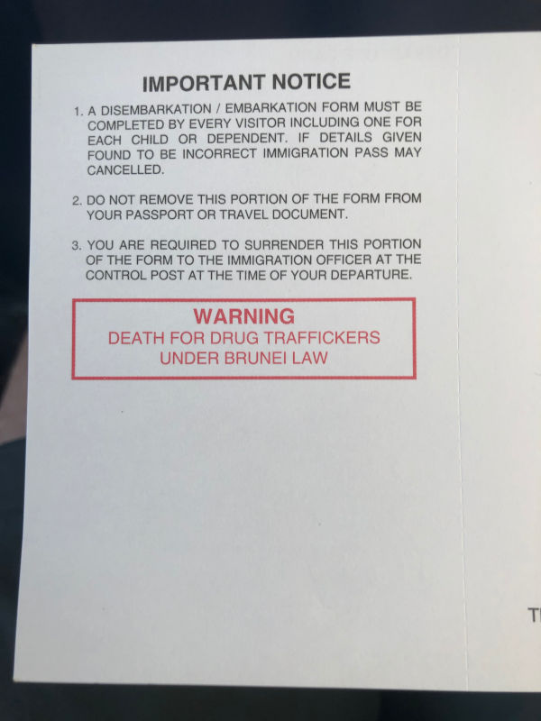

# Brunei

* If you plan to travel directly from Kuching (and Bako Park) to Bandar Seri Begawan (a Brunei's capital), it's way cheaper to take a AirAsia flight to Miri, and then bus to Brunei.
* Buses leave twice a day - at 8am and at 3:45pm - from Miri terminal.
* The terminal itself is open-spaced with nothing much to do, so arrive as late as possible, to not waste your time. Keep in mind, bus to Brunei leaves on time and it won't wait for you.
* Similar to Singapore, drug trafficking is punishable by death. Also no liquors and cigarettes are allowed (Brunei is a Muslim country with total ban on alcohol and tobacco).
    
* Homosexuality is also punishable by death, so if you are gay, do not show it off.
* Be aware that almost everybody in this country has a car, so most of the roads don't have pavements (so be extra cautious when planning a route using maps as you may end up walking on the side of the highway like we did).
* All main attractions of the city can be done by 2h walk, as they're very close to each other.
* Royal Regalia museum has a pretty well equipped souvenir shop. They can also send a postcard for you if you like.
* Most of the restaurants and shops are cash only. However there is a plenty of ATMs, but they will charge you extra.
* For whatever reason, Revolut cards were crashing BIBD Bank ATMs, so if it happens to you, don't try on another one.
* As in every Muslim country, you can't enter the mosque with short sleeves, however for the main mosque, black robes are provided free of charge.
* When flying off, along with Cebu Pacific and AirAsia, also check Royal Brunei airlines. They may have comparable price, but way higher standard (our flight had meal included, and inflight entertainment system for every passenger).
