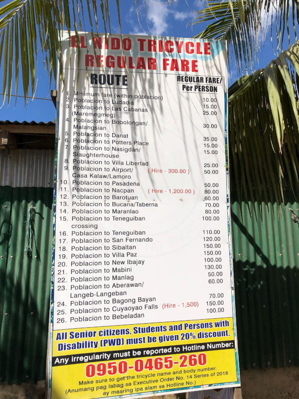

# Philippines

> This informations were gathered on January 2019.

## Manila

* You can exchange money on the airport. The rate is fair.
* You can also eat at arrivals terminal, for a fair price.
* 30 minutes Wi-Fi on the airport, and you need a Philippine SIM card to receive a confirmation code to activate Internet connection.
* You can buy SIM card on the airport - the cheapest option is 500PHP for unlimited calls/texts in the country, 3GB Internet and 1,5GB extra Internet for YouTube.
* Internet quality in Manila - both in hostels and restaurants is terrible. If you really need it, consider buying bigger plan for your SIM card. Mobile net seems to work better.
* Uber does not operate in Philippines but there is another similar company/app called [Grab](https://www.grab.com).
* You can also take an official taxi from the airport - be aware though, some drivers may not have GPS and you rely only on their knowledge of the city. Since Manila has a lot of small alleys, usually it means, they take you to the district from the address and then ask locals for directions. Our hostel put incorrect district in their address so we ended up wandering through the city looking for the street, and paying much more than we should.
* When the driver mentions "Skyway" he actually means a highway, which goes across Manila over the street level (it's built on massive pillars). The cost is 45PHP per ride, paid extra for the driver (no matter if you use taxi or Grab). Usually it's a faster way to travel through city, and if driver proposes it, and you're in a hurry - it's a reasonable price for massive time savings.
* Official taxi from airport to the city center should cost around 500PHP.
* There are plenty of shops and restaurants in Manila, most of them are cash only.
* Some shops sell alcohol, some don't.
* The city of Manila doesn't contain many attractions - the biggest one is Intramuros - the old part of the town surrounded by city walls.
* In Intramuros you can also find Fort Santiago - an old British prison. Entrance fee: 75PHP.
* Be sure to arrive early if you leave by airport and need to check in luggage - the lines are long, and move slowly - despite the fact, that airport personnel do their best to service people as fast as possible.

## Sagada

* Getting to Sagada is easy these days, as there is a direct bus from Manila, operated by Coda Bus company. You can book online tickets here: <http://codalinesph.com/online-bus-ticket-booking/>.
* Bus leaves Manila at the evening from Quezon City. And the traffic at that time *is crazy*. Plan your trip accordingly - in our case, it took us over two hours to get through Manila to the bus station, and it was 15km taxi ride!
* The last 30km of the ride to Sagada itself, is through the mountains - so it may take plenty of time. Our bus was ahead of the schedule, but it may not always be the case so keep that in mind.
* Notice where the bus drops you off, because this is also a pickup point for return trip.
* Sagada flourish thanks to tourists, and does everything to keep them happy. There are two tourist agencies, which can arrange everything for you - including guided tour to hanging coffins, echo valley, caves etc.
* There is a tourist tax 50PHP per person. Keep the receipt (photo is also ok) as you may be asked for it during trekking.
* Unfortunately due to vandalism, you can't visit the coffins without a guide. However the tour is fairly cheap and costs 300PHP per 1-10 person group, plus 10PHP entry fee per person.
* Whole town is set around one main road, so it's virtually impossible to get lost.
* Our return bus was also ahead of schedule - but again - it may not always be the case. Contrary to things we read on the Internet - the bus leaves directly from Sagada and goes to Manila, without any Jeep transfers on track or any other uncommon "attractions".

## Cebu

* Most important thing to note - Cebu is a big island, and in a middle of it there is a Cebu city.
* If you plan sunbathing on Cebu, don't stay in the city as it doesn't have any noteworthy beaches (unless you want to pay over 1000PHP extra for private resort). Choose a beach on either side of the island and book your accommodation nearby.
    * However if you end up in Cebu City like we did, and still want sunbathing, there is a cheap and good quality beach called Mactan Newtown Beach. The entry fee is 150PHP per person (weekdays) or 199PHP per person (weekends). We went there on weekday, and despite the beach being small, it wasn't very crowded.
* The only noticeable thing to see in Cebu is Magellan's cross and Basilica del Santo Nino.
    * In Basilica there is also a chapel, but if you want to see it, wear long pants (especially women), as you may be not be let in.

### Bohol

* There are ferries coursing to and from Bohol main ports roughly every hour.
* You can book online ticket, but be at least half an hour before the departure as you need to check in your baggage (if you have any), and replace your booking to an actual ticket.
    * The ferry port, works similarly to airport - there are check-in counters, and gates.
* Ferry ride takes approx 2 hours.
* When you arrive to Bohol, there will be plenty of people offering you to rent a van and do the countryside trip. The fare is 2500PHP per van. Usually tours include chocolate hills, Tarsier sanctuary, dinner on the river, man made Forrest, Loboc church, butterfly sanctuary and Blood Compact. However drivers are always open for negotations.
* Without river dinner, the whole thing took us approx 4 hours.
* If your tour ends earlier than you planned and you have a plenty of time to your return ferry, you can always rebook your ticket to the first available hour. The price is 50PHP per ticket, however (for whatever reason) we weren't charged at all.

## Palawan

* Grab does not operate on Palawan.
* There is nothing to do in Puerto Princessa city (which is the city where you land in) - you can treat it as your hub, for all the beautiful beaches on Palawan.
* On Palawan there is one of the new 7 natural wonders of the world - the underground river - it's really worth to see it.
    * When you leave airport, there are plenty of people offering trips there.
    * The whole trip takes a day, however, the boat ride on river itself takes only 40 minutes, the rest is transfer and waiting for the boat (there are a lot of people there).
    * The most famous beaches on Palawan, are in El Nido. You can book an underground river tour, which starts in Puerto Princessa and ends up in El Nido. We did it this way.
        * We booked our tour online here: <https://www.elnidoparadise.com/booking/inland-tours/underground-river-tour-to-el-nido/>. The price was 2800PHP/person.
    * You will ride in two boats.
        * First boat has a number - remember it, as you need to return to it.
        * Also on first boat, you will receive a life vest, which you need to keep for the second boat ride.
        * The second boat is the boat which would take you to the river itself.
        * In general, if you take a tour - everything will be handled for you, so you don't have to worry about it too much.

### El Nido

* Be sure to book your hostel way in advance (at least week before). We didn't consider it, and were booking three days before. There was only *one* accomodation left (for reasonable price)!
* Be prepared that you may catch a bacteria which force you to vomit and have a diarrhea at the same time. According to locals - every foreigner catches it sooner or later. It's a good idea, to have activated carbon - it helps. In our case - it took us 8 hours to get well.
* A ride back to Puerto Princessa can be booked directly on the terminal. You can either choose van or bus. Van goes faster (5 hours) and it was the option which we chose. It costed us 500PHP, but probably you can get it cheaper.
* Near the terminal there is also a big board, with tricycle prices to all destinations nearby. If you plan to visit the beaches, take a photo of it and use it when negotating the price.
    

