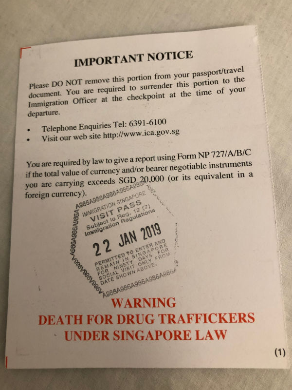
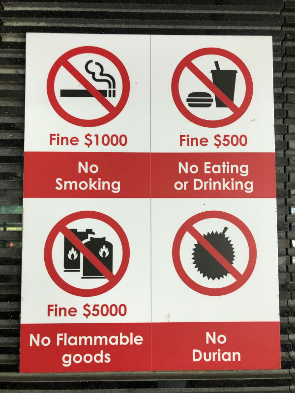

# Singapore

* Death penalty for smuggling drugs - you will be reminded of that, both by immigration card and by aircraft personnel during the flight.
    
* Although the chances are slim, still if you get drug-tested for whatever reason, and the test become positive - you can be prosecuted as well (either fine or prison, capital punishment is reserved only for people with large amount of drugs with them). If you are recreational user, give your body time to clean up before visiting Singapore.
* You will be handed an immigration card - it consists of two parts. Don't lose the second part, as you need to show it to the officer when you leave the country.
* Singapore does their best to stay clean, there are high penalties for littering, vandalizing etc.
    
* Grab works in Singapore as well.
* Typical meal should cost you around 10S$, cheap one - 5S$.
* Most of the restaurants and shops accept credit cards, however not all of them so either ask first or have some cash handy.
* There are plenty of ATMs scattered around the city.
* Gardens by the bay - one of the attractions is free to enter. However if you want to see the trees and waterfalls in the domes, it will cost you 26S$ per person (valid for both domes). There is also a skywalk inside the gardens - 8S$ per person.
* Skyline is best viewed at night, either from one of the bridges, or from river bunk between them.
* There are also hop-on/hop-off buses, operating on different routes. Ask for their leaflet in your hostel if you're interested.
* Tap water in Singapore is perfectly safe to drink.
* Singapore average daytime temperature is 31C, dropping to 24C at night.
* Smoking is prohibited in air conditioned areas and public transports.
* Tipping is appreciated but it's not common practice due to the 10% service charge imposed in most hotel and restaurants.
* English is not a primary language used by Singapore people, but we never met anyone who couldn't understand or communicate with it.
* You can book bus from Singapore to Kuala Lumpur online on [Easybook](https://www.easybook.com/).
* If you booked online - be at least 30 minutes earlier - you need to show your booking at the company's desk so they can issue a ticket for you.
* At the Singapore border you need to give back the officer the remaining immigration card part.
* At the Malaysian border you don't need to fill any cards at all.
* Usually the bus will wait for you on both borders but it's heavy dependent on the company. Some waits until all passengers are done, some waits 20 minutes and move on. For the second case - you are allowed to take the next bus of the same company, just show the ticket to the driver. It's also good idea to ask at company's desk, how do they resolve it.
* Buses leave punctually but arrival time may vary - don't plan your schedule too tight!
